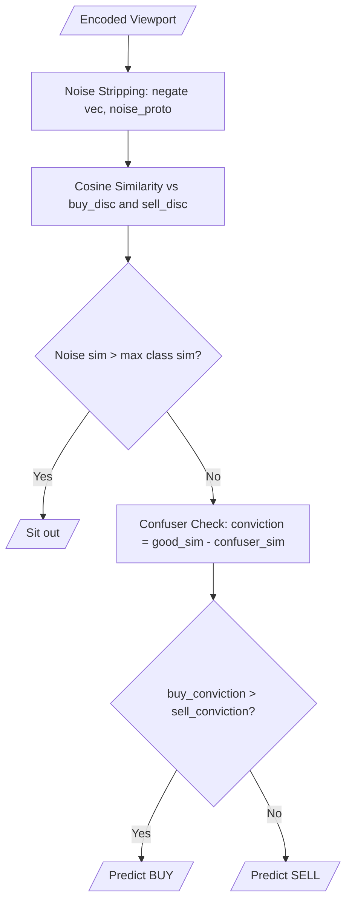
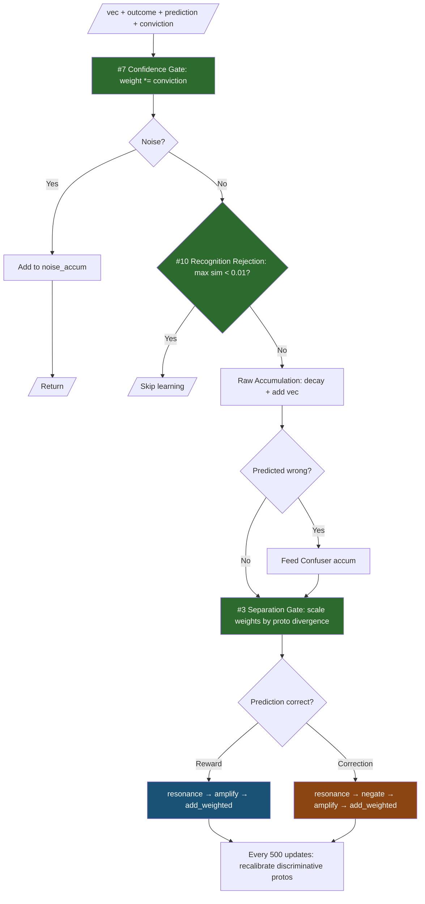
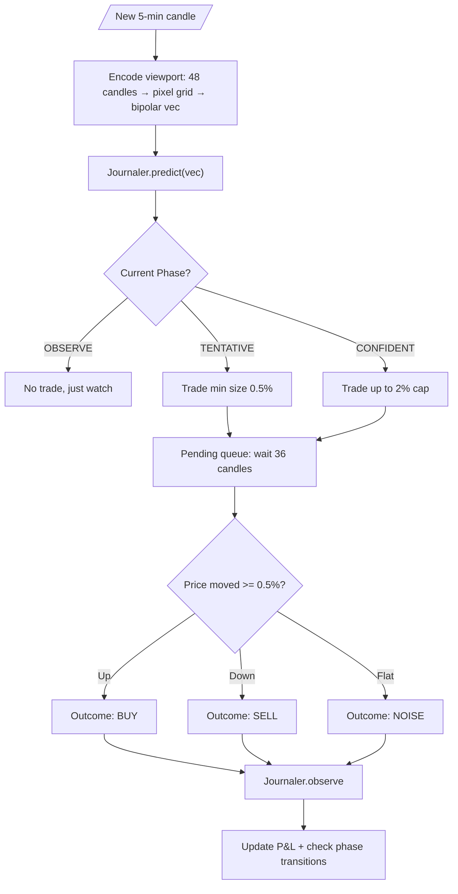
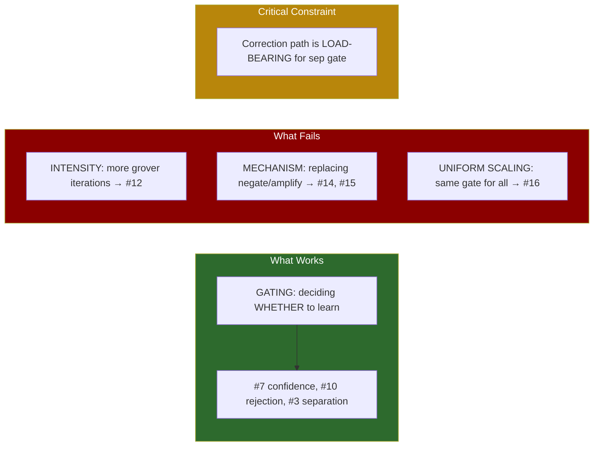

# Experiment Log — Holon BTC Trader

Living document tracking experiment results, system architecture, and learnings.

---

## Current Best: #7 + #10 + #3 → **+4.65% return, 50.5% win rate**

| Metric | Value |
|--------|-------|
| Equity | $10,465 (+4.65%) |
| Win rate | 50.5% (33,663/66,599) |
| j_acc overall | 50.6% |
| j_acc rolling | 48.3% |
| Candles | 100,000 (2019-01-01 to 2019-12-15) |
| Buy-and-hold | +89.56% |
| cos(buy_good, sell_good) | 0.9296 |
| cos(buy_good, noise) | 0.5473 |
| cos(sell_good, noise) | 0.5519 |
| buy_good count | 68,051 |
| sell_good count | 66,558 |
| buy_confuser | 16,629 |
| sell_confuser | 16,624 |
| Phase | CONFIDENT |

---

## System Architecture

### Prediction Flow

### Learning Flow (Journaler.observe)

### Trader Decision Flow

---

## Experiment Results

### Confirmed Techniques (in production baseline)

| # | Technique | Return | Win Rate | Key Insight |
|---|-----------|--------|----------|-------------|
| 7 | Confidence-Gated Learning | +2.50%¹ | 49.6% | Scales learning by conviction. Prevents prototype smearing from coin-flip predictions. 62x better than ungated baseline. |
| 10 | Recognition Rejection | +3.31%² | 49.7% | Skips learning when max similarity < 0.01. Filters truly novel/ambiguous data. |
| 3 | Separation Gate | +4.65%³ | 50.5% | Scales learning by prototype divergence. Suppresses corrections when buy/sell converge during trends. Noise separation improved dramatically (0.78→0.55). |

¹ vs +0.04% baseline  ² stacked on #7  ³ stacked on #7+#10

### Ruled Out Techniques

| # | Technique | Result | Root Cause |
|---|-----------|--------|------------|
| 1 | Multi-Timescale Accumulators | No improvement | Cross-timescale corrections corrupt accumulator state. Per-timescale fixes matched but didn't beat baseline. |
| 9 | Cross-Class Surgical Feedback | +0.14% (was +3.31%) | Over-feeds accumulators. Double-adding on wrong predictions smears prototypes. |
| 14 | Analogy-Based Correction | +2.23% (was +3.31%) | `analogy` degenerates when prototypes converge (difference→0). `flip` penalty dominates, creating asymmetric accumulator damage. |
| 12 | Iterative Grover Amplification | -7.4% at 50k | Grover iterations change vector *intensity* independently of weight. Conflicts with all weight-based gates (#3, #7). Tested on both correction and reward paths — same result. |
| 16 | Complexity-Gated Learning | -7.4% at 50k | Pixel encoding produces uniform complexity scores. Gate degenerates to constant scalar, smothering learning. |
| 15 | Blend-Based Gentle Correction | -5.6% at 40k | Replaces load-bearing negate/amplify correction. Nullifies separation gate — correction mechanism and gate are a coupled system. |

### Key Learnings

### What's Left to Try

| Category | # | Technique | Risk Assessment |
|----------|---|-----------|-----------------|
| **Reinforcement** | 8 | Layered resonance filtering | ⚠️ Modifies correction path — likely breaks sep gate |
| **Reinforcement** | 13 | Soft-then-hard filtering | ⚠️ Modifies correction path — likely breaks sep gate |
| **Reinforcement** | 18 | Similarity profile correction | ⚠️ Modifies correction path — likely breaks sep gate |
| **Encoding** | 4 | Temporal binding | ✅ Safe — changes input, not learning |
| **Architecture** | 2 | Engram library (sub-patterns) | ✅ Safe — adds parallel classification |
| **Architecture** | 17 | Reject-based class isolation | ✅ Safe — adds parallel classification |
| **Architecture** | 5 | Subspace classification | ✅ Safe — adds parallel classification |

**Recommendation**: Skip remaining reinforcement techniques (#8, #13, #18) — they all modify the correction path which is coupled to the separation gate. Next moves should come from **encoding** or **architecture** categories.

---

## Reuse Notes for Ruled-Out Techniques

These techniques failed at specific insertion points (the learning/correction path in `Journaler.observe`). They may be valuable elsewhere.

### #1 Multi-Timescale Accumulators
**Failed at:** Learning — cross-timescale corrections corrupt accumulator state.
**Could work at:**
- **Prediction (read-only):** Maintain multi-timescale accumulators but only READ from fast/slow for prediction signals. Learn at single timescale only. Fast/slow disagreement = regime transition signal.
- **Phase transitions:** Fast accumulator diverging from slow = market regime is changing. Could trigger CONFIDENT → TENTATIVE demotion earlier.

### #9 Cross-Class Surgical Feedback
**Failed at:** Learning — double-feeding on wrong predictions smears prototypes.
**Could work at:**
- **Prediction scoring:** Use the "what fooled us" signal as a read-only penalty during prediction, not as accumulator input. Already partially implemented via confuser accumulators.
- **Diagnostics:** Track how much of a wrong prediction was due to genuine confuser overlap vs noise.

### #14 Analogy-Based Correction
**Failed at:** Learning — `analogy(wrong, correct, vec)` degenerates when prototypes converge because `difference(correct, wrong) → 0`.
**Could work at:**
- **Well-separated regimes only:** Gate analogy by separation — only apply when `sep_gate > 0.5`. When prototypes are distinct, analogy is a principled rotation from wrong-space to correct-space.
- **Encoding / transfer:** Analogy is designed for relational transfer (A:B::C:?). Could be useful for encoding temporal relationships or transferring patterns across timeframes.

### #12 Iterative Grover Amplification
**Failed at:** Learning — changes vector intensity independently of weight-based gates, breaking the coupled equilibrium.
**Could work at:**
- **Encoding pipeline:** Sharpen viewport vectors BEFORE they enter the learning system. `grover_amplify(encoded_vec, null_template, 2)` to boost signal-to-noise in the raw encoding.
- **Prediction:** Amplify discriminative prototypes before similarity comparison: `grover_amplify(buy_disc, sell_disc, 2)` to make the classifier more decisive.
- **Recalibration:** Multiple grover iterations when building `buy_disc`/`sell_disc` during recalibration (offline step, not in the feedback loop).

### #16 Complexity-Gated Learning
**Failed at:** Learning — pixel encoding produces uniform complexity scores, so the gate is a constant.
**Could work at:**
- **Non-uniform encodings:** If we add temporal binding (#4), bound sequences would have genuinely varying complexity. A sequence of similar candles = low complexity. A volatile sequence = high complexity.
- **Monitoring/diagnostics:** Track complexity of prototypes over time. Rising prototype complexity could signal accumulator pollution.
- **Engram library (#2):** When deciding whether to create a new engram vs merge with an existing one, complexity of the residual could indicate "genuinely new pattern" vs "noisy variant."

### #15 Blend-Based Gentle Correction
**Failed at:** Learning — breaks the separation invariant that negate/amplify maintains. Feeds partial copies of prototypes back into accumulators.
**Could work at:**
- **Prototype seeding (warmup):** During OBSERVE phase before the separation gate is active, blend could bootstrap initial prototypes more gently than raw accumulation.
- **Prediction (soft classification):** `blend(buy_disc, sell_disc, confidence)` could produce a "consensus prototype" for ambiguous market states.
- **Engram merging:** When two engrams are close, `blend(engram_a, engram_b, 0.5)` is a natural merge operation.

---

## Next Experiments (prioritized)

### Tier 1 — Trivial, safe (read-only or offline)

| ID | Experiment | Where | Rationale |
|----|-----------|-------|-----------|
| 12R | Grover-amplify disc protos at recalibration | Recalibrate (offline, every 500 updates) | Sharper discriminative protos. Not in feedback loop. |
| 12P | Grover-amplify disc protos at prediction | Predict (read-only) | More decisive classifier. Doesn't touch learning. |
| 1R | Fast/slow accumulator disagreement for phase demotion | Phase transition logic | Read-only from extra accumulators. Earlier regime detection. |

### Tier 2 — Moderate, safe (changes input or preprocessing)

| ID | Experiment | Where | Rationale |
|----|-----------|-------|-----------|
| 4 | Temporal binding (bind consecutive viewports) | Encoding pipeline | New signal: transitions, not just snapshots. |
| 12E | Grover-sharpen viewport vectors before learning | Encoding pipeline | Boost signal-to-noise before accumulation. |

### Tier 3 — Architecture (parallel systems)

| ID | Experiment | Where | Rationale |
|----|-----------|-------|-----------|
| 2 | Engram library (sub-pattern clustering) | Parallel classification | Capture distinct buy/sell sub-patterns. |
| 5 | Subspace classification (OnlineSubspace) | Parallel classification | Second opinion via subspace projection. |

### Tier 3.5 — Trader-level (safe, no learning changes)

| ID | Experiment | Where | Rationale |
|----|-----------|-------|-----------|
| STR | Straddle on low conviction | Trader position sizing | When buy_sim ≈ sell_sim but both are high, play both sides. Captures volatility instead of direction. Low conviction + high recognition = "market will move, unclear which way." Net positive if winner > loser. |

### Tier 4 — Risky but principled

| ID | Experiment | Where | Rationale |
|----|-----------|-------|-----------|
| 14G | Analogy correction, only when separation > 0.5 | Correction path (conditional) | Analogy works when protos are distinct. Still touches feedback loop. |

---

## Run History

| Date | Config | 100k Return | Win Rate | Notes |
|------|--------|-------------|----------|-------|
| 2026-03-20 | Baseline (no gates) | +0.04% | 50.0% | Initial self-supervised trader |
| 2026-03-21 | +#7 | +2.50% | 49.6% | Confidence gating confirmed |
| 2026-03-21 | +#7+#10 | +3.31% | 49.7% | Recognition rejection confirmed |
| 2026-03-21 | +#7+#10+#9 | +0.14% | — | Cross-class ruled out |
| 2026-03-21 | +#7+#10+#14 | +2.23% | 49.5% | Analogy ruled out |
| 2026-03-21 | +#7+#10+#3 | **+4.65%** | **50.5%** | **Current best** |
| 2026-03-21 | +#7+#10+#3+#12 (correction) | — | — | Killed at 50k (-7.4%) |
| 2026-03-21 | +#7+#10+#3+#12 (reward) | — | — | Killed at 50k (-7.4%) |
| 2026-03-21 | +#7+#10+#3+#16 | — | — | Killed at 60k (-5.3%) |
| 2026-03-21 | +#7+#10+#3+#15 | — | — | Killed at 40k (-5.6%) |
| 2026-03-22 | +thoughts (frozen, old #10 gate) | +5.2% at 60k | 50.5% | Thought system frozen after ~10k samples; still competitive |
| 2026-03-22 | +thoughts (learning fix, 1% explore) | +3.0% at 40k | 50.3% | Thought learning unlocked; cos separation improving (0.83→0.80) |

---

## SQLite Analysis Findings (2026-03-22, run with thought learning fix)

Data from `runs/run_20260322_020026.db` — 30k candles analyzed with per-candle prediction logging.

### Conviction Is Inversely Calibrated

| Thought conviction band | Trades | Accuracy |
|--------------------------|--------|----------|
| <0.1                     | 2,829  | **53.6%** |
| 0.1–0.3                  | 5,400  | **53.1%** |
| 0.3–0.5                  | 1,587  | 45.2%    |
| 0.5–0.7                  | 115    | 53.0%    |
| 0.7+                     | 233    | 52.8%    |

Low conviction = higher accuracy. The metric measures prototype *familiarity* not *discriminative confidence*. When a pattern strongly matches one discriminant, it also partially trips the confuser (built from raw vectors, not discriminant-space). The confuser subtraction penalizes the strongest signals most.

Visual conviction is flat — almost no accuracy relationship across bands (46–50% at all levels).

### Confusers Are Net Negative

- **Flip rate**: 6.1% of visual predictions (1,533 / 25,000)
- **Flip accuracy**: 46.6% — worse than not flipping
- Near-zero sims (avg buy_sim=-0.006, sell_sim=-0.023) mean the confuser subtraction dominates the tiny raw signal

### Agreement Signal

- **Agreement rate**: 50.3% (near-perfect independence)
- When both agree Buy + low thought conviction: **54.1%** on 6,740 trades
- When both agree Buy + high thought conviction: **47.2%** on 1,038 trades
- **Thought wins 55.4% of disagreements**, trending to 62.9% at 20k+

### Visual Acts as Regime Filter, Not Directional Predictor

- Thought says Buy + visual agrees: 53.2% (7,778 trades)
- Thought says Buy + visual disagrees: 53.6% (7,746 trades)
- Visual agreement barely changes Buy accuracy — it's the *regime* that matters

### Thought Learning Fix Confirmed Working

| Step | cos_buy_sell | buy_count | sell_count | Notes |
|------|-------------|-----------|------------|-------|
| 10k  | 0.834       | 587       | 454        | Already exceeds old run's 50k totals (549/410) |
| 20k  | 0.813       | 627       | 500        | Separation improving |
| 30k  | 0.805       | 677       | 542        | Old run stuck at 0.878 |

New vs old thought accuracy (growing delta):
- 10-15k: +1.5pp
- 20-25k: +2.2pp  
- 25-30k: **+3.6pp**

---

## Improvement Backlog (data-driven, prioritized)

### Priority 0 — Noise Floor Ratchet (DONE, needs validation run)
Exploration fix caused prototype cascade: 677 → 39,083 samples, cos
collapsed from 0.805 → 0.992. Root cause: diluted prototypes raise
entropy → noise_floor drops → gate opens → more dilution → runaway.
Fix: `self.noise_floor = self.noise_floor.max(new_floor)` — floor can
only tighten, never loosen. Code is in but needs a clean 100k run to
validate.

### Priority 1 — Throughput Regression
Adding thought system dropped throughput from ~90/s to ~23/s (~4x slower).
Need to profile: is it fact generation, thought vector encoding, or the
thought predict/observe path? Likely candidate: per-candle fact evaluation
iterating all comparison pairs × zones × predicates.

### Priority 2 — Near-Zero Sim Filter
Buy/sell sims average -0.006/-0.023 — firmly in the VSA noise floor.
Most predictions are indistinguishable from orthogonal noise. Add minimum
absolute sim threshold (e.g., 0.03–0.05) to reject candles where
`max(|buy_sim|, |sell_sim|) < threshold`. Trade less, but only when
there's actual signal. Should reduce trade count significantly while
improving per-trade accuracy.

### Priority 2 — Fix Conviction Metric
Current: `conviction = discriminant_sim - confuser_sim`. Problem:
discriminants live in a narrow subspace (the ~20% NOT shared between
buy/sell) while confusers are built from full raw vectors. The subtraction
mixes incompatible vector spaces. Options:
- **(a)** Use `buy_sim - sell_sim` (margin between discriminants) as conviction
- **(b)** Project confusers into discriminant space before subtraction
- **(c)** Compute confuser sims against discriminant-space vectors

Option (a) is simplest and directly measures "how much more buy-unique
than sell-unique."

### Priority 3 — Rethink Confusers
Net negative at 46.6% flip accuracy. The concept (flagging past mistakes)
is sound; the implementation (flipping direction) is wrong. Options:
- **(a)** Disable entirely (baseline improvement)
- **(b)** Use confuser_sim as rejection signal — high confuser → abstain, don't reverse
- **(c)** Rebuild confusers in discriminant space so the subtraction is meaningful

### Priority 4 — Visual as Regime Detector
Visual barely adds directional value but shows strong regime-dependent
performance swings (32–62% across 5k buckets). Instead of using it for
Buy/Sell calls, use its rolling accuracy or sim magnitude to:
- Modulate position sizing
- Adjust thought system's confidence threshold
- Gate trading activity (only trade when visual is in a "good regime")

### Priority 5 — Verify Conviction Inversion Post-Fix
After fixing the metric, re-check if low conviction still outperforms
high conviction. If it persists with margin-based conviction, the
discriminant prototypes themselves need work (resonance subtraction
may be too aggressive at 0.80 cosine similarity).

---

## Planned Instrumentation / Dashboard

Metrics we currently lack visibility into. Priority: build
structured logging first, dashboard second.

### Confuser Impact Metrics
- **Sim distributions**: histogram of buy_sim and sell_sim values
  per candle — what does the typical spread look like?
- **Confuser flip rate**: how often does `buy_conviction > sell_conviction`
  differ from `buy_sim > sell_sim`? (i.e., confuser changed the
  prediction direction)
- **Flip accuracy**: when confusers flip a prediction, are they
  right? Track flipped-and-correct vs flipped-and-wrong.
- **Confuser magnitude**: distribution of `buy_confuser_sim` and
  `sell_confuser_sim` — how large is the penalty relative to the
  raw similarity? If confuser_sim is always tiny, they're not
  doing much.
- **Conviction before/after**: raw conviction (sim only) vs
  adjusted conviction (sim - confuser_sim) distribution.

### Prediction Pipeline Stage Metrics
- **Noise gate rejection rate**: % of candles where noise_sim >
  max(buy_sim, sell_sim). How often are we sitting out?
- **Recognition gate rejection rate**: % of labeled outcomes where
  max_sim < noise_floor. How much training data are we discarding?
- **Separation gate scaling**: distribution of sep_gate values
  (1 - cos(buy_proto, sell_proto)). How much is the correction
  path being throttled?

### Thought System Metrics
- **Fact activation frequency**: which facts fire most often? The
  background accumulator removes always-on facts, but tracking
  frequency helps validate that it's working.
- **Thought recognition rate**: % of candles where thought_sim
  passes the thought noise_floor vs visual noise_floor.
- **Fact count per candle**: distribution of how many facts are
  true per candle (thought vector density).

### Dashboard Vision
Real-time TUI or web dashboard showing:
- Rolling accuracy curves (visual, thought, agreement)
- Equity curve
- Sim distribution histograms (live updating)
- Confuser flip events highlighted on the equity curve
- Prototype separation (cos(buy, sell)) over time
- Recognition gate threshold (noise_floor) over time

**Implementation approach**: Start with structured JSON logging
(one JSON object per candle to stderr), pipe to a log file.
Dashboard reads the log. Keeps the trader binary clean — all
visualization is a separate consumer of the log stream.
