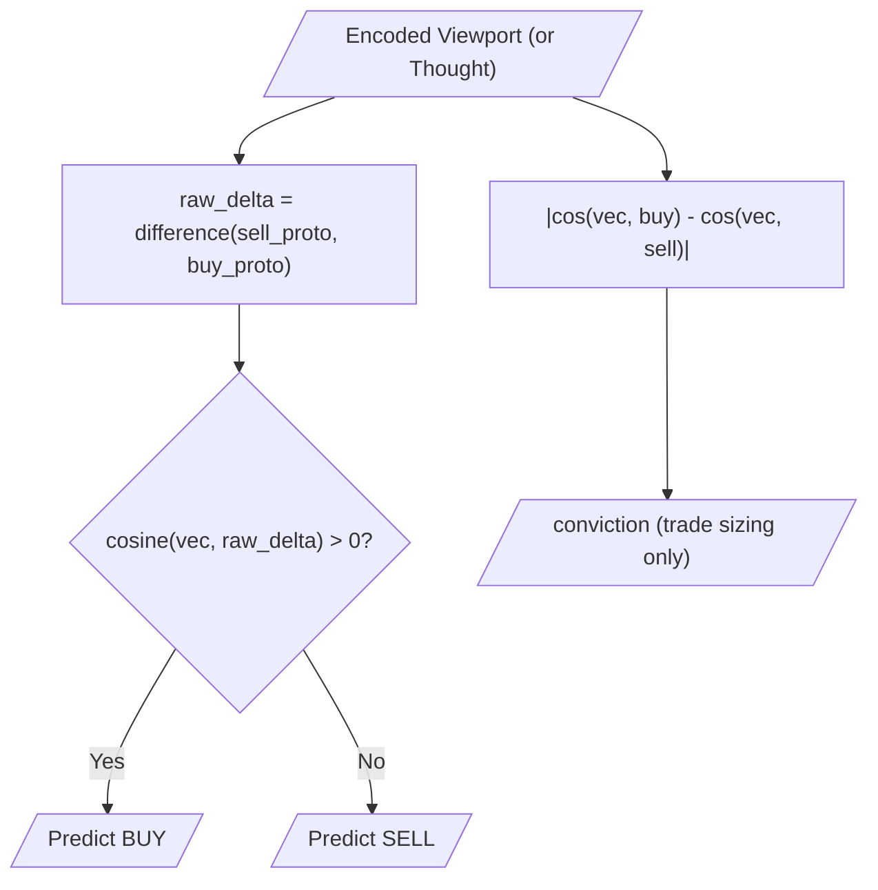
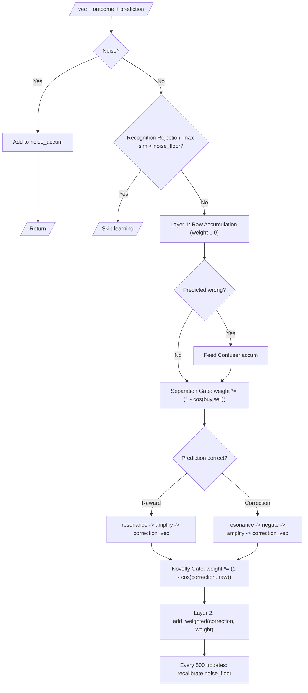
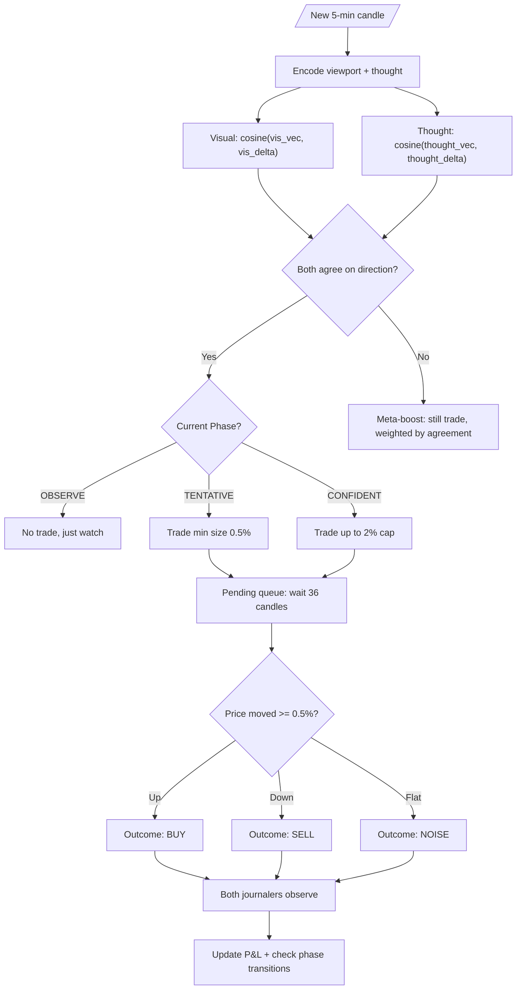
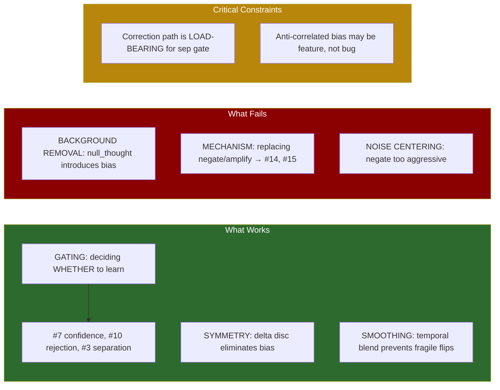

# Experiment Log — Holon BTC Trader

Living document tracking experiment results, system architecture, and learnings.

---

## Current State (2026-03-22, evening)

Architecture has undergone major restructuring today. Key changes:
- **Confidence gate REMOVED** — was an accidental constant (0.3), not a principled gate
- **Conviction decoupled from learning** — conviction is purely for trade sizing, never feeds back into observe()
- **Novelty-gated corrections** — algebraic correction weight scaled by `(1.0 - cosine(correction, raw).abs())`
- **Dual-cosine conviction** — `|cos(vec, buy_proto) - cos(vec, sell_proto)|` for position sizing
- **Smoothed delta_disc REMOVED** — direction uses raw `difference(sell_proto, buy_proto)`, eliminating temporal smoothing freeze

### Latest Run: `novelty-gate-v1` (in progress, ~90k/100k)

| Metric | Value (at 90k) |
|--------|----------------|
| Equity | $9,650 (-3.5%) |
| Win rate | 50.7% (60,019 trades) |
| Visual accuracy (rolling) | 40.9% |
| Thought accuracy (rolling) | 54.1% |
| Visual-Thought agreement | 46% |
| Visual bias | 99%+ Buy (locked — pre-fix) |
| Thought bias | ~45% Buy / 55% Sell (balanced) |
| cos(buy_good, sell_good) visual | 0.89 |
| cos(buy_good, sell_good) thought | 0.99 |

Key observations:
- Thought system makes **independent, balanced predictions** thanks to novelty gate
- Agreement at 42-46% is genuine (not 100% lock-in)
- When systems agree: **53.6% accuracy** vs 49.7% when they disagree
- Visual still locked Buy (pre-fix), thought carries the signal in later segments
- Thought accuracy sustained 52-56% from 60-90k while visual declines

### All-Time Best P&L: `sep-gated-raw-100k` (pre-thought-delta, old dual-disc)

| Metric | Value |
|--------|-------|
| Equity | $10,789 (+7.89%) |
| Win rate | 50.7% |
| Visual accuracy | 50.7% |
| Thought accuracy | 50.5% |
| Agreement | 52.4% |
| Visual bias | 51.1% Buy (balanced) |
| Thought bias | 60.7% Buy |

### Run Leaderboard (all 100k runs)

| Run | Return | Win% | Vis Acc | Tht Acc | Agree | Notes |
|-----|--------|------|---------|---------|-------|-------|
| **sep-gated-raw-100k** | **+7.89%** | 50.7% | 50.7% | 50.5% | 52.4% | Old arch, best P&L |
| delta-selftune | +4.66% | 51.6% | 50.7% | 51.5% | 50.7% | |
| expanded-vocab | +3.05% | 49.9% | 50.7% | 50.2% | 49.8% | |
| decoupled-raw | +1.91% | 50.5% | 50.5% | 50.5% | 99.9% | No conf gate, both locked Buy |
| conviction-fix-100k | +1.18% | 50.0% | 50.7% | 50.3% | 55.0% | |
| vis-delta-disc | +0.26% | 51.4% | 50.1% | 51.5% | 52.1% | |
| raw-conviction | -0.82% | 50.5% | — | — | — | Raw conv, pre-decouple |
| zscore-conviction | -2.1%* | 49.8%* | — | — | 2-10% | *aborted at 50k |
| novelty-gate-v1 | -3.5%* | 50.7%* | — | 54.1% | 46% | *at 90k, in progress |

### Critical Finding: Conviction-Learning Coupling

The confidence gate (`conviction.clamp(0.3, 1.0)`) was **never a principled design**.
Raw conviction was always tiny (0.02-0.08), so the clamp always hit the 0.3 floor.
The gate was effectively a **constant 0.3x multiplier** on all algebraic corrections.

This accidental damper was load-bearing: it kept corrections subordinate to raw
accumulation (Layer 1). Without it, corrections self-reinforce and lock predictions
into one direction permanently (see `decoupled-raw` run: both systems predict Buy
100% of the time from 10k candles onward).

**Two layers of learning in observe():**
1. **Raw accumulation** (weight 1.0, always runs) — ground truth, symmetric
2. **Algebraic correction** (weight × sep_gate × novelty, conditional) — derived signal, asymmetric

The correction is a self-reinforcing loop: correct predictions amplify the pattern
that produced them, making future predictions more likely to agree. The 0.3 damper
kept this loop weak enough that Layer 1 dominated. The principled replacement is
**novelty-gating**: `weight *= (1.0 - cosine(correction_vec, raw_vec).abs())`,
which measures how much new information the correction carries beyond raw accumulation.

### Critical Finding: Conviction Inversely Correlates with Accuracy

DB analysis from `decoupled-raw` revealed that both systems are **more accurate
when less confident**:

| Conviction bucket | Visual accuracy | Thought accuracy |
|-------------------|----------------|------------------|
| Low (< 0.02 vis / < 0.20 tht) | **58.2%** | **79.0%** |
| High (> 0.12 vis / > 0.60 tht) | 49.2% | 52.6% |

Position sizing based on conviction is actively harmful — it bets bigger on
worse predictions. This is a fundamental issue with the delta discriminant's
cosine magnitude as a confidence measure.

### Critical Finding: Visual Temporal Smoothing Freeze

The self-tuning temporal smoothing locked the visual system's delta_disc into
a permanent Buy direction:
- `cos(buy_proto, sell_proto)` ≈ 0.89 → alpha = 0.11
- Delta_disc updates: 89% old direction, 11% new
- Whatever direction the delta pointed at first recalibration becomes permanent
- 100% Buy predictions from candle 2000 onward in all runs using smoothed delta

The thought system survived with even worse separation (cos=0.99, alpha=0.05)
because thought vectors have higher variance relative to the delta, causing
`cosine(thought_vec, delta)` to naturally oscillate around zero.

**Fix**: Removed smoothed delta_disc entirely. Direction now uses raw
`difference(sell_proto, buy_proto)` which updates at every recalibration
without temporal smoothing.

---

## System Architecture

### Prediction (both visual and thought)

Direction from raw delta discriminant (no temporal smoothing):
```
raw_delta = difference(sell_proto, buy_proto)
is_buy = cosine(vec, raw_delta) > 0
```

Conviction from dual-cosine margin (decoupled from learning):
```
conviction = |cosine(vec, buy_proto) - cosine(vec, sell_proto)|
```

### Prediction Flow



### Learning Flow (Journaler.observe)

Conviction is NOT used in learning. Three gates control correction strength:



### Trader Decision Flow



---

## Experiment Results

### Confirmed Techniques (in production baseline)

| # | Technique | Return | Win Rate | Key Insight |
|---|-----------|--------|----------|-------------|
| 7 | Confidence-Gated Learning | +2.50%¹ | 49.6% | Scales learning by conviction. Prevents prototype smearing from coin-flip predictions. |
| 10 | Recognition Rejection | +3.31%² | 49.7% | Skips learning when max similarity < noise_floor. Filters truly novel/ambiguous data. |
| 3 | Separation Gate | +4.65%³ | 50.5% | Scales learning by prototype divergence. Suppresses corrections when buy/sell converge. |
| DD | Delta Discriminant | +0.26%⁴ | 51.4% | Single symmetric discriminant replaces dual disc + noise stripping. Eliminates majority-class bias. |
| ST | Self-Tuning Smoothing | (same)⁴ | 51.4% | Temporal blend of delta_disc with data-driven alpha. Prevents fragile delta flips. |

¹ vs +0.04% baseline  ² stacked on #7  ³ stacked on #7+#10  ⁴ stacked on all, both systems

### Delta Discriminant Migration (2026-03-22)

**Problem diagnosed**: The thought system's dual-discriminant + null_thought architecture
introduced majority-class bias. The null_thought (average of all thoughts) was slightly
Buy-biased because more candles resolved as Buy opportunities. Subtracting this biased
null_thought disproportionately weakened Buy signal → 65-80% Sell prediction bias.

**Solution**: Replace dual discriminants with `delta_disc = difference(sell_proto, buy_proto)`.
This is inherently symmetric — shared components cancel algebraically. No background
removal needed.

**Fragility fix**: Pure delta_disc was fragile (cos(buy,sell)=0.94 → sparse delta → prone
to sudden direction flips during strong trends). Fixed with temporal smoothing via
`blend(prev, new, alpha)` where alpha self-tunes from prototype separation.

**Applied to both systems**: Visual migrated from dual-disc + noise stripping to same
pattern. Both systems now share identical prediction architecture.

### Ruled Out Techniques

| # | Technique | Result | Root Cause |
|---|-----------|--------|------------|
| 1 | Multi-Timescale Accumulators | No improvement | Cross-timescale corrections corrupt accumulator state. |
| 9 | Cross-Class Surgical Feedback | +0.14% (was +3.31%) | Double-adding on wrong predictions smears prototypes. |
| 14 | Analogy-Based Correction | +2.23% (was +3.31%) | `analogy` degenerates when prototypes converge. |
| 12 | Iterative Grover Amplification | -7.4% at 50k | Conflicts with weight-based gates (#3, #7). |
| 16 | Complexity-Gated Learning | -7.4% at 50k | Pixel encoding produces uniform complexity. Gate is constant. |
| 15 | Blend-Based Gentle Correction | -5.6% at 40k | Breaks load-bearing negate/amplify correction path. |
| NC | Noise Centering (thought) | 35-42% acc | `negate(vec, noise_proto)` too aggressive — inverts neutral signals. |

### Key Learnings



---

## Reuse Notes for Ruled-Out Techniques

These techniques failed at specific insertion points (the learning/correction path in `Journaler.observe`). They may be valuable elsewhere.

### #1 Multi-Timescale Accumulators
**Failed at:** Learning — cross-timescale corrections corrupt accumulator state.
**Could work at:**
- **Prediction (read-only):** Maintain multi-timescale accumulators but only READ from fast/slow for prediction signals. Learn at single timescale only. Fast/slow disagreement = regime transition signal.
- **Phase transitions:** Fast accumulator diverging from slow = market regime is changing. Could trigger CONFIDENT → TENTATIVE demotion earlier.

### #9 Cross-Class Surgical Feedback
**Failed at:** Learning — double-feeding on wrong predictions smears prototypes.
**Could work at:**
- **Prediction scoring:** Use the "what fooled us" signal as a read-only penalty during prediction, not as accumulator input. Already partially implemented via confuser accumulators.
- **Diagnostics:** Track how much of a wrong prediction was due to genuine confuser overlap vs noise.

### #14 Analogy-Based Correction
**Failed at:** Learning — `analogy(wrong, correct, vec)` degenerates when prototypes converge because `difference(correct, wrong) → 0`.
**Could work at:**
- **Well-separated regimes only:** Gate analogy by separation — only apply when `sep_gate > 0.5`. When prototypes are distinct, analogy is a principled rotation from wrong-space to correct-space.
- **Encoding / transfer:** Analogy is designed for relational transfer (A:B::C:?). Could be useful for encoding temporal relationships or transferring patterns across timeframes.

### #12 Iterative Grover Amplification
**Failed at:** Learning — changes vector intensity independently of weight-based gates, breaking the coupled equilibrium.
**Could work at:**
- **Encoding pipeline:** Sharpen viewport vectors BEFORE they enter the learning system. `grover_amplify(encoded_vec, null_template, 2)` to boost signal-to-noise in the raw encoding.
- **Prediction:** Amplify discriminative prototypes before similarity comparison: `grover_amplify(buy_disc, sell_disc, 2)` to make the classifier more decisive.
- **Recalibration:** Multiple grover iterations when building `buy_disc`/`sell_disc` during recalibration (offline step, not in the feedback loop).

### #16 Complexity-Gated Learning
**Failed at:** Learning — pixel encoding produces uniform complexity scores, so the gate is a constant.
**Could work at:**
- **Non-uniform encodings:** If we add temporal binding (#4), bound sequences would have genuinely varying complexity. A sequence of similar candles = low complexity. A volatile sequence = high complexity.
- **Monitoring/diagnostics:** Track complexity of prototypes over time. Rising prototype complexity could signal accumulator pollution.
- **Engram library (#2):** When deciding whether to create a new engram vs merge with an existing one, complexity of the residual could indicate "genuinely new pattern" vs "noisy variant."

### #15 Blend-Based Gentle Correction
**Failed at:** Learning — breaks the separation invariant that negate/amplify maintains. Feeds partial copies of prototypes back into accumulators.
**Could work at:**
- **Prototype seeding (warmup):** During OBSERVE phase before the separation gate is active, blend could bootstrap initial prototypes more gently than raw accumulation.
- **Prediction (soft classification):** `blend(buy_disc, sell_disc, confidence)` could produce a "consensus prototype" for ambiguous market states.
- **Engram merging:** When two engrams are close, `blend(engram_a, engram_b, 0.5)` is a natural merge operation.

---

## Next Experiments (prioritized for 2026-03-23)

### Tier 0 — Thought Vocabulary Expansion (highest value, safe)

Adds genuinely new signal without touching learning or prediction.
The expanded pairs/zones already improved thought from ~50% to 51.5%.
These are the remaining planned items from THOUGHT_VOCAB.md.

| ID | Experiment | Effort | Rationale |
|----|-----------|--------|-----------|
| TV4 | Candle range vs ATR zones | Trivial | `(at candle-range large-range)` — abnormal candle detection. Two zone checks. |
| TV1 | Trend/reversal/continuation | Moderate | Uses `segment()` + `drift_rate()` from Holon. Biggest gap in thought vocabulary. |
| TV2 | Divergence predicates | Low (needs TV1) | `(diverging close up rsi down)` — classic TA signal. |
| TV3 | Temporal lookback (`since`) | Moderate | `(since fact N)` — multi-candle pattern memory. |
| TV5 | Market holidays | Low | Calendar-based regime facts. Thin liquidity detection. |

### Tier 1 — Analysis & Quick Wins (read-only)

| ID | Experiment | Where | Rationale |
|----|-----------|-------|-----------|
| CONV | Conviction calibration check | DB analysis | Verify high delta_sim → higher accuracy. Previous inversion was from confuser subtraction (fixed). |
| AGREE | High-conviction agreement filter | DB analysis | Accuracy when both agree AND both high conviction. May reveal strong sub-signal. |
| 12R | Grover-amplify delta_disc at recalibration | Recalibrate (offline) | Sharpen delta. Adapt for new architecture (amplify against noise_proto?). |

### Tier 2 — Encoding Changes (changes input, not learning)

| ID | Experiment | Where | Rationale |
|----|-----------|-------|-----------|
| 4 | Temporal binding (bind consecutive viewports) | Visual encoding | Captures transitions, not just snapshots. Fundamentally new signal. |
| 12E | Grover-sharpen viewport vectors before learning | Visual encoding | Boost signal-to-noise in raw encoding. |

### Tier 3 — Architecture (parallel systems)

| ID | Experiment | Where | Rationale |
|----|-----------|-------|-----------|
| 2 | Engram library (sub-pattern clustering) | Parallel classification | A breakout-buy ≠ dip-buy. Sub-pattern prototypes. |
| 5 | Subspace classification (OnlineSubspace) | Parallel classification | Second opinion via subspace projection. |
| REG | Visual as regime detector | Trader/orchestration | Use visual rolling accuracy to gate trading, not for directional calls. |

### Tier 3.5 — Trader-level (safe, no learning changes)

| ID | Experiment | Where | Rationale |
|----|-----------|-------|-----------|
| STR | Straddle on low conviction | Trader position sizing | Low conviction + high recognition → play both sides. Captures volatility. |

### Tier 4 — Investigation (diagnosis before fix)

| ID | Experiment | Where | Rationale |
|----|-----------|-------|-----------|
| BIAS | Visual Buy bias drift | Visual observe/recalibrate | Visual delta drifts to 76% Buy by 90k. Asymmetric correction path? |
| 14G | Analogy correction, gated by separation > 0.5 | Correction path | Analogy works when protos are distinct. Risky — touches feedback loop. |

---

## Run History

| Date | Config | 100k Return | Win Rate | Notes |
|------|--------|-------------|----------|-------|
| 2026-03-20 | Baseline (no gates) | +0.04% | 50.0% | Initial self-supervised trader |
| 2026-03-21 | +#7 | +2.50% | 49.6% | Confidence gating confirmed |
| 2026-03-21 | +#7+#10 | +3.31% | 49.7% | Recognition rejection confirmed |
| 2026-03-21 | +#7+#10+#9 | +0.14% | — | Cross-class ruled out |
| 2026-03-21 | +#7+#10+#14 | +2.23% | 49.5% | Analogy ruled out |
| 2026-03-21 | +#7+#10+#3 (sep-gated-raw) | **+7.89%** | **50.7%** | **All-time best P&L** |
| 2026-03-21 | +#7+#10+#3 (conviction-fix) | +1.18% | 50.0% | Conviction metric changed, P&L dropped |
| 2026-03-21 | +#7+#10+#3+#12 (correction) | — | — | Killed at 50k (-7.4%) |
| 2026-03-21 | +#7+#10+#3+#12 (reward) | — | — | Killed at 50k (-7.4%) |
| 2026-03-21 | +#7+#10+#3+#16 | — | — | Killed at 60k (-5.3%) |
| 2026-03-21 | +#7+#10+#3+#15 | — | — | Killed at 40k (-5.6%) |
| 2026-03-22 | +thoughts (frozen, old #10 gate) | +5.2% at 60k | 50.5% | Thought system frozen after ~10k; still competitive |
| 2026-03-22 | +thoughts (learning fix, 1% explore) | +3.0% at 40k | 50.3% | Thought learning unlocked; cos improving (0.83→0.80) |
| 2026-03-22 | expanded-vocab (thought) | — | — | 29 comparison pairs + 6 zone checks. Cascade fixed but Sell bias from null_thought |
| 2026-03-22 | delta-disc (thought only) | — | — | 50/50 balance restored but fragile — collapsed at 35k in bull run |
| 2026-03-22 | delta-smooth (thought, α=0.3) | +4.66% | 51.6% | Temporal smoothing fixed fragility |
| 2026-03-22 | delta-selftune (thought, self-tuning α) | +4.66% | 51.6% | Self-tuning α identical to fixed 0.3 (both clamp to 0.05) |
| 2026-03-22 | **vis-delta-disc** (both systems delta) | +0.26% | 51.4% | Both systems on delta disc. Anti-correlated bias (vis=68% Buy, tht=41% Buy). Agreement 52.1%. |

---

## SQLite Analysis Findings (2026-03-22, run with thought learning fix)

Data from `runs/run_20260322_020026.db` — 30k candles analyzed with per-candle prediction logging.

### Conviction Is Inversely Calibrated

| Thought conviction band | Trades | Accuracy |
|--------------------------|--------|----------|
| <0.1                     | 2,829  | **53.6%** |
| 0.1–0.3                  | 5,400  | **53.1%** |
| 0.3–0.5                  | 1,587  | 45.2%    |
| 0.5–0.7                  | 115    | 53.0%    |
| 0.7+                     | 233    | 52.8%    |

Low conviction = higher accuracy. The metric measures prototype *familiarity* not *discriminative confidence*. When a pattern strongly matches one discriminant, it also partially trips the confuser (built from raw vectors, not discriminant-space). The confuser subtraction penalizes the strongest signals most.

Visual conviction is flat — almost no accuracy relationship across bands (46–50% at all levels).

### Confusers Are Net Negative

- **Flip rate**: 6.1% of visual predictions (1,533 / 25,000)
- **Flip accuracy**: 46.6% — worse than not flipping
- Near-zero sims (avg buy_sim=-0.006, sell_sim=-0.023) mean the confuser subtraction dominates the tiny raw signal

### Agreement Signal

- **Agreement rate**: 50.3% (near-perfect independence)
- When both agree Buy + low thought conviction: **54.1%** on 6,740 trades
- When both agree Buy + high thought conviction: **47.2%** on 1,038 trades
- **Thought wins 55.4% of disagreements**, trending to 62.9% at 20k+

### Visual Acts as Regime Filter, Not Directional Predictor

- Thought says Buy + visual agrees: 53.2% (7,778 trades)
- Thought says Buy + visual disagrees: 53.6% (7,746 trades)
- Visual agreement barely changes Buy accuracy — it's the *regime* that matters

### Thought Learning Fix Confirmed Working

| Step | cos_buy_sell | buy_count | sell_count | Notes |
|------|-------------|-----------|------------|-------|
| 10k  | 0.834       | 587       | 454        | Already exceeds old run's 50k totals (549/410) |
| 20k  | 0.813       | 627       | 500        | Separation improving |
| 30k  | 0.805       | 677       | 542        | Old run stuck at 0.878 |

New vs old thought accuracy (growing delta):
- 10-15k: +1.5pp
- 20-25k: +2.2pp  
- 25-30k: **+3.6pp**

---

## Improvement Backlog (data-driven, prioritized)

### ~~Priority 0 — Noise Floor Ratchet~~ ✅ DONE
Validated. Thought system no longer cascades with expanded vocabulary.

### Priority 1 — Throughput
Currently ~72 vec/s (was ~90/s before thoughts, ~23/s before batch optimization).
Not blocking but room to improve. Thought predict/observe is cheap (~342ms total
for 100k candles). Bottleneck is visual encoding pipeline.

### ~~Priority 2 — Fix Conviction Metric~~ ✅ DONE
Conviction is now `delta_sim.abs()` — single cosine against delta discriminant.
No confuser subtraction. No mixed vector spaces.

### ~~Priority 3 — Rethink Confusers~~ ✅ DONE
Confusers still accumulate and log for diagnostics but don't affect prediction.
No flipping. May revisit as rejection signal (high confuser_sim → abstain).

### Priority 2 — Conviction Rescaling
Delta_sim.abs() produces conviction values ~2x lower than old dual-disc margin.
Self-tuning smoothing further compresses conviction variance. Position sizer
sees half the signal → makes smaller bets → lower P&L despite better accuracy.
Options:
- **(a)** Rescale delta_sim by a learned factor (e.g., 2x to match old range)
- **(b)** Z-score conviction: `(delta_sim - rolling_mean) / rolling_std`
- **(c)** Use conviction percentile rather than raw magnitude
- **(d)** Separate conviction from smoothing — smooth the delta for direction,
  but use raw (unsmoothed) delta_sim for conviction magnitude

Option (d) is most principled: smoothing prevents direction flips (which is
what we want), but conviction should reflect the current signal strength,
not the smoothed historical average.

### Priority 3 — Visual Buy Bias Drift
Visual delta_disc drifts to 76% Buy predictions by 90k candles. The self-tuning
alpha is 0.10 for visual (cos=0.90, more separated than thought's 0.95) so it
adapts faster — but the adaptation is one-directional. Investigate whether the
observe path's algebraic corrections are asymmetrically feeding the buy prototype.

### Priority 3 — Visual as Regime Detector
Visual shows strong regime-dependent accuracy swings (42-55% across 10k buckets).
Instead of using it for directional calls, use its rolling accuracy to:
- Modulate position sizing
- Gate trading activity (only trade when visual accuracy is trending up)
- Weight the meta-boost orchestration

### Priority 4 — Verify Conviction Calibration
With delta_sim as conviction, check if high-conviction predictions are more
accurate than low-conviction. Previous inverse calibration was caused by
confuser subtraction in a mixed vector space — should be resolved now.

### Priority 5 — Reward Mechanism Redesign
Current reward/correction is binary: prediction right → reinforce, wrong → correct.
No scaling by outcome magnitude (how much price moved), trade profitability, or
how wrong/right the prediction was. A 0.51% move gets the same treatment as a 5% move.

Key gaps:
- No concept of outcome magnitude in the learning signal
- No gradient between "barely wrong" and "completely wrong"
- No feedback from actual P&L into the learning system
- The 0.5% threshold itself is binary — 0.49% = Noise, 0.51% = Signal

Ideas and research: https://grok.com/c/25c9bfd2-8964-4972-9ba7-33f06a7f0e22?rid=90c2451a-7b28-491c-83f6-0a26be5ecede

Circle back after current queue (vocab expansion, conviction rescaling).

### Priority 6 — Agreement as Primary Signal
Agreement rate (52%) and agreement accuracy (51.6%) suggest the two systems
provide weak but real independent signals. The anti-correlated bias means
agreement requires both systems to overcome their natural lean — potentially
a stronger filter than raw accuracy. Investigate: accuracy when agree AND
high conviction from both systems.

---

## Planned Instrumentation / Dashboard

Metrics we currently lack visibility into. Priority: build
structured logging first, dashboard second.

### Confuser Impact Metrics
- **Sim distributions**: histogram of buy_sim and sell_sim values
  per candle — what does the typical spread look like?
- **Confuser flip rate**: how often does `buy_conviction > sell_conviction`
  differ from `buy_sim > sell_sim`? (i.e., confuser changed the
  prediction direction)
- **Flip accuracy**: when confusers flip a prediction, are they
  right? Track flipped-and-correct vs flipped-and-wrong.
- **Confuser magnitude**: distribution of `buy_confuser_sim` and
  `sell_confuser_sim` — how large is the penalty relative to the
  raw similarity? If confuser_sim is always tiny, they're not
  doing much.
- **Conviction before/after**: raw conviction (sim only) vs
  adjusted conviction (sim - confuser_sim) distribution.

### Prediction Pipeline Stage Metrics
- **Noise gate rejection rate**: % of candles where noise_sim >
  max(buy_sim, sell_sim). How often are we sitting out?
- **Recognition gate rejection rate**: % of labeled outcomes where
  max_sim < noise_floor. How much training data are we discarding?
- **Separation gate scaling**: distribution of sep_gate values
  (1 - cos(buy_proto, sell_proto)). How much is the correction
  path being throttled?

### Thought System Metrics
- **Fact activation frequency**: which facts fire most often? The
  background accumulator removes always-on facts, but tracking
  frequency helps validate that it's working.
- **Thought recognition rate**: % of candles where thought_sim
  passes the thought noise_floor vs visual noise_floor.
- **Fact count per candle**: distribution of how many facts are
  true per candle (thought vector density).

### Dashboard Vision
Real-time TUI or web dashboard showing:
- Rolling accuracy curves (visual, thought, agreement)
- Equity curve
- Sim distribution histograms (live updating)
- Confuser flip events highlighted on the equity curve
- Prototype separation (cos(buy, sell)) over time
- Recognition gate threshold (noise_floor) over time

**Implementation approach**: Start with structured JSON logging
(one JSON object per candle to stderr), pipe to a log file.
Dashboard reads the log. Keeps the trader binary clean — all
visualization is a separate consumer of the log stream.
