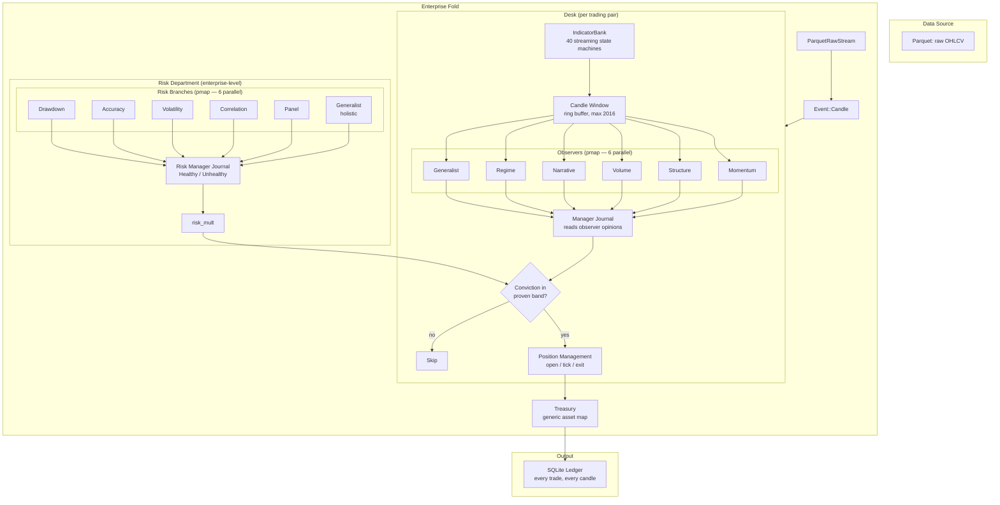

# Holon Lab: Trading

A self-organizing trading enterprise built from six primitives. Proves that named thoughts composed through vector algebra predict market direction — 59.7% at q99, five points above academic SOTA with deep learning. On a laptop. With 107 atoms and one cosine.

Currently trading BTC. The architecture is asset-agnostic — each desk trades a pair, the treasury holds any tokens, and adding an asset is pushing a desk. The algebra doesn't care what it's pointed at.

**This is the proving ground for [Holon](https://github.com/watmin/holon) and [wat](https://github.com/watmin/wat).** The enterprise is specified in wat (s-expression specifications that ARE programs), implemented in Rust, and defended by seven wards. The wat leads. The Rust follows. The wards catch lies.

## Architecture



## The Fold

The enterprise is a fold over a stream of raw candles: `(state, raw_candle) → state`. One event at a time. Walking into the future.

1. **Raw candle arrives** — 5 numbers and a timestamp
2. **Desk steps indicator bank** — 40 streaming state machines produce computed indicators
3. **Candle pushed to window** — ring buffer, observers sample slices at their own scale
4. **6 observers encode in parallel** (rayon pmap) — each through its own vocabulary lens
5. **6 observers predict in parallel** — each journal produces direction + conviction
6. **Manager encodes observer opinions** — learns which configurations are profitable
7. **Gates check** — conviction in proven band, risk_mult above threshold, market moved
8. **Position management** — open, tick (stop/trail/TP), exit, settle
9. **Learning** — observers learn from price outcomes, manager learns from profitability
10. **Risk evaluates** — 5 branches + generalist + manager, all from portfolio state

## Parallelism

Seven rayon `par_iter` / `par_iter_mut` sites verified by the compiler (Send+Sync):

| Site | Form | Items | Per |
|------|------|-------|-----|
| Observer encoding | pmap | 6 | every candle |
| Observer prediction | pmap | 6 | every candle |
| Observer decay | pfor-each | 6 | every candle |
| Observer resolve | pfor-each | 6 | per resolved entry |
| Risk branch scoring | pmap | 5 | recalib interval |
| Risk branch update | pfor-each | 5 | recalib interval |
| Desk iteration | pmap | N | every candle (1 desk today, N when multi-asset) |

The wat language declares `pmap` and `pfor-each` as structural forms. The Rust implements via rayon. The compiler verifies independence.

## Quick Start

```bash
./enterprise.sh build                                    # compile (release)
./enterprise.sh run --max-candles 5000 --asset-mode hold  # quick run
./enterprise.sh test 100000 --asset-mode hold --name run  # benchmark → runs/
./enterprise.sh kill                                      # kill switch
```

Kill switch: `touch trader-stop`

## Six Primitives

```
atom    — name a thought
bind    — compose thoughts
bundle  — superpose thoughts
cosine  — measure a thought
journal — learn from a stream of thoughts
curve   — evaluate the quality of learned thoughts
```

Everything else is userland. The enterprise is a program written in these six primitives.

## Two Templates

**Template 1 — Prediction (Journal):** "What will happen next?" Observers predict direction. The manager predicts profitability. The risk manager predicts portfolio health.

**Template 2 — Reaction (OnlineSubspace):** "Does this look normal?" Risk branches measure distance from healthy. The panel engram measures expert agreement familiarity.

## The Wat Specification

The `wat/` directory is the source of truth. Every Rust module has a corresponding wat file. The wat is an s-expression language for algebraic cognition — Lisp shaped for the six primitives. It specifies what the enterprise thinks, how it learns, and where the boundaries are.

```
wat/
  bin/enterprise.wat    — the fold: one raw candle, one state transition
  candle.wat            — 40 streaming indicator state machines + fact tables
  market/
    desk.wat            — desk struct, fold step, all 13 phases
    manager.wat         — manager encoding (15 atoms, motion delta)
    observer.wat        — observer struct, resolve, proof gates
    observer/*.wat      — 7 lens profiles (momentum, structure, ...)
  risk/
    mod.wat             — 5 branches + generalist + risk manager Journal
  thought.wat           — ThoughtEncoder, 17 eval methods, fact generation tables
  vocab/*.wat           — 12 vocabulary modules
  treasury.wat          — generic asset map, swap, claim, release
  position.wat          — symmetric positions (source/target)
  event.wat             — Event enum (raw candle, deposit, withdraw)
```

The wat language provides `pmap` and `pfor-each` for declaring independent computations. The enterprise uses both — observer encoding and prediction are `pmap`, observer decay and resolution are `pfor-each`. The Rust compiles these to rayon `par_iter`. The compiler verifies Send+Sync.

See the [wat language repository](https://github.com/watmin/wat) for the full language specification, including proposals reviewed by conjured designers (Hickey and Beckman).

## Module Layout

```
src/bin/enterprise.rs     — the heartbeat (orchestrates, doesn't define)
src/market/
  desk.rs                 — trading pair's full enterprise tree
  exit.rs                 — exit expert encoding
  manager.rs              — manager encoding (observer opinions → thought)
  observer.rs             — Observer struct + proof gates
  mod.rs                  — Lens enum, observer panel
src/risk/
  mod.rs                  — 5 specialist branches + generalist
  manager.rs              — risk manager Journal (Healthy/Unhealthy)
src/thought/
  mod.rs                  — ThoughtEncoder + 17 eval methods
  pelt.rs                 — PELT changepoint detection
src/vocab/                — 12 vocabulary modules (oscillators, flow, regime, ...)
src/indicators.rs         — streaming indicator fold (40 state machines)
src/event.rs              — Event::Candle(RawCandle)
src/state.rs              — EnterpriseState + CandleContext + SharedState
src/treasury.rs           — generic asset map with Rate newtype
src/position.rs           — symmetric positions (source/target)
src/portfolio.rs          — phase transitions, win/loss tracking
src/sizing.rs             — Kelly criterion
src/journal.rs            — holon-rs Journal bridge
src/ledger.rs             — SQLite schema
src/candle.rs             — Candle struct (52 indicator fields)
```

## Specifications

The `wat/` directory mirrors `src/`. Every Rust module has a wat specification. The wat leads, the Rust follows. Seven wards defend the code:

| Ward | Question |
|------|----------|
| `/sever` | Is it tangled? |
| `/reap` | Is it alive? |
| `/scry` | Does spec match code? |
| `/gaze` | Does it communicate? |
| `/forge` | Does it compose? |
| `/temper` | Is it efficient? |
| `/assay` | Is it expressed? |

## The Book

[BOOK.md](BOOK.md) documents the full journey — from visual encoding failure to streaming enterprise. Five chapters. The architecture, the philosophy, the results, the catharsis.

## Data

- `data/btc_5m_raw.parquet` — 652,608 5-minute BTC candles (Jan 2019–Mar 2025)
- `runs/` — run ledgers and logs (append-only, never delete)

## What This Proves

The trading system is a proxy for intelligence. We are proving that named thoughts composed through vector algebra — six primitives, one cosine, one fold — can predict. The same architecture that detects DDoS attacks, that builds spectral firewalls, that evaluates a million rules at kernel line rate. Different vocabulary. Same algebra. Same curve.

The ideas are free. The code is public. The curve confirms.
