# The Circuits

*The machine as signal flow diagrams. For humans.*

Each circuit is a mermaid graph definition. GitHub renders them natively.

---

## 1. The full enterprise

Signals flow down (candle → thought → proposal). Outcomes flow back up
(settlement → propagation → observers). The circuit is a loop. The fold
is one tick of the clock.

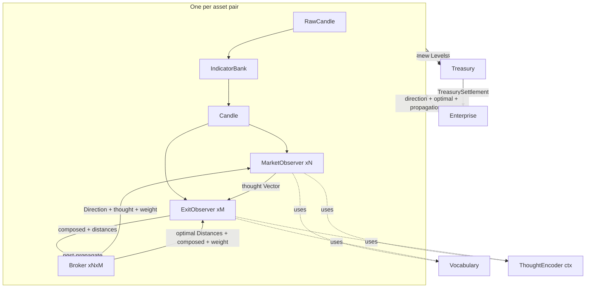

Note: dashed arrows (-.->|uses|) show tools the observers call, not data
flow. The observer calls Vocabulary for ASTs, then ThoughtEncoder for
Vectors. Vocabulary and ThoughtEncoder are tools, not upstream producers.

**Component legend:**

| Node | Contains | Produces |
|------|----------|----------|
| **IndicatorBank** | streaming state (ring buffers, EMA accumulators) | Candle (100+ indicators) |
| **Vocabulary** | pure functions, no state | Vec\<ThoughtAST\> — data, not execution |
| **ThoughtEncoder** | atoms (permanent dict) + compositions (HashMap, eventually-consistent via returned misses) | Vector from AST |
| **IncrementalBundle** | sums (Vec\<i32\>) + last-facts (Map\<ThoughtAST, Vector\>). Per observer. Optimization cache, not cognition. | Vector (bit-identical to full bundle) |
| **EncoderService** | single thread, LRU cache, N client pipe pairs (lookup/answer/install). select loop. | Vector on cache hit, None on miss |
| **MarketObserver ×N** | lens (MarketLens), reckoner :discrete (Up/Down, curve internal), noise-subspace, window-sampler, engram gate, incremental-bundle | (Vector, Prediction, edge, misses\*) |
| **ExitObserver ×M** | lens (ExitLens), 2× reckoner :continuous (trail, stop, K=10 bucketed, breathing range), default-distances, incremental-bundle | (Distances, experience) via cascade + misses\* |
| **Broker ×N×M** | reckoner :discrete (Grace/Violence, curve internal), noise-subspace, papers (deque), 2× scalar-accumulator, engram gate | Prediction + edge() |
| **Post** | indicator-bank, candle-window, market-observers, exit-observers, registry | Vec\<Proposal\> + Vec\<Vector\> + misses\* |
| **Treasury** | available ◄──► reserved, trades, trade-origins, next-trade-id | TreasurySettlement on settle |
| **Enterprise** | posts, treasury, market-thoughts-cache | (Vec\<LogEntry\>, misses\*) per candle |

\*misses = Vec\<(ThoughtAST, Vector)\> — cache misses returned as values, inserted by the binary between candles.

**Edge legend — data flow (solid arrows):**

| From → To | Type | Method |
|-----------|------|--------|
| RC → IB | RawCandle | tick(raw) → Candle |
| CD → MO | Candle (via candle-window slice) | post calls market-lens-facts → incremental.encode → observe(thought, misses) |
| CD → EO | Candle (for exit facts) | post calls exit-lens-facts → incremental.encode → exit-vec |
| MO + EO → BR | composed Vector (bundle of market thought + exit vec) + Distances | recommended-distances(composed, accums, scalar-encoder) → (Distances, f64) |
| Post → TR | Proposal (the barrage) | post assembles from broker outputs, treasury evaluates |
| TR → EN | TreasurySettlement | settle-triggered(prices) → (Vec\<TreasurySettlement\>, Vec\<LogEntry\>) |
| EN → Post | direction + optimal + propagation args | post-propagate(post, slot-idx, thought, outcome, weight, direction, optimal) |
| Post → BR | propagation args | broker.propagate(thought, outcome, weight, direction, optimal) |
| BR → MO | Direction + thought + weight | resolve(thought, direction, weight) |
| BR → EO | optimal Distances + composed + weight | observe-distances(composed, optimal, weight) |
| TR → Post | active trades for trigger update | trades-for-post(post-idx) — step 3c |
| Post → TR | new Levels | update-trade-stops(trade-id, new-levels) — step 3c |

**Tool usage (dashed arrows):**

| Observer | Tool | Purpose |
|----------|------|---------|
| MO, EO | Vocabulary | produce Vec\<ThoughtAST\> from Candle |
| MO, EO | ThoughtEncoder (ctx) | evaluate ASTs into Vectors |

---

## 2. The encoding circuit

RawCandle in, Vector out. Two levels of laziness: the IncrementalBundle
avoids re-summing unchanged facts, the composition cache avoids
recomputing unchanged sub-trees.

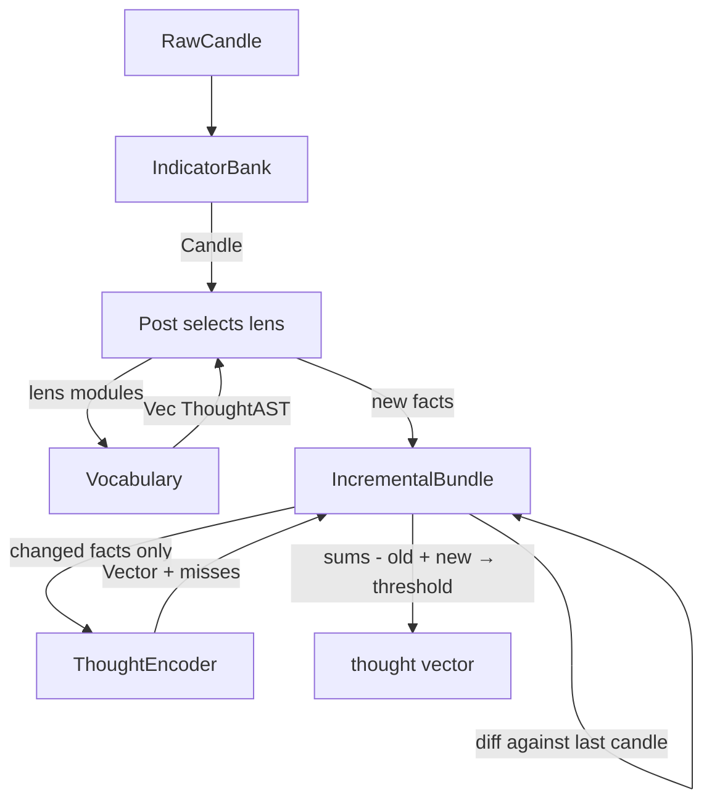

The post selects which vocabulary modules fire (the observer's lens).
The vocabulary produces ASTs — data describing what to think. The
IncrementalBundle diffs against last candle's facts. Unchanged facts:
zero work (sums already has their contribution). Changed facts: encode
via ThoughtEncoder (cache may hit), subtract old vector, add new.
Threshold the sums. Bit-identical to full bundle.

Two layers of laziness, complementary:
- IncrementalBundle: avoids re-summing unchanged facts (the bundle step)
- Composition cache: avoids recomputing unchanged sub-trees (the encode step)

---

## 3. The learning circuit

The feedback loop. Where Grace and Violence shape the next prediction.

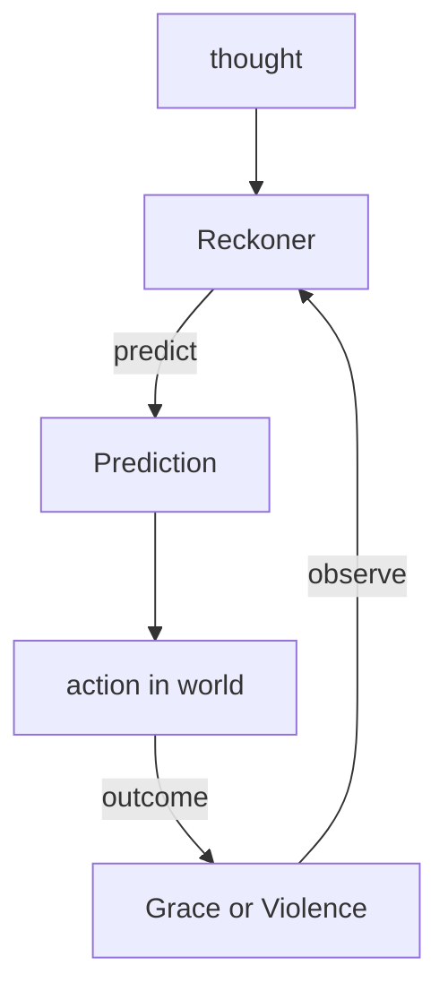

The reckoner accumulates observations. The discriminant sharpens. The
prediction improves. The loop is the learning. Each tick, the reckoner
that predicted Grace gets stronger. The one that predicted Violence
gets weaker.

---

## 4. The paper circuit

The fast learning stream. Every candle. Every broker. No real capital.

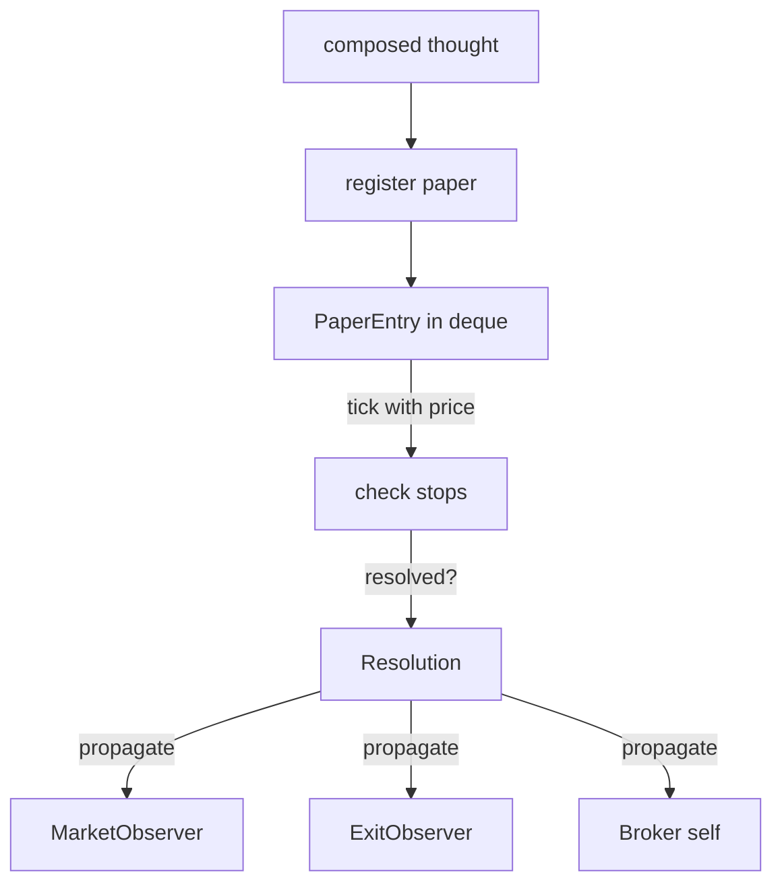

Papers play both sides (buy and sell) simultaneously. When a side's
trailing stop fires, the paper resolves. Direction: buy-side fires → :up,
sell-side fires → :down. The resolution carries the optimal distances
from hindsight. Papers are how the machine learns before it trades.

---

## 5. The funding circuit

The capital lifecycle. Deploy, protect, recover, accumulate.

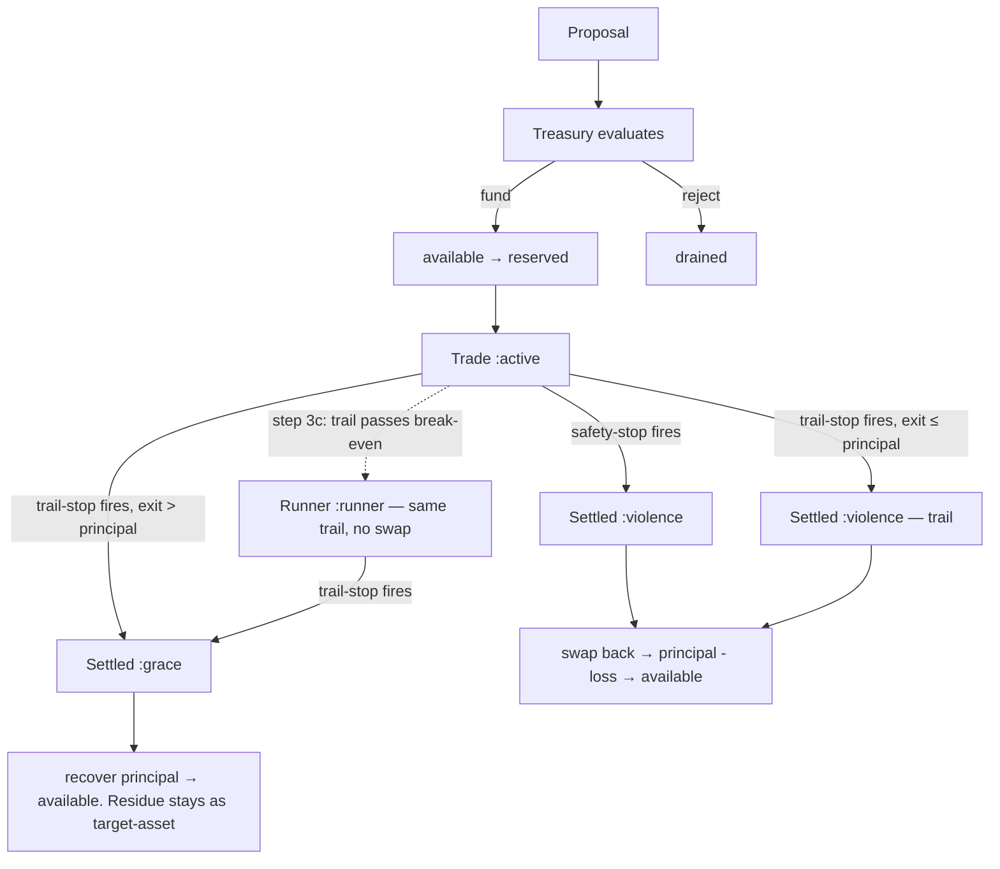

Note: dashed arrow (-.->|step 3c|) is the runner TRANSITION — a stop-
management event in step 3c, not a settlement trigger. The trail
continues to breathe — same distance, same reckoner. No separate
runner-trail distance. Solid arrows are settlement triggers (step 1).

The treasury funds proven proposals. Capital moves from available to
reserved. The trade is :active. One entry swap, one exit swap. Two
swaps total. The runner is NOT a swap — the trail continues. The trade
rides until exit. Each swap costs `swap-fee + slippage`.
- **Safety-stop fires** → :settled-violence. Full position swaps back.
  Principal minus loss returns. Bounded by reservation.
- **Trailing-stop fires** → outcome depends on exit vs principal.
  Exit > principal → :settled-grace (residue is permanent gain).
  Exit ≤ principal → :settled-violence (loss bounded by reservation).
- **Step 3c: trail passes break-even** → :runner transition. No swap.
  No exit. The trail continues to breathe via step 3c. The trade
  continues. Zero effective risk — exit would recover the principal.

---

## 6. The breathing stops circuit

Step 3c. Every candle. The stops adapt to the current market context.

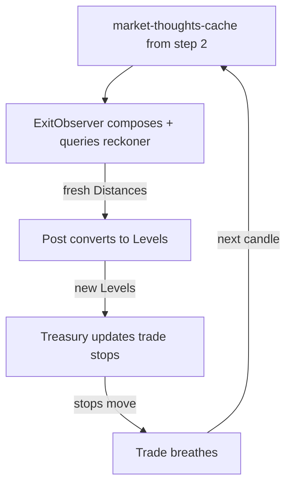

Note: step 3c reuses the market thoughts from step 2's cache — no fresh
encoding. The exit observer composes with the cached thoughts.

The exit observer's reckoner learned from every prior resolution which
distances produced Grace. Step 3c applies that learning to active trades
continuously. The reckoner sees the current thought — volatility,
momentum, regime — and predicts: "for THIS context, trail at 1.8%,
stop at 3.2%." The distances convert to price levels. The trailing
stop moves. The trade breathes.

This IS the value extraction mechanism. Not set-and-forget. Continuous
adaptation. The trade captures as much residue as the market will give,
bounded by the learned distances. The runner uses the same trail —
the reckoner adapts to the current market context through the composed
thought. No separate runner distance.

---

## 7. The cascade circuit

Three levels of distance knowledge. Specific to general.

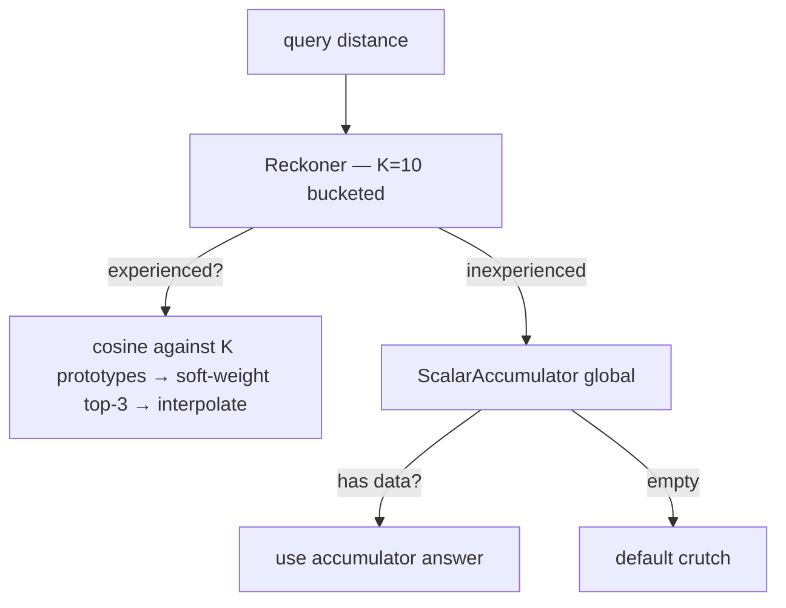

For each distance (trail, stop): try the contextual answer first
(reckoner — "for THIS thought, what distance?"). The reckoner uses K=10
bucketed accumulators with a breathing range. Each bucket accumulates
thoughts that produced values in that range. Query: cosine against K
prototypes, soft-weight top-3, interpolate. O(K×D) — constant in
observations. Range discovered from data, contracts when old weight
decays.

If inexperienced, try the global answer (scalar accumulator — "what
does Grace prefer for this pair overall?"). If empty, use the crutch
(the default value from construction).

---

## 8. The propagation circuit

The signal that teaches. TreasurySettlement → enterprise computes → observers learn.

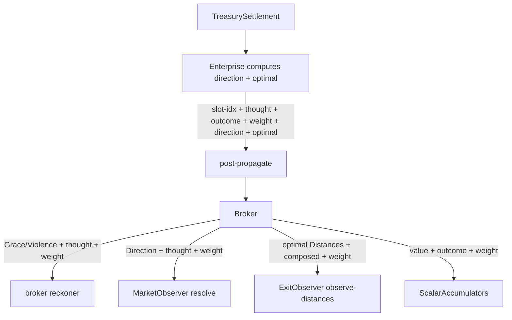

The enterprise computes direction and optimal-distances from the
TreasurySettlement's trade (replays price-history). Routes values directly —
no intermediate Settlement struct. Routes
to the post. The post calls broker.propagate. The broker fans out —
weight on every edge, because a large Grace teaches harder than a
marginal one: Grace/Violence to its own reckoner, Direction to the
market observer, optimal Distances to the exit observer, scalar values
to the accumulators. Everyone learns from one resolution.

---

## 9. The binary circuit

The outer loop. The fold driver. The pipe architect. 30+ threads.

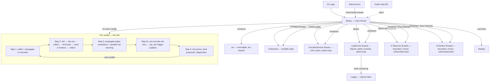

The binary creates the world (ctx) and the machine (enterprise) from
CLI arguments. It spawns 30+ threads: 6 observer threads, 24 broker
threads, 1 encoder service, 1 log service. Each thread communicates
through pipes (make-pipe). The main thread drives the fold — routing
candles to observer pipes, collecting thoughts, computing the N×M
grid via rayon par_iter, sending to broker pipes, collecting outputs.

Pipes are values. Processes are functions. The main thread is the
heartbeat. The threads are the muscles. The pipes are the nerves.
select multiplexes. bounded(1) synchronizes. unbounded learns.

At shutdown: drop the send ends → threads exit their recv loops →
join returns the state → observers and brokers restored to the
enterprise. The encoder service reports cache stats. The log service
drains remaining entries with batch commits. The summary prints.

The binary does not think. It drives the fold and writes what happened.

---

## 10. The moment circuit

The decoupling. Prediction and learning are two independent timelines.
The moment is for acting. The past is for learning. They breathe at
their own pace. (Proposal 012)

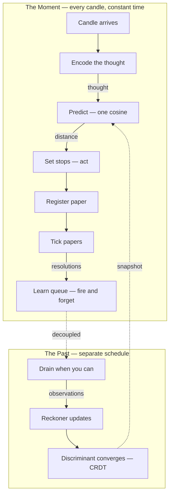

The `╳` between the moment and the past is the decoupling boundary.
Everything above runs every candle in constant time. Everything below
runs when it can — deferred, batched, eventually consistent.

The reckoner is a CRDT. The discriminant is a commutative monoid. The
order of observation doesn't change the destination — only the path.
The prediction reads a snapshot. The learning writes at its own pace.
The algebra guarantees convergence.

Warmup: synchronous for the first N candles (the discriminant is thin).
Then async. The prediction uses whatever the reckoner has learned so far.

---

## 11. The pipe circuit

CSP — communicating sequential processes. The concurrency architecture.

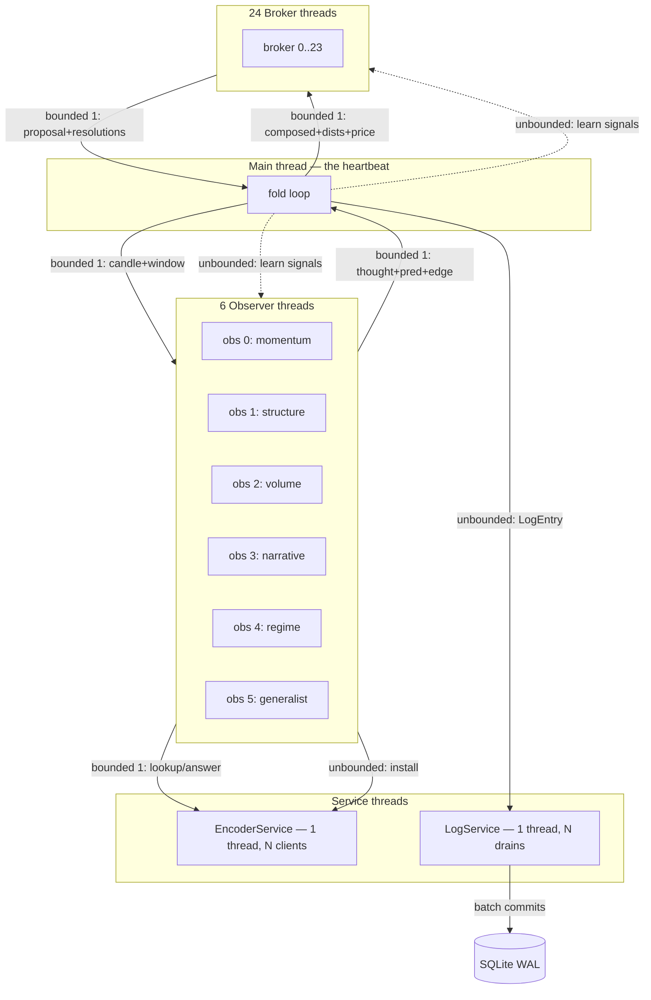

Solid arrows: data flow (bounded 1 = lockstep synchronization).
Dashed arrows: learning signals (unbounded = fire and forget, CRDT
convergence). The main thread is the clock. The bounded(1) channels
ARE the synchronization — no locks, no mutexes, no shared state.

Each consumer decides its own schedule. The observer thread drains
at most MAX_DRAIN=5 learn signals per candle before encoding. The
broker thread drains at most MAX_DRAIN=5 before proposing. The
log service batches 100 rows per COMMIT. Each process is a function.
Each pipe is a value. The composition IS the concurrency.

---

## The composition

The full enterprise is the composition of all sub-circuits. The encoding
circuit feeds the learning circuit — with incremental bundling for
laziness. The paper circuit is the learning circuit applied to
hypotheticals — each side resolves independently. The funding circuit
converts proposals into trades. The breathing stops circuit adapts
active trades every candle — the value extraction mechanism. The
cascade circuit provides distances at every experience level — through
K=10 bucketed accumulators with breathing range. The propagation
circuit closes the loop. The binary circuit wraps them all — it drives
the fold through 30+ threads connected by pipes. The moment circuit
decouples prediction from learning — the moment acts, the past teaches,
both converge. The pipe circuit IS the CSP — each process owns its
schedule, bounded channels synchronize, unbounded channels learn.

`f(state, candle) → state` — one tick of the clock. All circuits fire.
The moment circuits fire in constant time. The learning circuits fire
when they can. The pipes carry the signals. The fold advances. Grace
strengthens. Violence decays. The machine learns.
