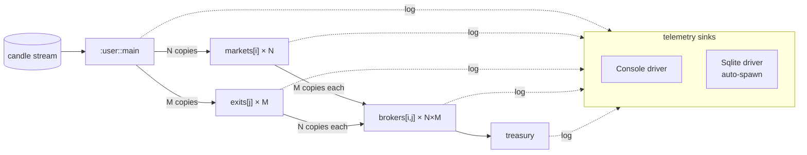
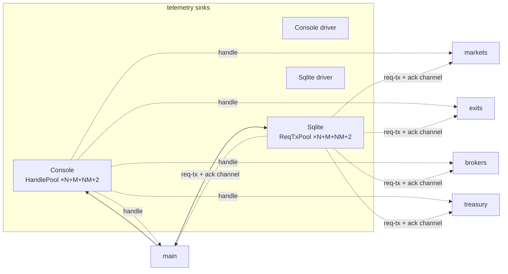
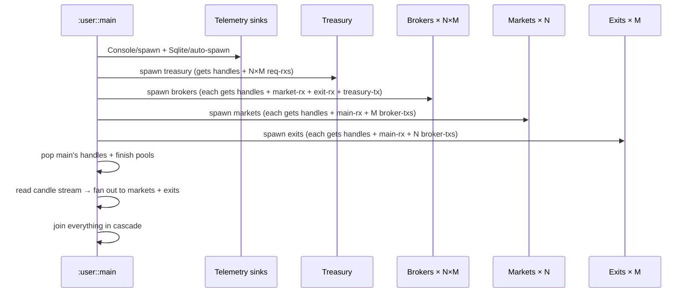

# CIRCUIT — the trader's wiring diagram

Companion to `wat-rs/docs/CIRCUIT.md` — that doc is the substrate's
wiring discipline (`:user::main` constructs pipes, plugs each into
its consumer, runs the input stream; resources are opened by the
worker that uses them; pipes cross threads, resources don't). This
doc is the LAB's specific circuit — what topology the trader
constructs on top of that discipline, what flows through it, what
each stage does.

Top-down: highest-level shape first, drill into channels last.

---

## The pulse

The candle stream is the program's pulse. One emission per 5-min
bucket from `data/btc_5m_raw.parquet` (Jan 2019 – Mar 2025;
652,608 rows). Bounded for development (`open-bounded "..." 15`);
unbounded for production backtest.

When the stream ends, the program ends. Nothing else drives time
in the system; everything downstream consumes the candle and
forwards or discards.

---

## The full circuit



Solid arrows = candle flow. Dashed arrows = telemetry. Every
stage logs every receipt; every receipt is timestamped at
`t-recv-ns` so the cascade is reconstructable from the run db.

---

## The cartesian product

The middle layer is the load-bearing recognition: **N market
opinions × M exit opinions = N×M combined positions to evaluate**.

```mermaid
flowchart TB
    candle[(candle)] --> M0[market[0]]
    candle --> M1[market[1]]
    candle --> E0[exit[0]]
    candle --> E1[exit[1]]

    M0 --> B00[broker[0,0]]
    M0 --> B01[broker[0,1]]
    M1 --> B10[broker[1,0]]
    M1 --> B11[broker[1,1]]

    E0 --> B00
    E0 --> B10
    E1 --> B01
    E1 --> B11

    B00 --> T[treasury]
    B01 --> T
    B10 --> T
    B11 --> T
```

Diagram for N=M=2; production scales N and M independently. Each
broker is the Cartesian-product cell `(market_i, exit_j)` — it
sees ONE market opinion and ONE exit opinion per candle, combines
them into a position evaluation, ships to treasury.

The treasury aggregates across ALL N×M brokers per candle.

---

## What each stage does

### `:user::main` — the wiring diagram

Constructs every pipe; pops every handle from every pool; spawns
every worker; runs the candle stream; joins everything in cascade.
Per `wat-rs/docs/CIRCUIT.md` rule 1: NO computation in main, only
wiring.

### Market observers (× N)

Each market observer holds an opinion about market direction.
Stage shape:

- **In:** one `:trading::candles::Ohlcv` per candle from main.
- **Work:** encode a market thought (Phase 2 — placeholder
  forward-only in Phase 1's smoke test).
- **Out:** the (encoded) opinion broadcast to its M downstream
  brokers (one per `broker[i,*]` for this market `i`).
- **Logs:** `circuit.market` Telemetry row, dimensions
  `{stage:"market", idx:i}`, value `t-recv-ns`.

### Exit observers (× M)

Each exit observer holds an opinion about exit conditions
(stop-loss, take-profit, hold-duration). Same shape as market:

- **In:** one Ohlcv per candle from main.
- **Work:** encode an exit thought (placeholder in Phase 1).
- **Out:** broadcast to its N downstream brokers (one per
  `broker[*,j]` for this exit `j`).
- **Logs:** `circuit.exit` Telemetry row, dimensions
  `{stage:"exit", idx:j}`.

### Broker observers (× N×M)

Each broker is the Cartesian-product cell. Per candle:

- **In:** ONE message from `market[i]`, ONE message from
  `exit[j]`. Order doesn't matter; bounded(1) on each makes
  both arrive before the broker can advance.
- **Work:** combine the two opinions into a position evaluation
  (placeholder in Phase 1).
- **Out:** evaluation to treasury.
- **Logs:** `circuit.broker` Telemetry row, dimensions
  `{stage:"broker", market:i, exit:j}`.

### Treasury

The terminal stage. Per candle, receives N×M evaluations (one per
broker). Phase 1: log each receipt, discard. Phase 2 onwards:
aggregate decisions, decide actual paper trades, enforce
deadlines, label retroactively at resolution (per Proposal 055).

- **In:** N×M evaluations per candle.
- **Work:** Phase 1 — none. Phase 2+ — aggregate + decide.
- **Out:** Phase 1 — none. Phase 2+ — paper-resolution events
  back to brokers / reckoner.
- **Logs:** `circuit.treasury` Telemetry row per receipt,
  dimensions `{stage:"treasury", market:i, exit:j}`.

---

## Channel topology

For a circuit with N markets, M exits, N×M brokers, 1 treasury:

| Direction | Channels | Purpose |
|---|---|---|
| `main → market[i]` | N | one bounded(1) per market observer |
| `main → exit[j]` | M | one bounded(1) per exit observer |
| `market[i] → broker[i,j]` | N×M | each market fans out to M brokers |
| `exit[j] → broker[i,j]` | N×M | each exit fans out to N brokers |
| `broker[i,j] → treasury` | N×M | each broker has its own line in |
| Console handle pool | 1 + N + M + N×M + 1 | one handle per producer scope (mini-TCP) |
| Sqlite handle pool | 1 + N + M + N×M + 1 | one handle per producer scope (batch-log + ack) |

Total candle-flow channels: `N + M + 3·N·M`.
For N=M=2: `2 + 2 + 12 = 16` candle channels.

Console + Sqlite handle pools each need one handle per producer
scope; with 1 (main) + N (markets) + M (exits) + N×M (brokers) +
1 (treasury) = `2 + N + M + N·M` producers. For N=M=2: 9 producer
scopes, 9 console handles, 9 sqlite handles.



Each producer scope creates its own bounded(1) ack channel for
sqlite (per arc 089's `Service::AckChannel` discipline) and pops
its own pre-paired Console::Handle (per arc 089 slice 5's
mini-TCP via paired channels). Both telemetry sinks land their
work-units durable before the producer's next message can queue.

---

## Lifecycle

### Spawn order (bottom-up; worker that opens a resource is the
worker that uses it)



### Shutdown cascade (CIRCUIT.md rule: scope IS shutdown)

When the candle stream returns `:None`, `:user::main`'s candle
loop exits. The exit cascade follows the wiring:

1. Main exits its loop → main's `let*` ends → its market-txs and
   exit-txs drop.
2. Markets see disconnect → their loops exit → their broker-txs
   drop.
3. Exits see disconnect → their loops exit → their broker-txs
   drop.
4. Brokers see one disconnect (market or exit), then the other
   → their loops exit → their treasury-txs drop.
5. Treasury sees N×M disconnects → its loop exits.
6. All telemetry-side senders dropped along the way → telemetry
   sinks see disconnect → their loops exit.
7. `:user::main` joins each driver in cascade order; everything
   completes.

No explicit teardown. The wiring is the shutdown.

---

## Logging

Every stage emits exactly ONE `:trading::log::LogEntry::Telemetry`
row per receipt:

| Namespace | When | Dimensions | metric_value |
|---|---|---|---|
| `circuit.candle` | main per candle | `{}` | `t-now-ns` at fan-out time |
| `circuit.market` | market[i] per candle | `{stage:"market", idx:i}` | `t-recv-ns` |
| `circuit.exit` | exit[j] per candle | `{stage:"exit", idx:j}` | `t-recv-ns` |
| `circuit.broker` | broker[i,j] after both recvs | `{stage:"broker", market:i, exit:j}` | `t-recv-ns` (after the second recv) |
| `circuit.treasury` | treasury per receipt | `{stage:"treasury", market:i, exit:j}` | `t-recv-ns` |

For the smoke test (N=M=2, 15 candles):

```
candle:    15 rows
market:    30 rows  (2 markets × 15)
exit:      30 rows  (2 exits × 15)
broker:    60 rows  (4 brokers × 15)
treasury:  60 rows  (60 broker→treasury messages)
─────────────────
total:    195 rows
```

Per-stage latency reconstructable post-hoc:

```sql
-- Mean latency, candle → broker per (market, exit) pair
SELECT
  json_extract(dimensions, '$.market') AS market_idx,
  json_extract(dimensions, '$.exit')   AS exit_idx,
  AVG(b.metric_value - c.metric_value) / 1e6 AS broker_lag_ms
FROM telemetry b
JOIN telemetry c
  ON c.namespace = 'circuit.candle'
 AND c.timestamp_ns < b.timestamp_ns
 AND c.timestamp_ns > b.timestamp_ns - 1e9
WHERE b.namespace = 'circuit.broker'
GROUP BY market_idx, exit_idx;
```

---

## The smoke test (Phase 1)

Goal: prove the wiring topology works end-to-end before the
observers carry any thought logic.

- **N = 2, M = 2** — smallest cartesian product that's still
  cartesian. 4 brokers; 9 producer scopes; ~12 driver threads.
- **15 candles** — bounded `:trading::candles::open-bounded`.
- **No thought logic** — every observer just `recv → log →
  forward → loop`. Treasury just `recv → log → discard → loop`.
- **All channels bounded(1)** — backpressure inherits from the
  substrate; no special tuning.
- **Acceptance:** 195 telemetry rows in the run db, per-stage
  cascade observable via SQL, Console driver shows ordered start
  / heartbeat / stopped events from each producer.

---

## Production scaling (Phase 3)

After Phase 2 (designer-subagent passes per
`docs/proposals/2026/04/059-the-trader-on-substrate/PHASES.md`)
delivers real thought logic, the same circuit absorbs it
unchanged. The numbers grow:

- **N and M** — tuned per the designer-subagent rounds. Likely
  N ∈ [3, 5], M ∈ [2, 3]; N×M ∈ [6, 15] brokers.
- **652,608 candles** — full 6-year stream, unbounded
  `:trading::candles::open`.
- **Performance gate:** ≥272 candles/sec sustained
  (652,608 candles in ≤40 minutes wall time per Proposal 059's
  Vision document).

The topology stays. The numbers grow. The smoke test's wiring
IS the production wiring.

---

## What this rides on

- **`wat-rs/docs/CIRCUIT.md`** — substrate-level wiring discipline
  (`:user::main` is the wiring diagram; resources are opened by
  the worker that uses them; pipes cross threads, resources
  don't).
- **`wat-rs/docs/ZERO-MUTEX.md`** — the three tiers, plus the
  mini-TCP via paired channels pattern that every producer-to-
  destination link in this circuit follows.
- **`wat-rs/docs/SERVICE-PROGRAMS.md`** — how each observer /
  broker / treasury is structured as a service program.
- **`wat-rs/docs/CONVENTIONS.md`** — naming, the substrate
  generic + consumer concrete alias rule, the service contract
  (Reporter + MetricsCadence).
- **`:wat::std::service::Console`** — every stage's logger
  handle.
- **`:wat::std::telemetry::Sqlite/auto-spawn`** — high-fidelity
  Telemetry rows; consumer-side `:trading::telemetry::Sqlite/spawn`
  wraps with WAL + transaction discipline (arc 089).
- **`:trading::candles::Stream`** — candle source (parquet
  reader). The stream IS the pulse.

---

## What this circuit DOESN'T cover yet

- **Cache** — `wat/cache/{L1, L2-spawn, walker, reporter}.wat`
  exists but has zero callers. Milestone 3 of `059-001` wires
  the cache into observer hot paths (likely `market` and
  `broker` first; `exit` and `treasury` later).
- **Thought logic** — every observer is a placeholder
  `recv → log → forward` in Phase 1. Phase 2 (designer-subagent
  rounds) substitutes real wat thoughts.
- **Resolution + retroactive labeling** — Proposal 055's
  treasury-driven resolution. Phase 2+. Treasury currently
  discards; later it opens / closes papers and the reckoner
  labels them at resolution.
- **Trust ladder** — multi-broker tournament; ProposerRecord;
  conviction-based size scaling. Phase 3+.

The circuit's topology supports all of these without restructure.
What grows is the work each stage does, not where each stage
sits.

---

## Cross-references

- Proposals — `docs/proposals/2026/04/`:
  - `055-treasury-driven-resolution/` — paper lifecycle, deadlines
  - `056-thought-architecture/` — three-thinker decomposition
  - `057-l1-l2-cache/` — cache architecture
  - `059-the-trader-on-substrate/` — the umbrella; phase-by-phase
    plan; this circuit is what 059's sub-arcs construct
- Substrate docs — `wat-rs/docs/`:
  - `CIRCUIT.md` — substrate wiring discipline
  - `ZERO-MUTEX.md` — concurrency tiers + mini-TCP pattern
  - `SERVICE-PROGRAMS.md` — service program template
  - `CONVENTIONS.md` — naming + service contract
