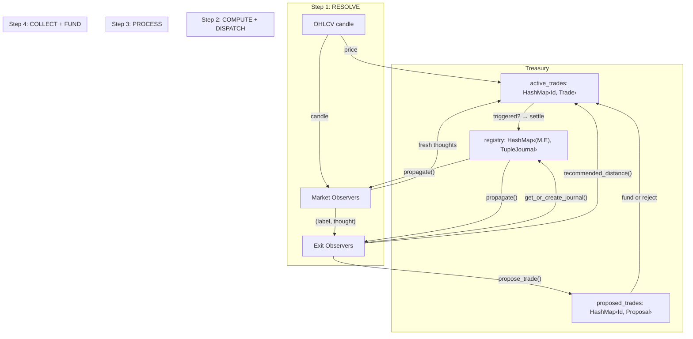

# Proposal 007: Exit Proposes

**Scope: userland** -- existing forms only. No new language forms. No new primitives.

---

## 1. The current state

The enterprise processes one candle at a time in a single pass. Market observers encode thoughts. The manager aggregates. The desk opens positions when conviction is sufficient. Positions are managed with fixed ATR multipliers (k_trail, k_stop, k_tp). The exit module has four proven pieces that are not yet wired into the candle loop:

**LearnedStop** (`src/exit/learned_stop.rs`): Nearest neighbor regression over (thought, distance) pairs. Given a thought vector, returns a weighted average of distances from similar thoughts. Tested: trending regime returns 0.05%, choppy regime returns 1.40%. The interface is two methods: `observe(thought, optimal_distance, weight)` and `recommended_distance(thought)`.

**compute_optimal_distance** (`src/exit/optimal.rs`): Sweeps trailing stop distances over a resolved price history and finds the one that maximized residue. Pure function. No state. Tested on ascending, reversal, choppy, and realistic BTC shapes. The market's answer to "what distance should you have used?"

**ScalarAccumulator** (`src/exit/scalar.rs`): Accumulates f64-encoded scalar values by outcome. Grace observations and violence observations build separate prototypes. Extract via sweep recovers the learned value. Tested: recovers 1.70 exactly from noisy input.

**TupleJournal** (`src/exit/tuple.rs`): The accountability primitive. One journal per (market observer, exit observer) pair. Labels: Grace/Violence from treasury reality. Proof curve gates treasury funding. Scalar accumulators attach to each tuple for per-parameter learning.

**DualExcursion** (`src/position.rs`): Tracks buy-side and sell-side excursions independently per pending entry. Four floats (buy MFE, buy MAE, sell MFE, sell MAE) plus trailing stop state for both sides. 99.9% organic resolution -- both sides resolve through price movement, not timers.

All five are tested. None are in the candle loop. The market observers produce thoughts that go nowhere except the single-sided MFE/MAE labeling. The exit module exists as an island of proven code.

## 2. The problem

The market observer proposes trades. This is wrong. The market observer perceives direction. It does not know how to manage a trade. It does not know what trailing stop distance to use. It does not know when the position it created should close. It fires and forgets.

The market observer's conviction becomes the sizing signal. But conviction about DIRECTION is not conviction about MANAGEABILITY. A strong directional signal in a volatile regime is a different trade than the same signal in a trending regime. The market observer cannot distinguish these -- it sees direction, not distance.

The fixed ATR multipliers (k_trail, k_stop, k_tp) fill the gap that should be filled by a learning entity. The multipliers are the same for every trade, regardless of what the market observer thought at entry. A trending thought and a choppy thought get the same stop. This is the last magic.

The exit module has the primitives to fill this gap -- LearnedStop predicts distance from thought, compute_optimal_distance provides the training signal, TupleJournal provides accountability -- but there is no entity that wires them together. No process that receives a market thought, checks its own experience, decides "I know how to manage this kind of thought," and proposes the trade.

## 3. The proposed change

### Five CSP phases per candle

The single-pass candle loop becomes four sequential steps. Reality first. The parallelism is WITHIN Step 2 — all (market, exit) pairs compute simultaneously via par_iter. Steps are sequential. The CSP is in the collect().

```
candle arrives
  │
  ├─ Step 1: RESOLVE     treasury closes triggered trades
  │                       accounting, propagate through tuple journals
  │
  ├─ Step 2: COMPUTE     par_iter(market_observers) → thoughts            collect()
  │                       par_iter(exit_observers × thoughts) → compose    collect()
  │                       → composed thoughts ready
  │                       → proposals populated
  │                       → distances computed
  │
  ├─ Step 3: PROCESS     using fresh composed thoughts from Step 2:
  │                       iterate active_trades → update triggers
  │                       iterate paper entries → tick, resolve → learning
  │
  ├─ Step 4: COLLECT     evaluate proposals from Step 2
  │                       fund or reject — all in this candle
  │                       proposed_trades is EMPTY after this step
  │
  └─ next candle (proposed_trades empty, active_trades updated)
```

Four steps. Sequential. The parallelism is horizontal inside Step 2 — N market observers × M exit observers compute simultaneously. Each par_iter completes before the next starts. Collect is the handoff. No carry across candles. Propose and fund in the same candle. The proposed_trades map fills in Step 2, drains in Step 4, empty at the end. Clean.

### Signal flow diagram



Signals and their types:
- `OHLCV → Market Observers`: raw candle data
- `Market Observer[i] → Exit Observer[j]`: `(label, Vector)` — one named thought per (market, exit) pair
- `Exit Observer → Treasury.registry`: `get_or_create_journal(market_id, exit_id)` — journal lives on treasury
- `Exit Observer → Treasury.proposed_trades`: `propose_trade(journal, composed, distance, conviction)`
- `Treasury.registry → Market Observer`: Win/Loss label (via tuple_journal.propagate)
- `Treasury.registry → Exit Observer`: optimal distance from hindsight (via tuple_journal.propagate)
- `Treasury.proposed_trades → Treasury.active_trades`: funded proposals move, rejected discard

No signal crosses without going through the tuple journal. The tuple journal is the central routing fiber. Every other connection is point-to-point.

### The tuple journal is a closure

The tuple journal is a closure over `(market_observer, exit_observer)`. Its identity IS the pair it captured. `propagate()` is the anonymous function — it knows how to route to THOSE two specific observers because it closed over them.

```rust
// Conceptually:
let propagate = |outcome, closes, entry_price| {
    let optimal = compute_optimal_distance(closes, entry_price, 100, 0.05);
    exit_observer.learned_stop.observe(thought, optimal.distance, optimal.residue);
    market_observer.resolve(thought, outcome_to_label(outcome));
    self.track_record.update(outcome);
};
```

The closure captures the pair. The closure routes the signal. The closure accumulates the track record. In Rust it's implemented as a struct (closures with state need a struct). But the concept: the tuple journal IS the anonymous function that routes reality to the right observers. The struct is the implementation. The closure is the thought.

### The treasury as registry

The treasury holds three maps:

```rust
registry:  Vec<TupleJournal>       // N×M, pre-allocated at startup, permanent
proposals: Vec<Option<Proposal>>   // N×M, pre-allocated, cleared every candle
trades:    Vec<Option<Trade>>      // N×M, pre-allocated, insert/remove
```

Index: `i = market_idx * M + exit_idx`. The index IS the pair identity. O(1) by arithmetic, not by hash.

All three are flat vecs. Pre-allocated at startup. Fixed size N×M. Never grow. Never shrink. Each slot is owned by exactly one (market, exit) pair. No two threads ever touch the same slot.

**Mutex-free parallel updates.** Rayon's `par_iter_mut` writes to disjoint slots. No mutex. No atomic. No lock. The borrow checker proves the writes are disjoint by construction. The flat vec IS the lock-free CSP channel. Each slot is an independent mailbox.

- `registry[i]` — only pair `i` reads or writes its journal
- `proposals[i]` — only pair `i` writes its proposal in Step 2, only Step 4 reads
- `trades[i]` — only pair `i` manages its trade in Step 3, only Step 1 settles

The **registry** is permanent. Each slot is a closure over (market_observer, exit_observer). Accumulates Grace/Violence across all trades. Never cleared. The institutional memory.

The **proposals** vec is cleared at the end of every candle. Step 2 fills slots. Step 4 drains them. Empty after Step 4.

The **trades** vec has Some for active positions, None for empty slots. Step 1 settles and clears to None. Step 4 funds and sets to Some.

The **proposed_trades** map is the queue. Step 2 (COMPUTE + DISPATCH) inserts proposals via `treasury.propose_trade()`. Step 4 (COLLECT + FUND) iterates them — sorted by pair track record, conviction, or whatever metric the treasury uses to prioritize — funds the best, rejects the rest. Funded proposals move to `active_trades`. Rejected proposals are removed. The queue is empty after Step 4.

The **active_trades** map is the current state. Phase 1 (SETTLE) iterates it — closes what triggered, propagates, removes closed trades. Phase 3 (MANAGE) iterates it — updates triggers from fresh thoughts.

Three maps. The lifecycle within one candle:
- RESOLVE → close triggered trades, remove from `active_trades`, propagate
- COMPUTE → market × exit pipeline fills `proposed_trades`
- PROCESS → update triggers on `active_trades` with fresh thoughts
- COLLECT → fund from `proposed_trades` into `active_trades`, drain `proposed_trades`

No carry across candles. `proposed_trades` is empty at the end of every candle. Registry grows permanently. `active_trades` reflects the current state.

When an exit observer wants to propose a trade with a market observer's thought:
1. Look up `(market_id, exit_id)` in the registry.
2. If it doesn't exist → create it. Fresh tuple journal. No history. Ignorance.
3. If it exists → use it. Check the track record. Is the curve proven? Does it have allocation?

**Step 1: RESOLVE** — Reality first. Money before thoughts.

Close triggered trades. For each live entry in `active_trades`, check current price against trigger. If fired:
1. Execute the swap (fees, slippage).
2. Update the balance sheet.
3. Compute Grace/Violence from actual P&L.
4. `tuple_journal.propagate(outcome, &closes, entry_price)` — one call, the tuple does the rest.
5. Remove from `active_trades`.

Nothing else happens in Step 1. Just reality.

For each closed trade:
1. Execute the swap (target → source, with fees and slippage).
2. Update the balance sheet (units moved, fees charged, accumulation recorded).
3. Compute Grace/Violence from the actual P&L (including fees — the most honest number).
4. `tuple_journal.propagate(outcome, &closes, entry_price)` — one call, the tuple does the rest.

When a trade closes: settle, propagate, remove from the map. Clean.

**Step 2: COMPUTE + DISPATCH** — Market encodes, exit dispatches to treasury.

```
par_iter(market_observers) → [(label, thought), ...]                     collect()

for each (market_observer, thought):
    for each exit_observer:
        composed = bundle(thought, exit_judgment_facts)
        journal = treasury.get_or_create_journal(market_id, exit_id)
        distance = exit_observer.recommended_distance(composed)
        if experienced AND high_conviction:
            treasury.propose_trade(journal, composed, distance, conviction)
```

The market encoding is parallel (par_iter). The exit dispatch is sequential — it MUTATES the treasury (creates journals, inserts proposals). The treasury's registry and `proposed_trades` grow during this step.

Returns: `[(market_label, market_thought), ...]` — the fresh thoughts for Step 3.

After this step:
- Registry may have new (market, exit) journals
- `proposed_trades` has this candle's proposals
- Fresh thoughts are ready for active trade management

**Step 3: PROCESS** — Update active entries with fresh thoughts.

Using the composed thoughts from Step 2:
- Active entries → tick DualExcursion, adjust trailing stop from LearnedStop's recommendation for the CURRENT composed thought.
- Resolved entries → compute optimal distance, feed LearnedStop, label market observer, update TupleJournal.
- Paper entries → tick, resolve, learn.

**Step 4: COLLECT + FUND** — Evaluate and fund proposals from this candle.

For each proposal from Step 2:
- Look up `(market_id, exit_id)` in the registry. Create the tuple journal if new.
- Is the pair's curve proven? Is capital available? Does risk allow it?
- Funded → insert into `active_trades`. Rejected → discard.

`proposed_trades` is empty after this step. No carry across candles. Propose and fund in the same candle.

### The exit observer has its own vocabulary

Each exit observer has a judgment lens — its own vocabulary for evaluating market conditions. From proposal 006:

- **Volatility judge**: ATR regime, volatility shift, squeeze state.
- **Structure judge**: trend consistency, support/resistance quality.
- **Timing judge**: momentum state, reversal signals, duration patterns.
- **Exit generalist**: full judgment vocabulary.

The exit observer receives a market thought and COMPOSES it with its own judgment facts:

```scheme
(bundle
  market-thought
  (bind :volatility-regime (scalar $log atr-ratio))
  (bind :structure-quality (scalar $linear trend-consistency))
  (bind :squeeze-state     (scalar $linear squeeze)))
```

The composed thought — market context + exit judgment — is what the LearnedStop sees. This is why there are N exit observers: each composes differently. The volatility judge adds volatility facts. The timing judge adds timing facts. The same market thought produces different compositions, different LearnedStop queries, different distances.

The LearnedStop IS the exit observer's brain. `recommended_distance(composed_thought)` is its prediction. `observe(composed_thought, optimal_distance, weight)` is its learning. The composition makes each exit observer unique. Without it, they'd all return the same distance for the same market thought.

### Each magic number gets its own LearnedStop

k_trail, k_stop, and k_tp are all distances. Each gets its own LearnedStop:

- **Trail LearnedStop**: "given this thought, what trailing stop distance?" Trained from `compute_optimal_distance` with the trail parameter.
- **Stop LearnedStop**: "given this thought, how far should the safety stop be?" Same sweep, different question.
- **TP LearnedStop**: "given this thought, what take-profit distance?" Same sweep, applied to the upside.

Each learns independently. Each returns the default until enough resolved entries have trained it. The defaults are the current ATR multipliers -- the crutch. As the LearnedStops accumulate experience, the crutch is replaced by learned values. No hard switch. The LearnedStop returns `default_distance` when empty and blends toward the learned value as pairs accumulate.

### Paper trades live inside the tuple journal

The tuple journal — the closure over (market_observer, exit_observer) — holds the paper entries for its pair. Not a separate data structure. Not a global pending queue. Each closure manages its own papers. The papers are internal state of the closure.

When Step 2 dispatches a market thought to an exit observer, the exit observer looks up the tuple journal on the treasury: `registry[market_idx * M + exit_idx]`. That closure:
1. Receives the composed thought (market + exit judgment)
2. Creates a paper entry with a DualExcursion
3. Ticks all its existing paper entries with the fresh price
4. Resolves any that triggered → compute_optimal_distance → feed LearnedStop → learning
5. If conditions met → propose trade via `treasury.proposals[i] = Some(proposal)`

The papers never leave the closure. The closure IS the paper manager. When papers resolve, the learning happens inside the closure. When a paper is promoted to a live trade, it moves to `treasury.trades[i]` — but the closure still owns the accountability.

Live entries are a subset of paper entries that were:
1. Proposed by the exit observer (high market conviction + proven distance for this thought).
2. Funded by the treasury (TupleJournal proven, capital available, risk allows).

Both paper and live entries produce learning. Paper is the training ground. Live is the exam. Both live in the same closure — the tuple journal for that (market, exit) pair.

### Three learning streams — all simultaneous

**Paper stream** (every candle, every market thought): the exit observer receives the thought, manages the paper entry, adjusts the paper trigger. When the paper entry resolves, the exit observer computes the optimal distance and learns. This is the fast stream. Thousands of data points per run. Cheap lessons.

**Live management stream** (every candle, every open position): the treasury asks the owning exit observer "what's the trigger now?" The exit observer queries its LearnedStop with the CURRENT thought — not the entry thought, the current one, because the market changed. The trigger moves every candle. This is the active stream. Real money, real adjustment, real time.

**Reality stream** (on position close): the treasury reports Grace/Violence with the actual amount. The exit observer learns from reality. The market observer receives the Win/Loss label. The TupleJournal records the pair's track record. This is the slow stream. Most honest. Final.

All three feed the same LearnedStop. Paper fills it fast with cheap lessons. Live management keeps it current with the market's state. Reality corrects it with the most honest signal. The learning never stops.

### The optimal distance replaces ALL magic numbers

The market does not use formulas. It uses measurement. `compute_optimal_distance` sweeps 100+ candidate distances against the actual price history from entry to resolution. It finds the peak residue. That is the market's answer.

The LearnedStop stores (thought, market_answer) pairs. When a new thought arrives, it queries: "what did the market say about thoughts like this?" The answer is a distance. Not a formula. Not a multiplier. A weighted average of the market's answers for similar thoughts.

The exit observer proposes only when:
1. The market observer has high conviction (strong directional signal).
2. The LearnedStop has proven experience for this kind of thought (not returning default).

Condition 2 is the key difference from today. Today, every high-conviction signal opens a trade with the same fixed stops. Under this proposal, the exit observer gates entries based on its own experience. A thought shape it has never seen stays on paper. A thought shape it has managed successfully before gets proposed.

### What changes

1. **Candle loop**: single pass becomes three passes (think, manage, settle). Each pass reads the output of the previous. No shared mutation within a pass.

2. **Exit observer**: wraps LearnedStop (one per distance parameter). Receives market thoughts. Proposes when experienced. Manages live entries every candle.

3. **Paper entries**: every market thought registers. DualExcursion tracks both sides. Resolved paper entries train the LearnedStops.

4. **Live entry creation**: the exit observer proposes, not the market observer. The treasury funds proposals from proven tuples.

5. **Label flow**: exit observer resolution becomes market observer Win/Loss label. The market observer learns from how the trade was managed, not from a fixed horizon drain.

6. **Trailing stop**: per-candle update from `recommended_distance(current_thought)`. The distance is contextual and learned, not fixed.

### What does NOT change

- The six primitives.
- The observer template (noise subspace + journal).
- The market observers' encoding pipeline.
- The risk branches.
- The accumulation model.
- The treasury's asset management.
- DualExcursion, LearnedStop, compute_optimal_distance, ScalarAccumulator, TupleJournal -- all exist and are tested.

## 4. The algebraic question

No new algebraic structures. The market observers use the existing pipeline (bind, bundle, journal, online-subspace, cosine, curve). The exit observer does not use the vector algebra for encoding -- it uses the vectors the market observers already produced as keys into a regression. The regression is cosine-weighted averaging, which is the same similarity primitive the journal uses.

The LearnedStop is `cosine(query, stored) * weight` summed over pairs. That is the same operation as journal prediction -- weighted similarity against accumulated experience. The difference is the output: the journal outputs a label (Win/Loss), the LearnedStop outputs a scalar (distance). Same geometry, different readout.

The TupleJournal uses the full algebra: bind, bundle, journal, noise subspace, curve. It operates on composed thoughts (market thought bundled with exit context). It is the third journal in the stack, alongside the market observer journal and the manager journal.

The coupling between passes is data flow: Pass 1 produces thoughts, Pass 2 consumes them and produces proposals + resolutions, Pass 3 consumes proposals and produces reality labels. No algebraic coupling. No shared vectors mutated across passes. CSP.

## 5. The simplicity question

**Is this simple or easy?** Simple. Each pass does one thing. Pass 1: think. Pass 2: manage. Pass 3: settle. The exit observer is a wrapper around LearnedStop, which is a tested primitive. The three-pass structure makes the data flow explicit -- no entangled mutation within a single candle step.

**What's being complected?** The risk is coupling the exit observer's proposal decision to the market observer's conviction. These are independent judgments: "is the direction strong?" and "can I manage this kind of thought?" The proposal gate requires both but they must remain separate measurements. The exit observer does not see conviction -- it sees the thought vector and queries its own experience.

**Could existing forms solve it?** They DO solve it. Every piece exists and is tested:
- LearnedStop: nearest neighbor regression. Tested.
- compute_optimal_distance: hindsight sweep. Tested.
- DualExcursion: dual-sided tracking. Tested, 99.9% organic resolution.
- TupleJournal: accountability primitive. Tested.
- ScalarAccumulator: continuous value learning. Tested.

The proposal is wiring. The pieces are proven. The question is the topology of the wiring, not the pieces themselves.

**What 005 and 006 attempted that this simplifies:**
- 005 proposed an exit panel with its own vocabulary lenses. This proposal keeps the vocabulary (volatility, structure, timing) but replaces the exit journal with a LearnedStop. The exit observer's intelligence is nearest neighbor regression on composed thoughts, not a journal with Win/Loss labels.
- 006 proposed N x M composition (N market observers x M exit observers) with dual-sided labeling and continuous management scalars. This proposal: the exit observer is simpler -- it is a regression, not a journal. It does not predict Buy/Sell. It predicts a distance. The composition is not bundle -- it is a function call.
- Both 005 and 006 described the exit observer as a full observer with its own encoding pipeline. This proposal: the exit observer has no encoding. It is a LearnedStop with a proposal gate. The intelligence is in the (thought, distance) pairs, not in a separate thought about the thought.

## 6. Questions for designers

1. **How many exit observers?** Each exit observer has its own judgment vocabulary (volatility, structure, timing, generalist). Each composes the market thought with its own facts, producing a different query into its LearnedStop. The question is not "one or many" — it's many, because they have different lenses. The question is: do we start with all four exit lenses, or start with one (exit generalist) and earn the specialization? The data from the 100k run should inform this — does the optimal distance vary more by volatility regime or by timing context?

2. **Paper entry memory.** Every market thought registers as a paper entry. Seven observers, one thought each per candle, each living until both sides of the DualExcursion resolve. At 99.9% organic resolution, entries die. But the buffer is implicit memory pressure. How many concurrent paper entries is reasonable? The DualExcursion is 8 floats per entry. At 7 observers x ~100 candle average lifetime, that is ~700 concurrent entries. Is this the right order? The buffer cap is the last implicit parameter.

3. **When does the exit observer start proposing?** The LearnedStop returns `default_distance` when it has zero pairs. As pairs accumulate, it blends. The question is the proposal gate: how many resolved paper entries must the LearnedStop have before the exit observer is willing to propose a live trade? This is the boot-up parameter. Too few and the exit observer proposes from ignorance. Too many and it stays on paper while the market moves. The TupleJournal's proof curve could gate this -- the exit observer proposes only when the tuple has proven Grace over Violence. Is the proof curve sufficient, or does the LearnedStop need its own minimum pair count?

4. **Does the exit observer adjust live stops every candle?** The current proposal says yes: each candle, the exit observer queries `recommended_distance(current_thought)` for each live entry. The thought changes each candle (new market state). The recommended distance changes as the LearnedStop accumulates new pairs. This means the trailing stop is not fixed at entry -- it adapts to the evolving market context and the exit observer's evolving experience. The question: is per-candle adjustment the right frequency, or should the stop only adjust at discrete events (regime change, DualExcursion milestone)?

5. **Label flow direction.** The proposal says: exit resolution becomes market observer Win/Loss label. Today, the label comes from single-sided MFE/MAE at horizon drain. The transition: paper entries resolve via DualExcursion (both sides organically), producing Buy/Sell + weight. The market observer's prediction is compared against this label. The exit observer's management quality is embedded in the resolution timing -- a well-managed entry resolves at a better price than a poorly-managed one. The question: does the dual-sided label from paper entries replace the current MFE/MAE label immediately, or should both run in parallel until the exit observer proves edge?

6. **The current thought as query key.** The exit observer queries `recommended_distance(current_thought)` where `current_thought` is the market observer's thought at the CURRENT candle, not the entry candle. This means the distance adapts as the market changes -- what started as a trending thought might look choppy 20 candles later, and the recommended distance shifts. Is this correct? The alternative: query with the ENTRY thought (fixed at entry, never changes). The entry thought captures what the market looked like when the trade was opened. The current thought captures what it looks like now. Which is the right key for "what distance should the stop be?"
