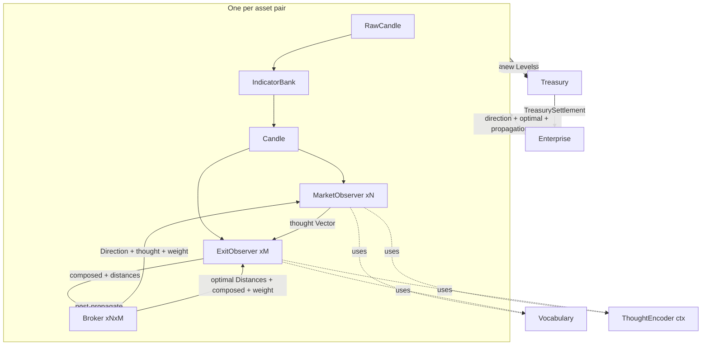
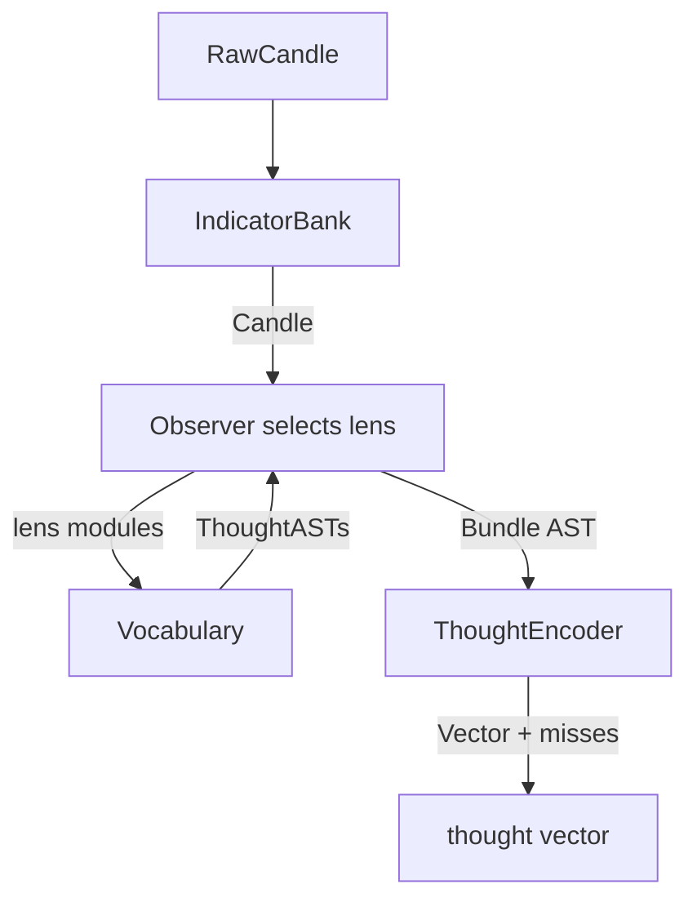
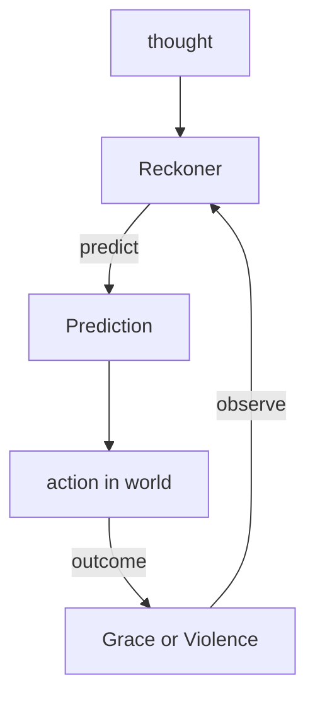
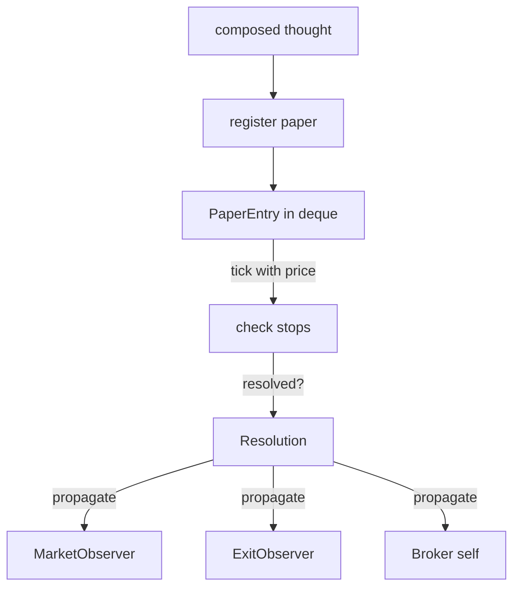
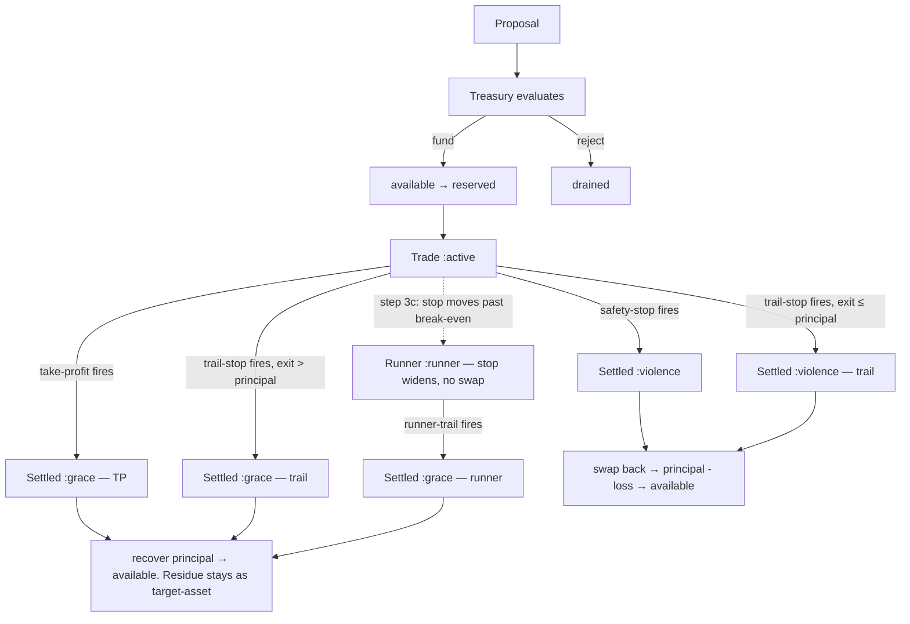
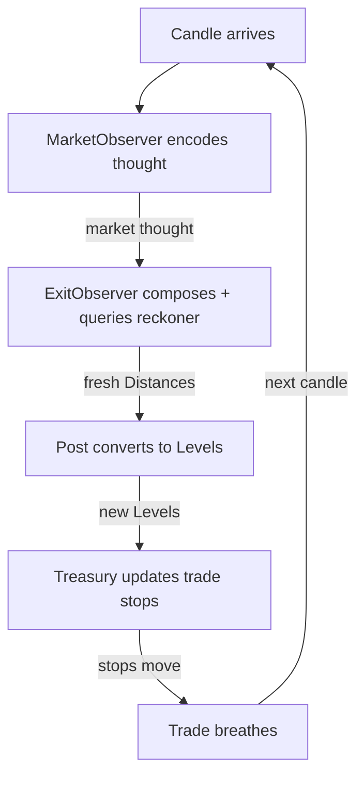
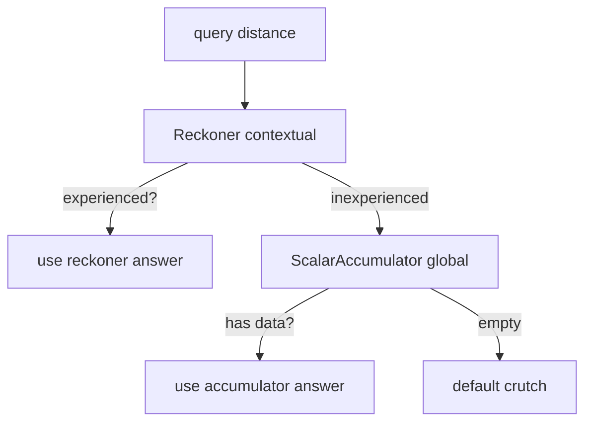
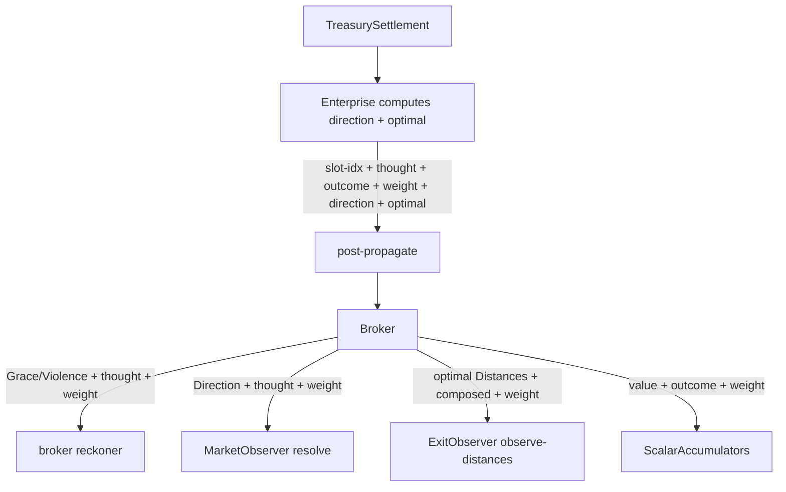
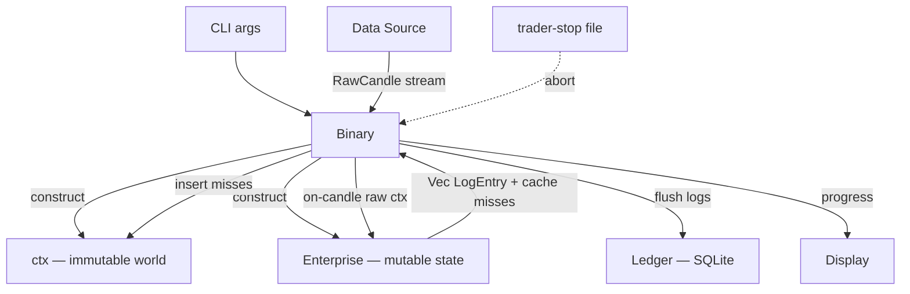

# The Circuits

*The machine as signal flow diagrams. For humans.*

Each circuit is a mermaid graph definition. GitHub renders them natively.

---

## 1. The full enterprise

Signals flow down (candle → thought → proposal). Outcomes flow back up
(settlement → propagation → observers). The circuit is a loop. The fold
is one tick of the clock.

Note: dashed arrows (-.->|uses|) show tools the observers call, not data
flow. The observer calls Vocabulary for ASTs, then ThoughtEncoder for
Vectors. Vocabulary and ThoughtEncoder are tools, not upstream producers.

**Component legend:**

| Node | Contains | Produces |
|------|----------|----------|
| **IndicatorBank** | streaming state (ring buffers, EMA accumulators) | Candle (100+ indicators) |
| **Vocabulary** | pure functions, no state | Vec\<ThoughtAST\> — data, not execution |
| **ThoughtEncoder** | atoms (permanent dict) + compositions (LRU cache, eventually-consistent via returned misses) | Vector from AST |
| **MarketObserver ×N** | lens (MarketLens), reckoner :discrete (Up/Down, curve internal), noise-subspace, window-sampler, engram gate | (Vector, Prediction, edge, misses\*) |
| **ExitObserver ×M** | lens (ExitLens), 4× reckoner :continuous (trail, stop, tp, runner-trail), default-distances | (Distances, experience) via cascade + misses\* |
| **Broker ×N×M** | reckoner :discrete (Grace/Violence, curve internal), noise-subspace, papers (deque), 4× scalar-accumulator, engram gate | Prediction + edge() |
| **Post** | indicator-bank, candle-window, market-observers, exit-observers, registry | Vec\<Proposal\> + Vec\<Vector\> + misses\* |
| **Treasury** | available ◄──► reserved, trades, trade-origins, next-trade-id | TreasurySettlement on settle |
| **Enterprise** | posts, treasury, market-thoughts-cache | (Vec\<LogEntry\>, misses\*) per candle |

\*misses = Vec\<(ThoughtAST, Vector)\> — cache misses returned as values, inserted by the binary between candles.

**Edge legend — data flow (solid arrows):**

| From → To | Type | Method |
|-----------|------|--------|
| RC → IB | RawCandle | tick(raw) → Candle |
| CD → MO | Candle (via candle-window slice) | observe-candle(window, ctx) → (Vector, Prediction, edge, misses) |
| CD → EO | Candle (for exit facts) | encode-exit-facts(candle) → Vec\<ThoughtAST\> |
| MO → EO | Vector (market thought) | evaluate-and-compose(thought, fact-asts, ctx) → (Vector, misses) |
| EO → BR | composed Vector + (Distances, experience) | recommended-distances(composed, accums) → (Distances, f64) |
| Post → TR | Proposal (the barrage) | post assembles from broker outputs, treasury evaluates |
| TR → EN | TreasurySettlement | settle-triggered(prices) → (Vec\<TreasurySettlement\>, Vec\<LogEntry\>) |
| EN → Post | direction + optimal + propagation args | post-propagate(post, slot-idx, thought, outcome, weight, direction, optimal) |
| Post → BR | propagation args | broker.propagate(thought, outcome, weight, direction, optimal, observers) |
| BR → MO | Direction + thought + weight | resolve(thought, direction, weight) |
| BR → EO | optimal Distances + composed + weight | observe-distances(composed, optimal, weight) |
| TR → Post | active trades for trigger update | trades-for-post(post-idx) — step 3c |
| Post → TR | new Levels | update-trade-stops(trade-id, new-levels) — step 3c |

**Tool usage (dashed arrows):**

| Observer | Tool | Purpose |
|----------|------|---------|
| MO, EO | Vocabulary | produce Vec\<ThoughtAST\> from Candle |
| MO, EO | ThoughtEncoder (ctx) | evaluate ASTs into Vectors |

---

## 2. The encoding circuit

Pure. No learning. No state (except the ThoughtEncoder's eventually-consistent
cache). RawCandle in, Vector out.

The observer selects which vocabulary modules fire (its lens). The
vocabulary produces ASTs — data describing what to think. The observer
wraps them in a Bundle. The encoder evaluates — computing the minimum
work via cache. Atoms are permanent. Compositions are optimistic (LRU,
eventually-consistent via returned misses).

---

## 3. The learning circuit

The feedback loop. Where Grace and Violence shape the next prediction.

The reckoner accumulates observations. The discriminant sharpens. The
prediction improves. The loop is the learning. Each tick, the reckoner
that predicted Grace gets stronger. The one that predicted Violence
gets weaker.

---

## 4. The paper circuit

The fast learning stream. Every candle. Every broker. No real capital.

Papers play both sides (buy and sell) simultaneously. When a side's
trailing stop fires, the paper resolves. Direction: buy-side fires → :up,
sell-side fires → :down. The resolution carries the optimal distances
from hindsight. Papers are how the machine learns before it trades.

---

## 5. The funding circuit

The capital lifecycle. Deploy, protect, recover, accumulate.

Note: dashed arrow (-.->|step 3c|) is the runner TRANSITION — a stop-
management event in step 3c, not a settlement trigger. Solid arrows
are settlement triggers that fire in step 1.

The treasury funds proven proposals. Capital moves from available to
reserved. The trade is :active. One entry swap, one exit swap. Two
swaps total. The runner is NOT a swap — the stop widens. The trade
rides until exit. Each swap costs `swap-fee + slippage`.
- **Safety-stop fires** → :settled-violence. Full position swaps back.
  Principal minus loss returns. Bounded by reservation.
- **Take-profit fires** → :settled-grace. Price reached the TP level.
  Principal recovers, residue stays as target asset.
- **Trailing-stop fires on :active** → outcome depends on exit vs principal.
  Exit > principal → :settled-grace (residue is permanent gain).
  Exit ≤ principal → :settled-violence (loss bounded by reservation).
- **Step 3c: stop moves past break-even** → :runner transition. No swap.
  No exit. The trailing stop WIDENS. The trade continues. Zero effective
  risk — exit would recover the principal.
- **Runner-trail fires** → :settled-grace. Full position swaps back.
  Treasury splits proceeds: principal returns, residue is permanent gain.

---

## 6. The breathing stops circuit

Step 3c. Every candle. The stops adapt to the current market context.

The exit observer's reckoner learned from every prior resolution which
distances produced Grace. Step 3c applies that learning to active trades
continuously. The reckoner sees the current thought — volatility,
momentum, regime — and predicts: "for THIS context, trail at 1.8%,
stop at 3.2%." The distances convert to price levels. The trailing
stop moves. The trade breathes.

This IS the value extraction mechanism. Not set-and-forget. Continuous
adaptation. The trade captures as much residue as the market will give,
bounded by the learned distances. The runner's wider stop is learned
by the fourth reckoner (runner-trail) — wider because losing house
money costs nothing.

---

## 7. The cascade circuit

Three levels of distance knowledge. Specific to general.

For each distance (trail, stop, tp, runner-trail): try the contextual answer first
(reckoner — "for THIS thought, what distance?"). If inexperienced, try the
global answer (scalar accumulator — "what does Grace prefer for this pair
overall?"). If empty, use the crutch (the default value from construction).

---

## 8. The propagation circuit

The signal that teaches. TreasurySettlement → enterprise computes → observers learn.

The enterprise computes direction and optimal-distances from the
TreasurySettlement's trade (replays price-history). Routes values directly —
no intermediate Settlement struct. Routes
to the post. The post calls broker.propagate. The broker fans out —
weight on every edge, because a large Grace teaches harder than a
marginal one: Grace/Violence to its own reckoner, Direction to the
market observer, optimal Distances to the exit observer, scalar values
to the accumulators. Everyone learns from one resolution.

---

## 9. The binary circuit

The outer loop. The fold driver. Everything above happens INSIDE one
call to `on-candle`. The binary is what calls it.

The binary creates the world (ctx) and the machine (enterprise) from
CLI arguments. It opens the data source — parquet or websocket. It
feeds raw candles one at a time. It collects log entries and cache
misses from each `on-candle` call. It inserts cache misses into ctx's
ThoughtEncoder between candles (the one seam). It flushes log entries
to the ledger in batches. It displays progress. It checks the kill
switch. When the stream ends, it prints the summary.

The binary does not think. It drives the fold and writes what happened.

---

## The composition

The full enterprise is the composition of all sub-circuits. The encoding
circuit feeds the learning circuit. The paper circuit is the learning
circuit applied to hypotheticals. The funding circuit converts proposals
into trades. The breathing stops circuit adapts active trades every
candle — the value extraction mechanism. The cascade circuit provides
distances at every experience level. The propagation circuit closes
the loop. The binary circuit wraps them all — it drives the fold and
persists the results.

`f(state, candle) → state` — one tick of the clock. All circuits fire.
The fold advances. Grace strengthens. Violence decays. The machine learns.
