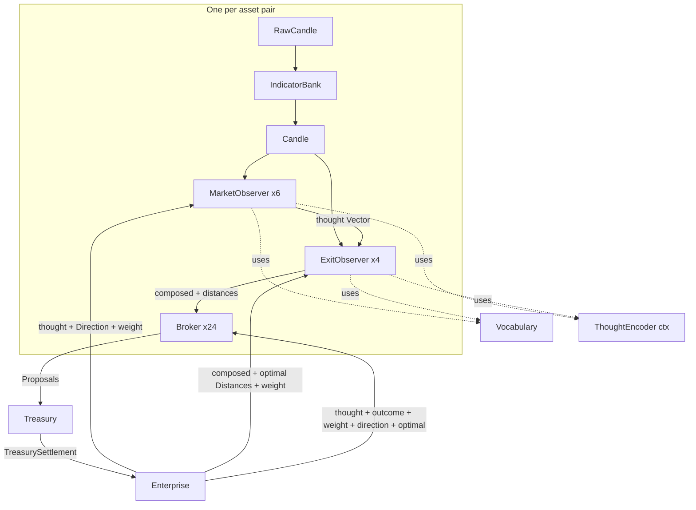
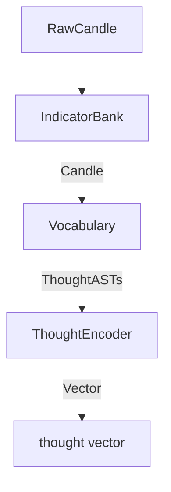
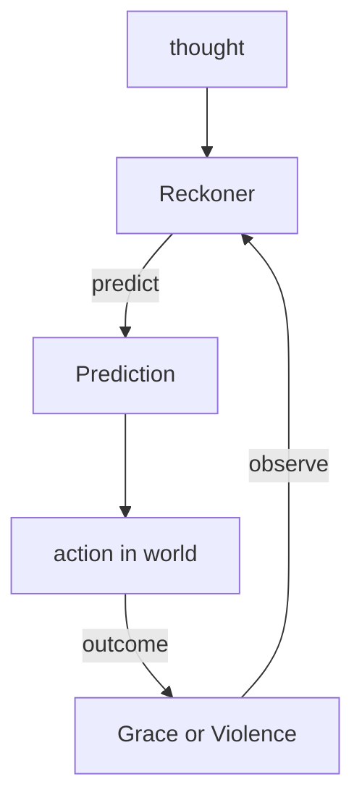
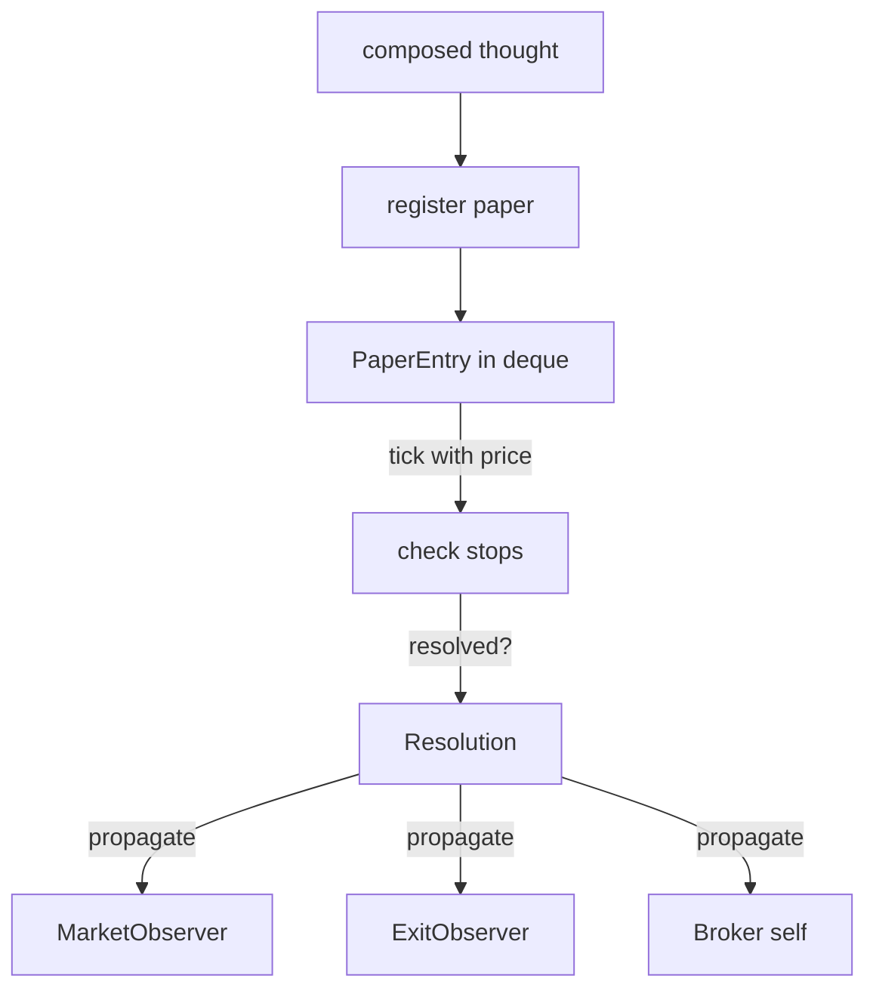
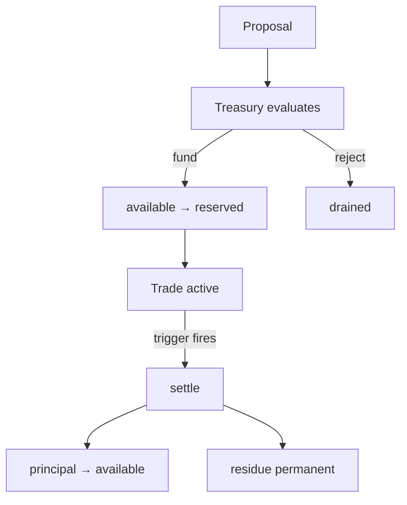
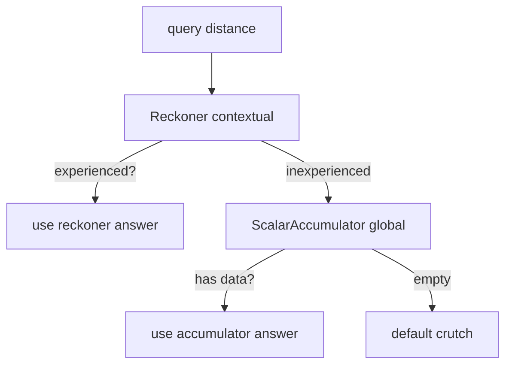
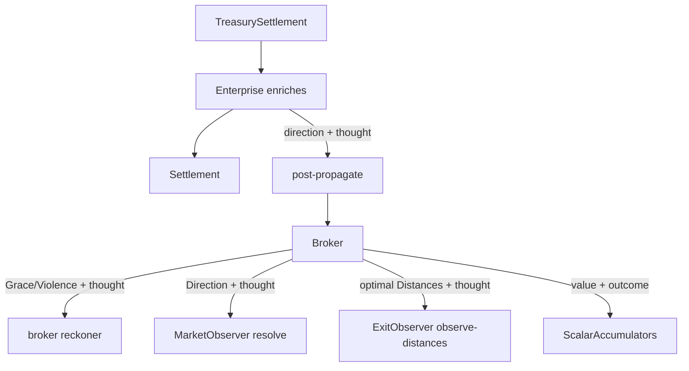

# The Circuits

*The machine as signal flow diagrams. For humans.*

Each circuit is a mermaid graph definition. GitHub renders them natively.

---

## 1. The full enterprise

Signals flow down (candle → thought → proposal). Outcomes flow back up
(settlement → propagation → observers). The circuit is a loop. The fold
is one tick of the clock.

Note: dashed arrows (-.->|uses|) show tools the observers call, not data
flow. The observer calls Vocabulary for ASTs, then ThoughtEncoder for
Vectors. Vocabulary and ThoughtEncoder are tools, not upstream producers.

**Component legend:**

| Node | Contains | Produces |
|------|----------|----------|
| **IndicatorBank** | streaming state (ring buffers, EMA accumulators) | Candle (100+ indicators) |
| **Vocabulary** | pure functions, no state | Vec\<ThoughtAST\> — data, not execution |
| **ThoughtEncoder** | atoms (permanent dict) + compositions (LRU cache, miss-queued) | Vector from AST |
| **MarketObserver ×N** | reckoner :discrete (Up/Down), noise-subspace, window-sampler, curve | (Vector, Prediction, edge) |
| **ExitObserver ×M** | 4× reckoner :continuous (trail, stop, tp, runner-trail), default-distances | (Distances, experience) via cascade |
| **Broker ×N×M** | reckoner :discrete (Grace/Violence), curve, papers (deque), 3× scalar-accumulator | Prediction + funding() |
| **Post** | indicator-bank, candle-window, market-observers, exit-observers, registry, broker-map | Vec\<Proposal\> + Vec\<Vector\> |
| **Treasury** | available ◄──► reserved, trades, trade-origins, next-trade-id | TreasurySettlement on settle |
| **Enterprise** | posts, treasury, market-thoughts-cache, log-queues | Settlement (enriched) |

**Edge legend — data flow (solid arrows):**

| From → To | Type | Method |
|-----------|------|--------|
| RC → IB | RawCandle | tick(raw) → Candle |
| CD → MO | Candle (via candle-window slice) | observe-candle(window, ctx) → (Vector, Prediction, curve-valid) |
| CD → EO | Candle (for exit facts) | encode-exit-facts(candle) → Vec\<ThoughtAST\> |
| MO → EO | Vector (market thought) | evaluate-and-compose(thought, fact-asts, ctx) → Vector |
| EO → BR | Vector (composed) + (Distances, experience) | propose(composed) → Prediction |
| BR → TR | Proposal (the barrage) | submit-proposal(proposal) |
| TR → EN | TreasurySettlement | settle-triggered(prices) |
| EN → MO | Direction (:up/:down) | resolve(thought, direction, weight) |
| EN → EO | Distances (optimal) | observe-distances(composed, optimal, weight) |
| EN → BR | Outcome (:grace/:violence) | propagate(thought, outcome, weight, direction, optimal, observers) |

**Tool usage (dashed arrows):**

| Observer | Tool | Purpose |
|----------|------|---------|
| MO, EO | Vocabulary | produce Vec\<ThoughtAST\> from Candle |
| MO, EO | ThoughtEncoder (ctx) | evaluate ASTs into Vectors |

---

## 2. The encoding circuit

Pure. No learning. No state (except the ThoughtEncoder's miss-queued cache).
RawCandle in, Vector out.

The vocabulary produces ASTs — data describing what to think. The encoder
evaluates them — computing the minimum work via cache. Atoms are permanent.
Compositions are optimistic (LRU, miss-queued for eventual consistency).

---

## 3. The learning circuit

The feedback loop. Where Grace and Violence shape the next prediction.

The reckoner accumulates observations. The discriminant sharpens. The
prediction improves. The loop is the learning. Each tick, the reckoner
that predicted Grace gets stronger. The one that predicted Violence
gets weaker.

---

## 4. The paper circuit

The fast learning stream. Every candle. Every broker. No real capital.

Papers play both sides (buy and sell) simultaneously. When a side's
trailing stop fires, the paper resolves. Direction: buy-side fires → :up,
sell-side fires → :down. The resolution carries the optimal distances
from hindsight. Papers are how the machine learns before it trades.

---

## 5. The funding circuit

The capital lifecycle. Deploy, protect, recover, accumulate.

The treasury funds proven proposals. Capital moves from available to
reserved. The trade is active. When the trigger fires — trailing stop,
safety stop, or take-profit — the trade settles. Principal returns to
available. Residue is permanent. The maximum loss is bounded by the
reservation.

---

## 6. The cascade circuit

Three levels of distance knowledge. Specific to general.

For each magic number (trail, stop, tp): try the contextual answer first
(reckoner — "for THIS thought, what distance?"). If inexperienced, try the
global answer (scalar accumulator — "what does Grace prefer for this pair
overall?"). If empty, use the crutch (the default value from construction).

---

## 7. The propagation circuit

The signal that teaches. Settlement → observers learn.

The enterprise enriches a TreasurySettlement into a Settlement (derives
direction, replays price-history for optimal distances). Routes to the
post. The post calls broker.propagate. The broker fans out: Grace/Violence
to its own reckoner, Direction to the market observer, optimal Distances
to the exit observer, scalar values to the accumulators. Everyone learns
from one resolution.

---

## The composition

The full enterprise is the composition of all sub-circuits. The encoding
circuit feeds the learning circuit. The paper circuit is the learning
circuit applied to hypotheticals. The funding circuit converts proposals
into trades. The cascade circuit provides distances at every experience
level. The propagation circuit closes the loop.

`f(state, candle) → state` — one tick of the clock. All circuits fire.
The fold advances. Grace strengthens. Violence decays. The machine learns.
