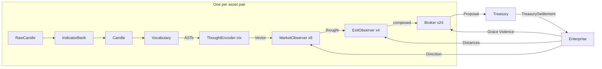

# wat/ — The 007 Blueprint

*The coordinates to where the machine is.*

A machine that measures thoughts against reality. Did this thought
produce value or destroy it? Built leaves to root from
`docs/proposals/2026/04/007-exit-proposes/`.

This document defines every struct and its interface. No implementation.
The wat files implement what this document declares.

Each section declares its dependencies. The order of sections IS the build
order — leaves first, root last. Each file's dependencies are already
written before it appears.

## Holon-rs primitives (provided by the substrate)

These are NOT specified in this tree. They are provided by holon-rs.

- **atom** — `(atom name) → Vector` — name a thought
- **bind** — `(bind a b) → Vector` — compose two thoughts
- **bundle** — `(bundle &vecs) → Vector` — superpose many thoughts
- **cosine** — `(cosine a b) → f64` — measure similarity
- **reckoner** — the learning primitive. "Reckon" means both "to count"
  and "to judge." Market observers use discrete mode (Up/Down classification).
  Exit observers use continuous mode (distance regression). A reckoner
  keeps accounts and delivers a verdict. It accumulates experience.
  Internally it builds a discriminant — the direction that separates
  outcomes. It reckons a verdict from a new
  input via cosine against the discriminant. Old experience decays.
  The verdict sharpens over time through recalibration. One primitive,
  multiple readout modes:
  - `(make-reckoner config)` → Reckoner
    - config is a `reckoner-config` struct (defined in construction order)
      containing dims, recalib-interval, and readout mode:
      - `(labels "Up" "Down")` → discrete. N labels. Classification.
      - `(default-value 0.015)` → continuous. Scalar. Regression.
  - `(observe reckoner thought outcome weight)` — both modes.
    outcome is a label (discrete) or a scalar (continuous).
  - `(predict reckoner thought)` — both modes.
    returns Prediction — the reckoner's verdict.
  - `(decay reckoner factor)` — both modes. Old experience fades.
  - `(experience reckoner) → f64` — how much? 0.0 = ignorant.
  - `(recalib-count reckoner) → usize` — both modes.
  - **holon-rs has both modes.** `Reckoner` with `ReckConfig::Discrete`
    and `ReckConfig::Continuous`. The Reckoner is the only learning
    primitive in holon-rs.
  - Coordinates for later: circular readout (periodic values that wrap),
    ranked readout (orderings). Other readout modes are possible — the
    reckoner mechanism is general. These are future work, not current.
- **curve** — measures how much edge a reckoner has earned. After many
  predictions resolve (correct or wrong), the curve answers: "when you
  predicted strongly, how often were you right?" Input: prediction
  strength. Output: accuracy. A continuous surface. How much edge,
  not whether edge.
  - `(make-curve)` → Curve
  - `(record-prediction curve conviction correct?)` — feed each resolved prediction
  - `(edge-at curve conviction) → f64` — query: how accurate at this conviction level?
  - `(proven? curve min-samples) → bool` — enough data to trust?
- **OnlineSubspace** — learns what normal looks like. Measures how unusual
  a new input is (the residual). High residual = unusual. Low = boring.
  - `(update subspace vector)`
  - `(anomalous-component subspace vector) → Vector`
  - `(residual subspace vector) → f64`
  - `(sample-count subspace) → usize`
- **ScalarEncoder** — continuous value → vector
  - `(encode-log value) → Vector`
  - `(encode-linear value scale) → Vector`
  - `(encode-circular value period) → Vector`
- **VectorManager** — deterministic atom → vector allocation
  - `(get-vector vm name) → Vector`

---

## Definitions — the thoughts themselves

Before the structs. Before the constructors. The meanings.
Each definition can only reference definitions above it.

- **Up / Down** — direction labels. The market observer predicts: the price
  will go up or the price will go down. That's the prediction. When a trade
  resolves, the actual direction is routed back to the market observer.
  The reckoner learns from reality.

- **Grace / Violence** — accountability labels. "Did this trade produce
  value or destroy it?" Grace = profit. Violence = loss. More Grace, more
  capital. More Violence, less capital. The Grace/Violence ratio IS the
  answer to "do we trust this team of observers?"

- **Labels** — Up/Down and Grace/Violence are labels. Labels are not
  booleans. They carry weight — how decisively the market answered.
  A strong Grace teaches harder than a marginal one. Two pairs for
  learning: Direction (Up/Down) and Accountability (Grace/Violence).
  A third pair for action: Side (Buy/Sell) — derived from Up/Down,
  used on proposals and trades.

- **Candle** — one period of market data. Raw: six data values (open, high,
  low, close, volume, timestamp) plus an asset pair for routing (source-asset,
  target-asset) — eight fields total on the RawCandle struct. Enriched: the
  raw data plus 100+ computed indicators (moving averages, oscillators,
  volatility, momentum, structure).

- **Indicator** — a derived measurement from price history. RSI, MACD,
  ATR (Average True Range — a measure of volatility), Bollinger Bands.
  Each one is a streaming computation — it needs all prior candles to
  produce the current value. Indicators produce SCALARS, not zones.
  "RSI at 0.73" not "RSI is overbought." The reckoner learns where the
  boundaries are.

- **Magic numbers** — k_trail (trailing stop multiplier), k_stop (safety
  stop multiplier), k_tp (take-profit multiplier). When a trade is open,
  three distances matter: how far to trail the price, how far to let it
  move against you, how far to let it go before taking the win. Someone
  chose these as multipliers of ATR (defined above). They are the last
  magic — crutches returned when the system has no experience. As
  observations accumulate, the crutch is replaced by what the market said.

- **Discriminant** — the direction in thought-space that separates two
  outcomes. The reckoner builds it from accumulated observations. "Which
  direction in 10,000 dimensions best separates Grace from Violence?"
  The discriminant IS that direction. Cosine against it → conviction.

- **Conviction** — how strongly the reckoner predicts. The cosine between
  the thought and the discriminant. High conviction = many facts voting
  in the same direction. Low conviction = ambiguous.

- **Fact** — a named observation about the world, composed from atoms. "RSI
  is at 0.73." The composition IS a vector. The vector IS the fact.

- **ThoughtAST** — a deferred fact. AST = Abstract Syntax Tree — a tree of
  operations described as data, not yet executed. The vocabulary produces
  these. The ThoughtEncoder evaluates them.

- **Thought** — a bundle of facts. Many fact-vectors superposed into one
  vector. The thought is what an observer perceived about this candle.
  A "composed thought" is a market thought bundled with exit facts —
  it appears on PaperEntry, Proposal, TradeOrigin, Resolution, and
  TreasurySettlement. Same vector, stashed at different lifecycle points.

- **Lens** — which vocabulary subset an observer thinks through. A momentum
  lens selects momentum-related facts. A regime lens selects regime-related
  facts. A generalist lens selects all facts. The lens IS the observer's
  identity — it determines what thoughts the observer thinks.

- **N and M** — N is the number of market observers (today: 6, one per
  MarketLens variant). M is the number of exit observers (today: 4, one
  per ExitLens variant). Every combination gets a broker. N×M = 24 brokers
  today. Each broker's identity is the set {"market-lens", "exit-lens"} —
  two names today, more later.

- **Observer** — an entity that perceives and learns. It has a lens and
  accumulated experience. Two kinds: market observers predict direction
  (Up/Down) using a discrete reckoner. Exit observers estimate distance
  (optimal exit) using continuous reckoners.

- **Exit reckoners** — the exit observer has three continuous reckoners,
  one per magic number: trail, stop, tp. "For a thought like THIS, what
  distance did the market say was optimal?" Replaces magic numbers with
  measurement.

- **ScalarAccumulator** — per-magic-number f64 learning. Each scalar value
  is encoded as a vector (using ScalarEncoder, defined above in primitives).
  Grace outcomes accumulate into a Grace prototype.
  Violence outcomes accumulate into a Violence prototype. To extract: try
  candidate values, encode each, cosine against the Grace prototype. The
  candidate closest to Grace wins. "What value does Grace prefer overall?"
  Global per-pair — one answer regardless of thought.

- **Paper trade** — a "what if." A hypothetical trade that tracks what WOULD
  have happened. Both sides (buy and sell) are tracked simultaneously.
  When both sides resolve, the paper teaches: what distance would have
  been optimal? Papers are the fast learning stream — cheap, many, every
  candle. Papers and active trades are treated equally by the learning
  system. Both use whatever the reckoner knows at the time. Both start
  ignorant (crutch values). Both feed Grace/Violence back to the broker.

- **Prediction** — what the reckoner returns when asked. Data, not action.
  An enum — two honest branches, no dead fields:
  - Discrete: a list of (label, score) pairs + conviction. The consumer picks.
  - Continuous: a scalar value + experience.
  Pattern-match to know which mode. The type tells you. The Discrete
  variant is generic over labels — the broker's reckoner returns
  (Grace/Violence, score) pairs. The market observer's returns
  (Up/Down, score) pairs. Same enum. Different label vocabularies.

- **Proof curve** — the curve primitive (defined above) applied to a
  specific reckoner. How much edge? A continuous measure. 52.1% is barely
  there. 70% is screaming. The treasury funds proportionally. The entity
  earns a DEGREE of trust, not a binary gate. More edge, more capital.
  "Proof curve" and "curve" are the same thing — one is the primitive,
  the other is its name when applied.

- **Broker** — binds a set of observers as a team. Any number — two today
  (market + exit), three tomorrow (market + exit + risk). The accountability
  primitive. It measures how successful the team is — Grace or Violence.
  It owns paper trades. When papers or real trades resolve, it routes
  outcomes to every observer in the set.

- **Propagation** — routing resolved outcomes through the broker to
  the observers that need to learn. Grace/Violence to the broker's
  own record. The actual direction (Up/Down) to the market observer.
  Optimal distance to the exit observer.

- **Post** — a trading post. The NYSE had specialist posts — each one
  handled one security, had its own specialists, its own order book.
  The (USDC, WBTC) post. The (SPY, SILVER) post. The (SOL, GOLD) post.
  Any asset pair. The post doesn't care what the pair IS — it watches a
  stream of candles, acquires capital from the treasury, and the treasury
  holds it accountable. Grace or Violence. Each post has its own observers,
  its own brokers, its own indicator bank. No cross-talk between posts.
  The enterprise is the floor. Each post watches one market.

- **Denomination** — what "value" means. The treasury counts in a
  denomination. USD today. Could be EUR, could be SOL.

- **TradeId** — a usize. The treasury's key for active trades. Assigned
  at funding time. Maps back to (post-idx, slot-idx) via trade-origins.

- **slot-idx** — the flat index into the broker registry.
  Today each broker binds exactly one market observer + one exit observer.
  `slot-idx = market-idx × M + exit-idx` — one broker per
  (market, exit) pair, N×M total. When the broker generalizes to more
  than two observer kinds, the indexing scheme changes. The slot-idx
  remains — a usize into a flat vec. The formula adapts.

- **Noise subspace** — the background model. An OnlineSubspace that
  learns what ALL thoughts look like — the average texture of thought-space.
  Subtract it from a thought and what remains is what's UNUSUAL. The reckoner
  learns from the unusual part, not the boring part.

- **Experience** — how much a reckoner has learned. 0.0 = empty. Grows
  with each observation. The reckoner's self-knowledge of its own depth.

- **Ignorance** — the starting state. Every reckoner begins with zero
  experience. No edge. The reckoner does not participate when it knows
  it doesn't know. No special bootstrap logic. The architecture IS the
  bootstrap — papers fill the reckoner, experience grows, the treasury
  starts listening. Start ignorant. Learn. Graduate.

- **Weight** — an f64 that scales how much an observation contributes to
  learning. 1.0 = normal contribution. Larger = stronger signal. Used in
  reckoner.observe, broker.propagate, and scalar accumulator.observe.
  Typically derived from the magnitude of the outcome — a large Grace
  teaches harder than a marginal one.

- **Recalibration** — the reckoner periodically recomputes its discriminant
  from accumulated observations. The interval (recalib-interval) is how
  often this happens — every N observations.

- **Engram gating** — after a recalibration with good accuracy, snapshot
  the discriminant as a "good state." An OnlineSubspace learns what good
  discriminants look like. Future recalibrations are checked against this
  memory — does the new discriminant match a known good state?

- **ctx** — the immutable world. Lowercase intentionally — ctx is a parameter
  that flows through function calls, not a type you instantiate like Post
  or Treasury. Born at startup. Never changes. Contains
  the ThoughtEncoder (which contains the VectorManager). Also dims,
  recalib-interval, and any other constants decided at startup. ctx flows
  in as a parameter — the enterprise receives it, posts receive it,
  observers receive it. Nobody owns it. Everybody borrows it. Immutable
  config is separate from mutable state. That's not duplication — that's
  honesty.

- **encode-count** — the candle counter. How many candles the post has
  processed. The window sampler uses it to determine window size each candle.

---

## Forward declarations

The construction order. Each line can only reference what's above it —
those are the things that exist when this thing is constructed. The
constructor calls ARE the dependency graph.

### The path from market to thought

The market produces price data at regular intervals. For one time
period (5 minutes for BTC), five measurements:

- **Open** — price at the start of the period
- **High** — highest price during the period
- **Low** — lowest price during the period
- **Close** — price at the end of the period
- **Volume** — how much was traded during the period

This is a **RawCandle**. Tagged with its asset pair — which market
produced it. The enterprise consumes a stream of these. One per period.

The **IndicatorBank** consumes raw candles and computes technical
indicators — moving averages, oscillators, volatility measures,
momentum, structure. The output is an enriched **Candle** — the raw
data plus 100+ derived measurements. This is what the observers
think about.

### The construction order

This section shows the dependency graph as constructor calls — a sketch.
The "Structs and interfaces" section below is the authority — full field
definitions, full interface signatures. This section shows what depends
on what. That section shows what each thing IS.

```scheme
;; ── Primitives — depend on nothing ──────────────────────────────────

;; Asset: a named token
(struct asset name)

(let ((source (make-asset "USDC"))
      (target (make-asset "WBTC"))
      (ts     "2025-01-01T00:00:00")
      (open   96000.0)
      (high   96500.0)
      (low    95800.0)
      (close  96200.0)
      (volume 1500.0))
  (make-raw-candle source target ts
    open high low close volume))                     → RawCandle

(make-indicator-bank)                                → IndicatorBank

(let ((seed 7919)
      (min-window 12)
      (max-window 2016))
  (make-window-sampler seed min-window max-window))  → WindowSampler

(let ((name "trail-distance"))
  (make-scalar-accumulator name))                    → ScalarAccumulator

;; ── Candle — produced by indicator bank from raw candle ─────────────

(tick indicator-bank raw-candle)                     → Candle

;; ── Vocabulary — pure functions, context in, ASTs out ───────────────
;; Three domains: shared (time), market (direction), exit (conditions)
;; The vocabulary speaks a DSL of ThoughtASTs — data, not execution

(oscillator-facts candle)                            → Vec<ThoughtAST>
;; ThoughtAST: data describing a composition — not vectors, not execution

;; ── ThoughtEncoder — evaluates the vocabulary's ASTs ────────────────

(let ((vector-manager (make-vector-manager dims)))
  (make-thought-encoder vector-manager))             → ThoughtEncoder
(encode thought-encoder ast)                         → Vector

;; ── Label enums ─────────────────────────────────────────────────────
;; Side is action (what the trader does). Direction is observation (what
;; the price did). They are related (Up → Buy, Down → Sell) but distinct
;; types — one is a decision, the other is a measurement.

(enum Side :buy :sell)              ; trading action — on Proposal and Trade
(enum Direction :up :down)          ; price movement — used in propagation
(enum Outcome :grace :violence)     ; accountability — used everywhere

;; ── Lenses — which vocabulary subset an observer thinks through ─────
;; A lens selects which vocab modules fire. The observer's identity.
;; Each variant selects a subset of the vocabulary. See vocab/ for the modules.
;; :generalist selects ALL modules in the domain.
(enum MarketLens :momentum :structure :volume :narrative :regime :generalist)
(enum ExitLens :volatility :structure :timing :generalist)
;; See Vocabulary section below for lens → module mappings.

;; ── Reckoner — the learning primitive ────────────────────────────────
;; One constructor. Config is data.

(enum reckoner-config
  (Discrete
    dims               ; usize — vector dimensionality
    recalib-interval   ; usize — observations between recalibrations
    labels)            ; Vec<String> — ("Up" "Down")
  (Continuous
    dims               ; usize
    recalib-interval   ; usize
    default-value))    ; f64 — the crutch, returned when ignorant

(let ((dims 10000)
      (recalib-interval 500)
      (labels '("Up" "Down")))
  (make-reckoner (Discrete dims recalib-interval labels)))
                                                     → Reckoner

(let ((dims 10000)
      (recalib-interval 500)
      (default-value 0.015))  ; 0.015 = 1.5% of price — the crutch distance
  (make-reckoner (Continuous dims recalib-interval default-value)))
                                                     → Reckoner

;; ── Prediction — what a reckoner returns. Data. ─────────────────────
;; The consumer decides what "best" means.

(enum prediction
  (Discrete
    scores             ; Vec<(String, f64)> — (label name, cosine) for each label
    conviction)        ; f64 — how strongly the reckoner leans
  (Continuous
    value              ; f64 — the reckoned scalar
    experience))       ; f64 — how much the reckoner knows (0.0 = ignorant)

;; ── MarketObserver — depends on: Reckoner :discrete, WindowSampler ──

(let ((lens :momentum)
      (dims 10000)
      (recalib-interval 500)
      (seed 7919)
      (min-window 12)
      (max-window 2016)
      (sampler (make-window-sampler seed min-window max-window)))
  (make-market-observer lens
    (Discrete dims recalib-interval '("Up" "Down"))
    sampler))                                        → MarketObserver

;; ── Distances — the three exit values, used everywhere ──────────
;; A named tuple. Appears on PaperEntry, Proposal, Resolution, Settlement.

(struct distances
  trail                ; f64 — trailing stop distance (percentage of price)
  stop                 ; f64 — safety stop distance
  tp)                  ; f64 — take-profit distance

;; ── ExitObserver — depends on: Reckoner :continuous (×3), Distances ──

(let ((lens :volatility)
      (dims 10000)
      (recalib-interval 500)
      (default-trail 0.015)
      (default-stop  0.030)
      (default-tp    0.045))
  (make-exit-observer lens dims recalib-interval
    default-trail default-stop default-tp))          → ExitObserver

;; ── PaperEntry — hypothetical trade inside a broker ──────────
;; A paper trade is a "what if." Every candle, every pair gets one.
;; It tracks what WOULD have happened if a trade was opened here.
;; Both sides (buy and sell) are tracked simultaneously.
;; When both sides resolve (their trailing stops fire), the paper
;; teaches the system: what distance would have been optimal?

(struct paper-entry
  composed-thought     ; Vector — the thought at entry
  entry-price          ; f64 — price when the paper was created
  entry-atr            ; f64 — volatility at entry
  distances            ; (trail, stop, tp) — from the exit observer at entry
  buy-extreme          ; f64 — best price in buy direction so far
  buy-trail-stop       ; f64 — trailing stop level (from distances.trail)
  sell-extreme         ; f64 — best price in sell direction so far
  sell-trail-stop      ; f64 — trailing stop level (from distances.trail)
  buy-resolved         ; bool — buy side's stop fired
  sell-resolved)       ; bool — sell side's stop fired

;; ── Broker — depends on: Reckoner :discrete, ScalarAccumulator ──────

(let ((observers '("momentum" "volatility"))
      (market-idx 0)           ; resolved by the post from "momentum"
      (exit-idx 0)             ; resolved by the post from "volatility"
      (dims 10000)
      (recalib-interval 500))
  (make-broker observers market-idx exit-idx dims recalib-interval
    (list (make-scalar-accumulator "trail-distance")
          (make-scalar-accumulator "stop-distance")
          (make-scalar-accumulator "tp-distance"))))  → Broker

;; ── Proposal — what a post produces, what the treasury evaluates ────

;; Assembled by the post during step-compute-dispatch. The post calls:
;;   market observer → thought vector
;;   exit observer → compose(thought, facts) → composed + distances
;;   broker → propose(composed) → prediction
;;   post bundles these into a Proposal and submits to treasury.
(struct proposal
  composed-thought     ; Vector — market thought + exit facts
  prediction           ; Prediction :discrete (Grace/Violence) — from the broker's
                       ; reckoner, NOT the market observer's Up/Down prediction.
  distances            ; Distances — from the exit observer
  funding              ; f64 — broker's edge level, from broker.funding().
                       ; The treasury sorts proposals by this value.
  side                 ; :buy or :sell — trading action, from the market observer's
                       ; Up/Down prediction. Up → :buy, Down → :sell.
                       ; Distinct from "direction" (:up/:down) which describes
                       ; price movement used in propagation.
  post-idx             ; usize — which post this came from
  broker-slot-idx)     ; usize — which broker proposed this

;; ── Trade — an active position the treasury holds ───────────────────

(struct trade
  id                   ; TradeId — assigned by treasury at funding time
  post-idx             ; usize — which post
  broker-slot-idx      ; usize — which broker (for trigger routing)
  source-asset         ; Asset — what was deployed
  target-asset         ; Asset — what was acquired
  side                 ; :buy or :sell — trading action (not price direction)
  entry-rate           ; f64
  entry-atr            ; f64 — from candle.atr at funding time
  source-amount        ; f64 — how much was deployed
  trail-stop           ; f64 — current trailing stop level
  safety-stop          ; f64 — safety stop level (cut the loss)
  take-profit          ; f64 — take-profit level (take the win)
  candles-held         ; usize — how long open
  price-history)       ; Vec<f64> — close prices from entry to now. Appended each
                       ; candle. The trade closes over its own history. Pure.

;; ── TreasurySettlement — what the treasury produces when a trade closes ──

(struct treasury-settlement
  trade                ; Trade — which trade closed (carries post-idx, broker-slot-idx, side)
  exit-price           ; f64 — price at settlement
  outcome              ; Outcome — :grace or :violence
  amount               ; f64 — how much value gained or lost
  composed-thought)    ; Vector — from trade-origins, stashed at funding time
;; The treasury produces this. It does NOT have optimal-distances.

;; ── Settlement — the complete record, after enterprise enrichment ─────

(struct settlement
  treasury-settlement  ; TreasurySettlement — the treasury's accounting
  direction            ; Direction — :up or :down, derived from exit-price vs entry-rate
  optimal-distances)   ; Distances — replay trade's price-history, maximize residue
;; The enterprise builds this by enriching a TreasurySettlement.
;; The trade's price-history (on the Trade) provides the replay data.

;; ── Resolution — what a broker produces when a paper resolves ────────
;; Facts, not mutations. Collected from parallel tick, applied sequentially.
;; A paper has two sides (buy and sell). Each side resolves independently.
;; Each resolved side produces one Resolution with its own direction.

(struct resolution
  broker-slot-idx      ; usize — which broker produced this
  composed-thought     ; Vector — the thought that was tested
  direction            ; Direction — :up or :down. Each paper side resolves
                       ; independently: buy-side stop fires → :up (price rose
                       ; then retraced). sell-side stop fires → :down.
  outcome              ; Outcome — :grace or :violence
  amount               ; f64 — how much value
  optimal-distances)   ; Distances — hindsight optimal

;; ── LogEntry — the glass box. What happened. ────────────────────────
;; Generic. Any producer can emit log entries to its queue.

(enum log-entry
  (ProposalSubmitted
    broker-slot-idx    ; usize
    composed-thought   ; Vector
    distances)         ; Distances
  (ProposalFunded
    trade-id           ; TradeId
    broker-slot-idx    ; usize
    amount-reserved)   ; f64
  (ProposalRejected
    broker-slot-idx    ; usize
    reason)            ; String
  (TradeSettled
    trade-id           ; TradeId
    outcome            ; :grace or :violence
    amount             ; f64
    duration)          ; usize — candles held
  (PaperResolved
    broker-slot-idx    ; usize
    outcome            ; :grace or :violence
    optimal-distances) ; Distances
  (Propagated
    broker-slot-idx    ; usize
    observers-updated)); usize — how many observers received the outcome

;; ── TradeOrigin — where a trade came from, for propagation routing ───

(struct trade-origin
  post-idx             ; usize — which post
  broker-slot-idx      ; usize — which broker
  composed-thought)    ; Vector — the thought at entry

;; ── Post — depends on: IndicatorBank, MarketObserver, ExitObserver, Broker ──

(let ((source (make-asset "USDC"))
      (target (make-asset "WBTC"))
      (dims 10000)
      (recalib-interval 500)
      (max-window-size 2016))
  (make-post source target dims recalib-interval max-window-size
    (make-indicator-bank)
    market-observers exit-observers registry))       → Post

;; ── Treasury — pure accounting ──────────────────────────────────────

(let ((denomination (make-asset "USD"))
      (initial-balances {(make-asset "USDC") 10000.0}))
  (make-treasury denomination initial-balances))     → Treasury

;; ── Ctx — the immutable world. Born at startup. Never changes. ───────

(struct ctx              ; this is the complete set — three fields, nothing else
  thought-encoder      ; ThoughtEncoder (contains VectorManager)
  dims                 ; usize — vector dimensionality
  recalib-interval)    ; usize — observations between recalibrations

;; ── Enterprise — the coordination plane ─────────────────────────────

(let ((posts (list btc-post sol-post))
      (treasury (make-treasury denomination balances)))
  (make-enterprise posts treasury))                  → Enterprise
;; ctx is separate — created by the binary, passed to on-candle
```

---

## Structs and interfaces

### RawCandle (the input — depends on: nothing)

The enterprise consumes a stream of raw candles. This is the only input.
Everything else is derived. Each raw candle identifies its asset pair —
the pair IS the routing key. Only the post for that pair receives it.

```
(struct raw-candle
  source-asset    ; Asset — e.g. USDC
  target-asset    ; Asset — e.g. WBTC
  ts open high low close volume)
```

Eight fields. From the parquet. From the websocket. The enterprise doesn't
care which. The asset pair IS the identity of the stream.

---

### Candle (depends on: RawCandle)

The enriched candle. Raw OHLCV in, 100+ computed indicators out.
Produced by IndicatorBank.tick(raw-candle). The post's first act
every candle.

```
(struct candle
  ;; Raw
  ts open high low close volume
  ;; Moving averages
  sma20 sma50 sma200
  ;; Bollinger
  bb-upper bb-lower bb-width bb-pos
  ;; RSI, MACD, DMI, ATR
  rsi macd macd-signal macd-hist
  plus-di minus-di adx atr atr-r
  ;; Stochastic, CCI, MFI, OBV
  stoch-k stoch-d cci mfi obv
  ;; Keltner, squeeze
  kelt-upper kelt-lower kelt-pos squeeze
  ;; Range position
  range-pos-12 range-pos-24 range-pos-48
  ;; Multi-timeframe
  tf-1h-close tf-1h-high tf-1h-low tf-1h-ret tf-1h-body
  tf-4h-close tf-4h-high tf-4h-low tf-4h-ret tf-4h-body
  ;; Ichimoku
  tenkan-sen kijun-sen senkou-span-a senkou-span-b cloud-top cloud-bottom
  ;; Time — circular scalars (encode-circular)
  minute              ; mod 60
  hour                ; mod 24
  day-of-week         ; mod 7
  day-of-month        ; mod 31
  month-of-year)      ; mod 12
  ;; ... additional fields computed by IndicatorBank as the vocabulary grows.
  ;; This struct lists the current set. "100+" in the definitions is the
  ;; target — the actual count grows with the vocabulary.
```

---

### IndicatorBank (depends on: RawCandle)

Streaming state machine. Advances all indicators by one raw candle.
Stateful — ring buffers, EMA accumulators, Wilder smoothers.
One per post (one per asset pair).

```
(struct indicator-bank ...)  ; internal state — implementation detail
```

**Interface:**
- `(new-indicator-bank) → IndicatorBank`
- `(tick indicator-bank raw-candle) → Candle`

---

### WindowSampler (depends on: nothing)

Deterministic log-uniform window selection. Each market observer has its
own — its own seed, its own time scale. The observer uses it every candle
to decide how much history to look at.

Owned by the market observer. Not by the enterprise. Not shared.
The enterprise doesn't sample windows — the observers do.

When window sampling becomes learned, the feedback routes through the
same resolution mechanism that teaches everything else. "This window size
produced Grace." The system knows. It routes back to the market observer.
The market observer adjusts its sampler.

```
(struct window-sampler
  seed min-window max-window)
```

**Interface:**
- `(new-window-sampler seed min max) → WindowSampler`
- `(sample window-sampler encode-count) → usize`

**Note:** min-window and max-window are crutches. The observer needs them
to bootstrap — it cannot learn its own time scale from nothing. But the
optimal window is learnable. The market tells us which windows produce
Grace. This is a coordinate for future work, not a problem to solve now.

---

### Vocabulary (depends on: what it thinks about)

Pure functions. Something in, facts out. No state.
Each domain thinks about different things. Market vocab thinks about
candles. Exit vocab thinks about candles and conditions. Risk vocab
(future) thinks about portfolio state. The input is whatever the
domain needs to form its judgment.

Three domains. Each domain has scoped subfiles.

**Domains:**

- **shared/** — universal context. Any observer can use these.
  - `time.wat` — minute (mod 60), hour (mod 24), day-of-week (mod 7), day-of-month (mod 31). Circular scalars.

- **market/** — what the market IS DOING. Direction signal. Market observers use these.
  MarketLens → modules:
  - `:momentum` → oscillators, momentum, stochastic
  - `:structure` → keltner, fibonacci, ichimoku, price-action
  - `:volume` → flow
  - `:narrative` → timeframe, divergence
  - `:regime` → regime, persistence
  - `:generalist` → all of the above
  Files:
  - `oscillators.wat` — Williams %R, StochRSI, UltOsc, multi-ROC
  - `flow.wat` — OBV, VWAP, MFI, buying/selling pressure
  - `persistence.wat` — Hurst, autocorrelation, ADX zones
  - `regime.wat` — KAMA-ER, choppiness, DFA, variance ratio, entropy, Aroon, fractal dim
  - `divergence.wat` — RSI divergence via PELT structural peaks
  - `ichimoku.wat` — cloud zone, TK cross
  - `stochastic.wat` — %K/%D zones and crosses
  - `fibonacci.wat` — retracement level detection
  - `keltner.wat` — channel position, BB position, squeeze
  - `momentum.wat` — CCI zones
  - `price-action.wat` — inside/outside bars, gaps, consecutive runs
  - `timeframe.wat` — 1h/4h structure + narrative + inter-timeframe agreement

- **exit/** — whether CONDITIONS favor trading. Distance signal. Exit observers use these.
  - `volatility.wat` — ATR regime, ATR ratio, squeeze state
  - `structure.wat` — trend consistency, ADX strength
  - `timing.wat` — momentum state, reversal signals
  - The `:generalist` exit lens selects ALL three (volatility + structure + timing).

- **risk/** — portfolio health. Coordinate for future work. Not in 007.

**Interface (per module):**
- `(encode-*-facts context) → Vec<ThoughtAST>`
  context is whatever the domain thinks about — candles, portfolio, trade state

A **fact** is a composition of atoms. The composition IS a vector.
The vector IS the fact. It doesn't need a separate name. It simply is.

```
"RSI is at 0.73"            → (bind (atom "rsi") (encode-linear 0.73 1.0))           → Vector
"close is 2.3% above SMA20" → (bind (atom "close-sma20") (encode-linear 0.023 0.1))  → Vector
"ATR is 1.8x its average"   → (bind (atom "atr-ratio") (encode-log 1.8))             → Vector
"hour is 14:00"              → (bind (atom "hour") (encode-circular 14.0 24.0))       → Vector
```

Every relationship is a signed scalar. Not "close is above SMA20" —
the relative distance, with sign.

`(bind (atom "close-sma20") (encode-linear  0.023 0.1))` — 2.3% above.
`(bind (atom "close-sma20") (encode-linear -0.041 0.1))` — 4.1% below.

Same atom. Same encoding. The sign IS the direction. The magnitude IS
the distance. No "above" atom. No "below" atom. No boolean. Just the
number. The discriminant learns what positive means and what negative
means. The word "above" doesn't exist in the vector space. The number
0.023 does. The number -0.041 does.

The boolean threw away the signal. The scalar preserves it. The
discriminant learns that 0.1% above is noise and 5% above is signal.
The sign carries direction. The magnitude carries conviction.

The vocabulary observes. It composes atoms. The result is a vector.
Many fact-vectors get bundled into one thought-vector. That's the
superposition. The thought is the bundle of facts.

```
vocabulary observes → composes atoms → fact (a vector)
many facts → bundle → thought (a vector)
thought → cosine against discriminant → prediction
```

**The vocabulary is conditional.** It emits what IS true. Close is within the
bands or beyond them — not both. Each truth has a scalar property. The
vocabulary observes reality and speaks only truth.

**The encoding scheme IS the bounding strategy.** The vocabulary chooses the
right scheme for each fact — not magic, logic:

- **encode-linear** — naturally bounded scalars. The bounds are in the math.
  - Bollinger position: [-1, 1] — where on the band
  - RSI: [0, 1] — Wilder's formula defines the range
  - Stochastic %K: [0, 1] — where in the recent range

- **encode-log** — unbounded positive scalars. Log compresses naturally.
  The difference between 1x and 2x matters more than 4x and 5x. No cap needed.
  - Band-widths beyond Bollinger: how far past the boundary
  - ATR ratio: volatility relative to price
  - Volume ratio: volume relative to its moving average

- **encode-circular** — periodic scalars. The value wraps.
  - Minute: mod 60. Hour: mod 24. Day-of-week: mod 7. Day-of-month: mod 31.

Some facts are bounded. Some aren't. That's honest. The log doesn't
bound — it compresses. The circular doesn't bound — it wraps. Only
linear needs bounds, and linear's bounds come from the math.

The vocabulary owns the encode AND the decode — it put the value on
the scalar, it can take it back. That's why scalar accumulators work.

**No zones. No categories. Only scalars.** "Overbought" is a human label
on a continuous value — a magic number wearing a name. WHO decided 70
was the boundary? The vocabulary emits "RSI is at 0.73." The discriminant
learns where the boundaries are. Maybe 65 for BTC, maybe 80 for SPY.
The data decides. Every zone is a premature measurement — the boolean
lie one level up. Kill them all. Emit the scalar. Let the discriminant learn.

The encoding receives normalized values. The scale is uniform.
The domain knowledge lives in the vocabulary, not in the encoder.

The ThoughtEncoder in the Rust is a cache and a renderer — an
optimization that pre-computes common compositions. But the concept
has no intermediate form. Atoms compose. Vectors result. Thoughts bundle.

---

### ThoughtEncoder (depends on: VectorManager)

The vocabulary produces ASTs — the specification of WHAT to think. The
ThoughtEncoder evaluates them — HOW to think efficiently. It walks the
AST bottom-up, checking its memory at every node. The minimum computation
happens. Parts of the thought are already ready for reuse.

Two kinds of memory:

**Atoms: a dictionary.** Finite. Known at startup. Pre-computed. Never
evicted because never growing. The set is closed. Always there.

**Compositions: a cache.** Infinite. Optimistic. Use it if we have it.
Compute if we don't. Evict when memory says so. The set is open.

The ThoughtEncoder reclaims its name. It IS an encoder — it takes a
thought AST and produces a vector, doing the minimum work.

Lives on ctx — the immutable world created at startup. Passed to posts
via ctx on every on-candle call. The enterprise does not own it directly.

```
(struct thought-encoder
  atoms                 ; map of name → Vector (finite, pre-computed, permanent)
  compositions)         ; LRU cache: key → Vector (optimistic, self-evicting)
;; The cache mutates on miss. ctx is immutable. The Rust uses interior
;; mutability (RefCell or similar) — the ThoughtEncoder appears immutable
;; from the outside but the cache updates internally. This is the one
;; place where ctx's immutability has a seam. The solution: observers
;; queue cache misses during parallel encoding, the enterprise drains
;; the miss-queues between steps (same pattern as log-queues). The
;; cache becomes eventually-consistent — miss on candle N, hit on N+1.
```

**The AST — what the vocabulary speaks:**

```scheme
(enum thought-ast
  (Atom name)                           ; dictionary lookup
  (Linear name value scale)             ; bind(atom, encode-linear)
  (Log name value)                      ; bind(atom, encode-log)
  (Circular name value period)          ; bind(atom, encode-circular)
  (Bind left right)                     ; composition of two sub-trees
  (Bundle children))                    ; superposition of sub-trees
```

The vocabulary produces trees of this. Cheap. No vectors. No 10,000-dim
computation. Just "here is what I want to say." The calls to bind and
encode are deferred — the vocabulary knows what it wants, the encoder
decides how to compute it efficiently.

**Interface:**
- `(encode thought-encoder ast) → Vector`

One function. Recursive. Cache at every node. The cache key IS the AST
node — its structure is its identity. Same structure, same vector.

```scheme
(define (encode encoder ast)
  (or (lookup (:cache encoder) ast)          ;; cache hit → done
      (let ((result
              (match ast
                (Atom name)
                  (lookup-atom (:atoms encoder) name)

                (Linear name value scale)
                  (bind (encode encoder (Atom name))
                        (encode-linear value scale))

                (Log name value)
                  (bind (encode encoder (Atom name))
                        (encode-log value))

                (Circular name value period)
                  (bind (encode encoder (Atom name))
                        (encode-circular value period))

                (Bind left right)
                  (bind (encode encoder left)
                        (encode encoder right))

                (Bundle children)
                  (apply bundle
                    (map (lambda (c) (encode encoder c)) children)))))

        (store (:cache encoder) ast result)
        result)))
```

The vocabulary produces QUOTED expressions — data, not execution. The
encoder evaluates them. The vocabulary doesn't know about caching. The
encoder doesn't know about RSI. The quoted list is the interface.

The observer composes the thought:
```
observer calls vocab(context)                → Vec<ThoughtAST>  ; AST nodes
observer wraps in (Bundle facts)             → ThoughtAST      ; still data
observer calls (encode encoder bundle-ast)   → Vector          ; the thought
```

The lens is not a parameter. The lens is on the observer. The observer
knows which vocab modules are its domain.

**Thought composition is AST evaluation with caching.** The vocabulary
produces the AST — the structure of the thought. The ThoughtEncoder
walks it:

```
evaluate(node)
  → atom?        → dictionary (always succeeds)
  → any other?   → cache check → hit: reuse / miss: compute, store
  → bundle?      → always fresh (per-observer, per-candle)
```

Scalars, binds, encodes — all go through the cache. Same structure,
same vector. Scalars may evict quickly (values change each candle),
but within a candle the same scalar is reused across observers.

The AST IS a function. `bind(atom("rsi"), encode-linear(x, 1.0))` — the
structure is fixed. Only x varies. The encoder recognizes the structure
and reuses everything except the fresh scalar.

**The AST can be as complex as the thought requires.** These are data —
quoted expressions the vocabulary returns. The ThoughtEncoder evaluates them.

```scheme
;; A scalar fact — one atom, one signed value
(Linear "rsi" 0.73 1.0)

;; A signed relationship — 2.3% above. Negative would be below.
(Linear "close-sma20" 0.023 0.1)

;; A structural observation — RSI diverging from price, both magnitudes
(Bind (Atom "divergence")
  (Bind (Linear "close-delta" 0.03 0.1)
        (Linear "rsi-delta" -0.05 1.0)))

;; A moving average stack — the entire structure as signed distances
(Bundle
  (Linear "close-sma20" 0.023 0.1)
  (Linear "sma20-sma50" 0.011 0.1)
  (Linear "sma50-sma200" -0.035 0.1))

;; A conditional fact — the vocabulary chose this path, not both
(Log "bb-breakout-lower" 1.3)          ;; beyond: how far (log)
(Linear "bb-position" -0.7 1.0)        ;; inside: where (linear)

;; A temporal change — MACD histogram 3 candles ago vs now
(Bind (Atom "macd-hist-change")
  (Bind (Linear "now" -0.001 0.01)
        (Linear "3-ago" 0.002 0.01)))

;; Time — circular scalars that wrap
(Circular "hour" 14.0 24.0)
(Circular "minute" 35.0 60.0)
(Circular "day-of-week" 3.0 7.0)

;; A deep confluence — multi-timeframe + oscillator + momentum
(Bundle
  (Linear "tf-1h-trend" 0.7 1.0)
  (Linear "tf-4h-structure" 0.6 1.0)
  (Linear "rsi" 0.82 1.0)
  (Linear "macd-hist" -0.0005 0.01)
  (Log "macd-hist-from-peak" 0.167))
```

Simple thoughts are shallow trees. Complex thoughts are deep trees.
The encoder walks them all the same way. The mechanism doesn't change.

---

### ScalarAccumulator (depends on: nothing)

Per-magic-number f64 learning. Lives on the broker. Global per-pair.
Each magic number (trail-distance, stop-distance, tp-distance) gets its own.

Separates grace/violence observations into separate f64 prototypes.
Grace outcomes accumulate one way. Violence outcomes accumulate the other.
Extract recovers the value Grace prefers — sweep candidate values against
the Grace accumulator, find the one with highest cosine. "What value does
Grace prefer for this pair overall?" One answer regardless of thought.

Fed by resolution events: when a paper or trade resolves, the
broker routes the optimal distance + Grace/Violence outcome to its
scalar accumulators.

```
(struct scalar-accumulator
  name                 ; String — which magic number ("trail-distance", etc.)
  grace-acc            ; Vector — accumulated encoded values from Grace outcomes
  violence-acc)        ; Vector — accumulated encoded values from Violence outcomes
```

**Interface:**
- `(new-scalar-accumulator name) → ScalarAccumulator`
- `(observe-scalar acc value outcome weight)`
  value: f64 — the scalar to accumulate (e.g. a distance).
  outcome: Outcome — :grace or :violence. Determines which accumulator
  receives the encoded value.
  weight: f64 — scales the contribution. Larger weight = stronger signal.
- `(extract-scalar acc steps range) → f64`
  steps: usize — how many candidates to try.
  range: (f64, f64) — (min, max) bounds to sweep across.
  Sweep `steps` candidate values across `range`, encode each, cosine
  against the Grace prototype. Return the candidate closest to Grace.

---

### MarketObserver (depends on: Reckoner, OnlineSubspace, WindowSampler)

Predicts direction. Learned. Labels come from broker propagation —
Predicts Up/Down. The broker routes the actual direction back from
resolved paper and real trades. The market observer does NOT label itself.
Reality labels it.

The generalist is just another lens. No special treatment.

```
(struct market-observer
  lens                 ; MarketLens enum
  reckoner             ; Reckoner :discrete — Up/Down
  noise-subspace       ; OnlineSubspace — background model
  window-sampler       ; WindowSampler — own time scale
  ;; Proof tracking
  resolved                 ; usize — how many predictions have been resolved
  conviction-history       ; Vec<f64> — recent conviction values for curve fitting
  conviction-threshold     ; f64 — minimum conviction to participate.
                           ; derived from the curve after recalibration:
                           ; the conviction level where edge first appears.
                           ; 0.0 when the curve has insufficient data.
  curve                    ; Curve — measures this observer's edge (conviction → accuracy)
  curve-valid              ; f64 — cached edge from the curve. 0.0 = unproven.
                           ; updated after each recalibration by querying the curve.
  cached-accuracy          ; f64 — rolling accuracy of resolved predictions
  ;; Engram gating
  good-state-subspace      ; OnlineSubspace — learns what good discriminants look like
  recalib-wins             ; usize — wins since last recalibration
  recalib-total            ; usize — total since last recalibration
  last-recalib-count)      ; usize — recalib-count at last engram check
```

**Interface:**
- `(make-market-observer lens reckoner-config window-sampler) → MarketObserver`
  noise-subspace: created empty (new OnlineSubspace). Learns from observations.
  lens: MarketLens. config: Discrete with "Up"/"Down" labels.
  All proof-tracking and engram-gating fields initialize to zero/empty.
- `(observe-candle observer candle-window ctx) → (Vector, Prediction)`
  returns both; only the Vector flows downstream to exit composition and
  brokers. The Prediction is used by the post for logging and conviction
  tracking. candle-window: a slice of recent candles. The post calls
  `(sample (:window-sampler observer) encode-count)` to get the window
  size, slices the candle window, and passes the slice. The observer
  encodes → noise update → strip noise → predict. Returns both the
  thought vector (needed downstream for exit composition, paper
  registration, and propagation) and the prediction. The prediction
  is used by the post for logging and conviction tracking — the
  broker produces its OWN prediction (Grace/Violence) from the
  composed thought. The market observer's prediction does not appear
  on the Proposal.
- `(resolve observer thought direction weight)`
  direction: Direction (:up or :down) — the actual price movement.
  Called by broker propagation — reckoner learns from reality.
  Not "outcome" (which is Outcome :grace/:violence). Different type.
- `(strip-noise observer thought) → Vector`
- `(experience observer) → f64` — how much has this observer learned?

---

### ExitObserver (depends on: Reckoner :continuous)

Estimates exit distance. Learned. Each exit observer has THREE continuous
reckoners — one per magic number (trail, stop, tp). No noise-subspace,
no curve, no engram gating — intentionally simpler than MarketObserver.
The exit observer's quality is measured through the BROKER's curve, not
its own. The broker's Grace/Violence ratio reflects the combined quality
of its market + exit observers. The exit observer doesn't need its own
proof gate — it is proven through the team it belongs to.

Each reckoner accumulates (thought, distance, weight) observations and returns the
cosine-weighted answer for a given thought.

Has a judgment vocabulary matching its ExitLens:
`:volatility` → `exit/volatility.wat`, `:structure` → `exit/structure.wat`,
`:timing` → `exit/timing.wat`, `:generalist` → all three.
The generalist is just another lens. No special treatment.
Composes market thoughts with its own judgment facts.
One per exit lens — M instances, not N×M.
The composed thought carries the market observer's signal in superposition.

```
(struct exit-observer
  lens                ; ExitLens enum — which judgment vocabulary
  trail-reckoner      ; Reckoner :continuous — trailing stop distance
  stop-reckoner       ; Reckoner :continuous — safety stop distance
  tp-reckoner         ; Reckoner :continuous — take-profit distance
  default-distances)  ; Distances — the crutches, returned when reckoners are empty
```

Each reckoner: `(thought, distance, weight)` observations. Query by
cosine → distance for THIS thought. Contextual — different thoughts
get different distances.

**Interface:**
- `(make-exit-observer lens dims recalib-interval default-trail default-stop default-tp) → ExitObserver`
- `(encode-exit-facts exit-obs candle) → Vec<ThoughtAST>`
  pure: candle → judgment fact ASTs for this lens
- `(compose exit-obs market-thought exit-fact-asts ctx) → Vector`
  evaluates exit ASTs via ctx's ThoughtEncoder, then bundles with
  the market thought. ASTs in, one composed Vector out.
- `(recommended-distances exit-obs composed broker-accums) → Distances`
  broker-accums: Vec<ScalarAccumulator> — the broker's global per-pair learners.
  the cascade, per magic number:
  ```
  (if (experienced? reckoner)
    (predict reckoner composed)          ; contextual — for THIS thought
    (if (has-data? broker-accum)
      (extract-scalar broker-accum ...)  ; global per-pair — any thought
      default-distance))                 ; crutch — the starting value
  ```
  One call, three answers. Each magic number cascades independently.
- `(observe-distances exit-obs composed optimal-trail optimal-stop optimal-tp weight)`
  the market spoke — all three reckoners learn from one resolution
- `(experienced? exit-obs) → bool`
  have the reckoners accumulated observations?

---

### Broker (depends on: Reckoner, OnlineSubspace, ScalarAccumulator)

The accountability primitive. Today: binds one market observer + one
exit observer. N×M brokers total. Tomorrow: more observer kinds may join.
Holds papers. Propagates resolved outcomes to every observer in the set.
Measures Grace or Violence.

The broker's identity IS the set of observer names it closes over.
`{"momentum", "volatility"}` is one broker. `{"regime", "timing"}` is
another. `{"momentum", "volatility", "drawdown"}` is a third — N observers,
not locked to two.

The broker does NOT own the observers — they live on the post.
The broker knows their coordinates: indices into the post's observer
vecs, resolved from names at construction, frozen forever. At runtime
the broker grabs its observers by index. O(1). The coordinates are known.

The broker does NOT own proposals or active trades — those are
the treasury's. The broker proposes TO the treasury.

**Lock-free parallel access.** At construction, the enterprise enumerates
all broker sets. Each set gets a slot in a flat vec. The mapping
`Set<String> → slot-idx` is built once, then frozen. Never written to
again. At runtime, all access is by slot-idx into the flat vec. Disjoint
slots. No mutex. The borrow checker proves the writes are disjoint.

```
construction:  enumerate all sets → allocate flat vec → build frozen map
runtime:       frozen map (read-only) → slot-idx → &mut broker (disjoint)
```

```
(struct broker
  observer-names     ; Vec<String> — the identity. e.g. ("momentum" "volatility").
  market-idx         ; usize — index into post's market-observers vec
  exit-idx           ; usize — index into post's exit-observers vec
                     ; today: one market + one exit. Tomorrow: more observer kinds
                     ; may add more index fields. The broker knows its observers
                     ; by position, resolved from names at construction, frozen.
  ;; Accountability
  reckoner           ; Reckoner :discrete — Grace/Violence
  noise-subspace     ; OnlineSubspace
  curve              ; Curve — measures how much edge this broker has earned.
                     ; fed by the reckoner's resolved predictions.
  ;; Track record
  cumulative-grace   ; f64
  cumulative-violence ; f64
  trade-count        ; usize
  ;; Papers — the fast learning stream
  papers             ; deque of PaperEntry, capped
  ;; Scalar learning
  scalar-accums      ; Vec<ScalarAccumulator>
  ;; Engram gating
  good-state-subspace recalib-wins recalib-total last-recalib-count)
```

**Interface:**
- `(make-broker observers market-idx exit-idx dims recalib-interval scalar-accums) → Broker`
  observers: list of lens names (e.g. '("momentum" "volatility")).
  market-idx: usize — resolved by the post from the market lens name.
  exit-idx: usize — resolved by the post from the exit lens name.
  The post constructs all brokers, resolving names to indices at
  construction time. The indices are frozen forever.
  scalar-accums: Vec<ScalarAccumulator>.
- `(propose broker composed) → Prediction`
  noise update → strip noise → predict Grace/Violence
- `(funding broker) → f64` — how much edge? The curve reads the broker's
  accuracy at its typical conviction level. 0.0 = no edge. The treasury
  funds proportionally. More edge, more capital.
- `(register-paper broker composed entry-price entry-atr distances)`
  create a paper entry — every candle, every broker.
  distances: (trail, stop, tp) from the exit observer.
- `(tick-papers broker current-price) → Vec<Resolution>`
  tick all papers, resolve completed. Returns resolution facts.
  The broker knows its observer indices — it doesn't need them passed in.
- `(propagate broker thought outcome amount direction optimal market-observers exit-observers)`
  thought: Vector. outcome: :grace or :violence. amount: f64.
  direction: :up or :down — derived from the trade's price movement.
  If exit-price > entry-price, :up. If exit-price < entry-price, :down.
  The caller (post or resolution handler) computes this from the trade's
  entry-rate and the price at resolution.
  optimal: Distances from hindsight.
  The post passes its observer vecs — the broker uses its frozen indices
  to reach the right observers. Routes:
  - Grace/Violence + thought → broker's own reckoner (accountability)
  - direction + thought → market observer via resolve (Up/Down learning)
  - optimal distances + thought → exit observer via observe-distances
- `(paper-count broker) → usize`

**Two mechanisms for the same magic numbers — both now introduced:**

The exit observer's continuous reckoners are CONTEXTUAL: "for THIS thought,
what distance?" Different thoughts → different answers.

The broker's ScalarAccumulators are GLOBAL per-pair: "what value
does Grace prefer for this pair overall?" One answer regardless of thought.

Both learn from the same resolution events. Different questions.
The cascade when queried: contextual (reckoner) → global per-pair
(ScalarAccumulator) → default (crutch).

---

### Post (depends on: IndicatorBank, MarketObserver, ExitObserver, Broker)

A self-contained unit for one asset pair. The post is where the thinking
happens. It owns the observers, the brokers, the indicator bank.
It does NOT own proposals or trades — those belong to the treasury.

Each post watches one market. (USDC, WBTC) is one post. (USDC, SOL) is
another. No cross-talk. Observers within a post learn together. Observers
across posts are independent.

The post proposes to the treasury. The treasury decides. When a trade
closes, the treasury routes the outcome back to the post for
accountability — to the broker that proposed it.

```
(struct post
  ;; Identity
  post-idx             ; usize — this post's index in the enterprise's posts vec
  source-asset         ; Asset — e.g. USDC
  target-asset         ; Asset — e.g. WBTC

  ;; Data pipeline
  indicator-bank       ; IndicatorBank — streaming indicators for this pair
  candle-window        ; VecDeque<Candle> — bounded history
  max-window-size      ; capacity

  ;; Observers — both are learned, both are per-pair
  market-observers     ; Vec<MarketObserver> [N]
  exit-observers       ; Vec<ExitObserver> [M]

  ;; Accountability — brokers in a flat vec, parallel access
  registry             ; Vec<Broker> — one per observer set, pre-allocated
  broker-map           ; Map<Set<String>, usize> — derived from registry at
                       ; construction: iterate brokers, map each observer-names
                       ; set to its index. Frozen forever. Never written at
                       ; runtime. Read-only lookups, flat vec access. No mutex.

  ;; Counter
  encode-count)
```

**Interface:**
- `(make-post source target dims recalib-interval max-window-size
    indicator-bank market-observers exit-observers registry) → Post`
- `(post-on-candle post raw-candle ctx) → (Vec<Proposal>, Vec<Vector>)`
  returns proposals for the treasury AND market-thoughts for step 3c.
  tick indicators → push window → market observers observe-candle (→ thoughts + predictions)
  → exit observers encode-exit-facts then compose(market-thought, exit-facts, ctx)
  → exit observers recommended-distances(composed, broker.scalar-accums) → Distances
    (the POST passes the broker's scalar accumulators to the exit observer —
    the post has access to both because it owns both)
  → brokers propose(composed) → returns Prediction (Grace/Violence)
  → the POST assembles each Proposal from: composed-thought, broker's
    Prediction, distances, broker.funding(), post-idx, broker-slot-idx.
    Side derivation: the market observer's Prediction has scores for "Up"
    and "Down". The winning label maps to Side: "Up" → :buy, "Down" → :sell.
  → register papers → return proposals for the treasury
- `(post-update-triggers post trades market-thoughts ctx)`
  trades: Vec<(TradeId, Trade)> — treasury's active trades for this post.
  market-thoughts: Vec<Vector> — this candle's encoded thoughts (one per
  market observer). The post composes with exit observers for distances.
  Each trade's trailing stop adjusts to the current market context.
- `(current-price post) → f64`
  the close of the last candle in the post's candle-window.
  The enterprise calls this per post to build current-prices for the treasury.
- `(post-propagate post slot-idx thought outcome amount direction optimal)`
  direction: :up or :down — derived by the enterprise from the settlement's
  trade (exit-price vs entry-rate). The enterprise routes a settlement back
  to the post. The post calls broker.propagate with its observer vecs.

---

### Treasury (depends on: nothing — pure accounting, but receives proposals from Posts)

Holds capital. Capital is either available or reserved. When a trade is
funded, the capital moves from available to reserved — off limits. No
other trade can touch it. When the trade ends, the principal returns
to available. The residue is permanent gain.

Receives proposals from posts — the barrage. Accepts or rejects based on
available capital and the broker's Grace/Violence ratio. If 10 brokers
propose and there's capital for 3 — fund the top 3, reject the rest.

Settles trades. Routes outcomes back to posts for accountability.
The maximum loss on any trade is bounded by its reservation.

The treasury is where the money happens. It does not think. It counts.
It decides based on capital availability and proof curves.

The treasury maps each active trade back to its post and broker
so that on settlement, propagate reaches the right observers.

```
(struct treasury
  ;; Capital — the ledger
  denomination         ; Asset — what "value" means (e.g. USD)
  available            ; map of Asset → f64 — capital free to deploy
  reserved             ; map of Asset → f64 — capital locked by active trades

  ;; The barrage — proposals received each candle, drained after funding
  proposals            ; Vec<Proposal> — cleared every candle

  ;; Active trades — funded proposals become trades
  trades               ; map of TradeId → Trade
  trade-origins        ; map of TradeId → TradeOrigin

  ;; Counter
  next-trade-id)       ; usize — monotonic
```

**Interface:**
- `(make-treasury denomination initial-balances) → Treasury`
  denomination: Asset — what "value" means (e.g. USD).
  initial-balances: map of Asset → f64. All other fields start empty/zero.
- `(submit-proposal treasury proposal)`
  a post submits a proposal for the treasury to evaluate.
  The proposal carries post-idx and broker-slot-idx inside it.
- `(fund-proposals treasury)`
  evaluate all proposals, sorted by broker funding (the curve's edge measure).
  Fund the top N that fit in available capital. Reject the rest.
  For each funded proposal: move capital from available to reserved,
  create a Trade, stash a TradeOrigin (post-idx, broker-slot-idx,
  composed-thought) for propagation at settlement time. Drain proposals.
- `(settle-triggered treasury current-prices) → Vec<TreasurySettlement>`
  current-prices: map of (Asset, Asset) → f64 — one price per asset pair.
  Each post provides its latest candle close as its current price.
  Check all active trades, settle what triggered, return treasury-settlements.
  Move capital from reserved back to available. Add residue.
  The enterprise enriches each TreasurySettlement into a Settlement
  (derives direction, replays trade's price-history for optimal-distances)
  before routing to post-propagate.
- `(available-capital treasury asset) → f64`
  how much is free to deploy?
- `(deposit treasury asset amount)`
  add to available
- `(total-equity treasury) → f64`
  available + reserved, all converted to denomination
- `(update-trade-stops treasury trade-id trail-stop safety-stop take-profit)`
  step 3c: the post computes new stop levels, the enterprise writes them
  back to the treasury's trade records via this interface.
- `(trades-for-post treasury post-idx) → Vec<(TradeId, Trade)>`
  step 3c: the enterprise queries active trades for a given post.

---

### Enterprise (depends on: everything above)

The coordination plane. The CSP sync point.

The enterprise is the only entity that sees the whole picture. Every other
entity is an independent process — it takes input and produces output.
It does not know about parallelism, ordering, or other entities.

The enterprise holds posts and a treasury. It routes raw candles to the
right post. It coordinates the four-step loop across all posts and the
treasury.

The enterprise knows:
- **What runs parallel** — market observers encode simultaneously (par_iter)
- **What runs sequential** — exit dispatch into registry (disjoint slots)
- **What order** — Step 1: RESOLVE → Step 2: COMPUTE+DISPATCH → Step 3a: TICK (parallel) → Step 3b: PROPAGATE → Step 3c: UPDATE TRIGGERS → Step 4: COLLECT+FUND
- **What flows where** — proposals from posts to treasury, settlements from treasury to posts
- **What gets cleared** — proposals empty after funding, every candle

```
(struct enterprise
  ;; The posts — one per asset pair
  posts                ; Vec<Post> — each watches one market

  ;; The treasury — shared across all posts
  treasury             ; Treasury — holds capital, funds trades, settles

  ;; The enterprise does NOT own immutable config. It receives ctx
  ;; as a parameter on every on-candle call. ctx is born at startup
  ;; and never changes. The enterprise is mutable state. ctx is not.

  ;; Logging
  ;; Observability — the debug interface. The glass box.
  ;; The machine measures thoughts. The logs measure the machine.
  ;; Without them, the machine is a black box. That is not what we build.
  ;;
  ;; Logging is a registry of queues. Same architecture as the broker
  ;; registry. Each producer gets an index. Writes to its own queue.
  ;; Disjoint. Lock-free. The enterprise drains all queues at the
  ;; candle boundary. Generic — anyone who declares a logger can log.
  ;; Per-candle cache — produced in step 2, consumed in step 3c
  market-thoughts-cache ; Vec<Vec<Vector>> — one Vec<Vector> per post, cleared each candle

  log-queues)          ; Vec<Vec<LogEntry>> — one per producer, drained each candle
```

**Interface:**
- `(on-candle enterprise raw-candle ctx)`
  route to the right post, then four steps. ctx flows in from the binary.
- `(step-resolve enterprise current-prices)` — no return value, mutates state.
  current-prices: the enterprise collects each post's latest candle close.
  Treasury settles triggered trades using these prices.
  For each settlement: enterprise computes optimal-distances via the post,
  then routes to the post for propagation.
- `(step-compute-dispatch enterprise post ctx) → (Vec<Proposal>, Vec<Vector>)`
  post encodes, composes, proposes — returns proposals for the treasury
  AND market-thoughts (Vec<Vector>) for step 3c. The enterprise caches
  market-thoughts between steps.
- `(step-tick enterprise post) → Vec<Resolution>`
  parallel tick of all brokers' papers. Returns resolution facts.
- `(step-propagate enterprise post resolutions)`
  sequential: apply resolutions to observers. Brokers learn
  Grace/Violence. Market observers learn Up/Down. Exit observers
  learn optimal distances.
- `(step-update-triggers enterprise post market-thoughts ctx)`
  the enterprise queries the treasury for active trades belonging to this
  post, then calls post-update-triggers(post, trades, market-thoughts, ctx).
  The post composes each trade's market thought with exit observers,
  queries fresh distances, computes new trailing stop levels. The
  enterprise writes the new values back to the treasury's trade records.
  This is step 3c — after tick and propagate.
- `(step-collect-fund enterprise)`
  treasury funds or rejects all proposals, drains

---

## The build order

The construction order section above IS the build order. The sections
below it detail each entity in the same order. Each file is agreed
upon before the next is written.

---

## The CSP (Communicating Sequential Processes) per candle

Every boundary is a channel. Every process reads from its channels and
writes to its channels. Nobody reaches across. The coupling is data flow,
not shared mutation. Nothing learns in the moment. Everything learns from
the past. Produce now, consume later, learn from what actually happened.

### Channels — the typed boundaries

```scheme
;; What flows between processes. Each channel has a type.

raw-candle       ; RawCandle           — enterprise → post (routed by asset pair)
market-thoughts  ; Vec<Vector>         — the thought vectors from market observers
                 ;                      (predictions are internal to the observer)
composed         ; Vec<Vector>         — exit observers → brokers
proposals        ; Vec<Proposal>       — posts → treasury (the barrage)
treasury-settlements ; Vec<TreasurySettlement> — treasury → enterprise
settlements      ; Vec<Settlement>     — enterprise enriches → posts (reality feedback)
trade-triggers   ; Vec<(TradeId, Trade)> — treasury → posts (active trades for update)
distances        ; (trail, stop, tp)   — exit observers → proposals + papers
propagation      ; (thought, outcome, weight)
                 ;   broker → market observer.resolve (Up/Down)
                 ;   broker → exit observer.observe-distances (optimal)
                 ;   broker → self reckoner (Grace/Violence)
```

### The four steps — who produces, who consumes

```
Step 1: RESOLVE
  treasury reads:   active trades, current price
  treasury produces: settlements
  enterprise routes: settlements → posts
  posts consume:    settlements → brokers → propagation → observers learn

Step 2: COMPUTE + DISPATCH
  posts read:       raw-candle
  market observers produce: market-thoughts (parallel, par_iter)
  exit observers consume:   market-thoughts → compose → composed
  brokers consume:          composed → propose → register paper
  posts produce:    proposals (the barrage)
  treasury receives: proposals

Step 3a: TICK (parallel — all cores)
  brokers par_iter: tick papers, check conditions, compute outcomes
  each broker touches ONLY its own papers. Disjoint. Lock-free.
  brokers produce:  Vec<Resolution> — facts, not mutations
  collect() is the synchronization primitive.

Step 3b: PROPAGATE (sequential — cheap)
  fold over resolutions: apply to shared observers
  market observers learn Up/Down. Exit observers learn distance.
  brokers learn Grace/Violence. Sequential because observers are shared.

Step 3c: UPDATE TRIGGERS (sequential)
  treasury passes active trades to posts.
  posts compose fresh thoughts, query exit observers for distances.
  posts compute new stop levels. Treasury applies new values to trades.

Step 4: COLLECT + FUND
  treasury reads:   proposals, available capital, broker funding levels
  treasury produces: funded trades (move capital: available → reserved)
  treasury drains:  proposals → empty
```

---

## The circuit

The machine as a signal flow diagram. Signals flow down (candle → thought
→ proposal). Outcomes flow back up (settlement → propagation → observers).
The circuit is a loop. The fold is one tick of the clock.

The diagram source — a mermaid graph definition:



Rendered:

```
;; curl https://mermaid-ascii.art -d mermaid="<the graph above>"

                         +--------------------------------------------------------+
                         |               Post [One per asset pair]                |
                         |                                                        |
                         |                                                        |
+--------------------+   | +----------------+          +------------------------+ |
|                    |   | |                |          |                        | |
|         BR         |   | | RC[RawCandle]  |--------->|   IB[IndicatorBank]    | |
|                    |   | |                |          |                        | |
+--------------------+   | +----------------+          +------------------------+ |
       Proposal          |                                                        |
           +------------+|                                                        |
                        ||                                                        |
+--------------------+  || +----------------+          +------------------------+ |
|                    |  || |                |          |                        | |
|         TR         |  || |       IB       |--------->|       CD[Candle]       | |
|                    |  || |                |          |                        | |
+--------------------+  || +----------------+          +------------------------+ |
  TreasurySettlement    ||                                                        |
           +------------+|                                                        |
    Grace Violence      ||                                                        |
+--------------------+  || +----------------+          +------------------------+ |
|                    |  || |                |          |                        | |
|         EN         |  || |       CD       |--------->|     VO[Vocabulary]     | |
|                    |  || |                |          |                        | |
+--------------------+  || +----------------+          +------------------------+ |
           |            ||                                                        |
           |            ||                                                        |
           |            ||                                                        |
           |            || +----------------+          +------------------------+ |
           |            || |                |          |                        | |
           |            || |       VO       |--ASTs--->| TE[ThoughtEncoder ctx] | |
           |            || |                |          |                        | |
           |            || +----------------+          +------------------------+ |
           |            ||                                                        |
           |            ||                                                        |
           |            ||                                                        |
           |            || +----------------+          +------------------------+ |
       Direction        || |                |          |                        | |
           |            || |       TE       |-Vector-->| MO[MarketObserver x6]  | |
           |            || |                |          |                        | |
           |            || +----------------+          +------------------------+ |
       Distances        ||                                                        |
           |            ||                                                        |
           |            ||                                                        |
           |            ||                                                        |
           |            ||                                                        |
           |            ||                                                        |
           |            ||                                                        |
           |            || +----------------+          +------------------------+ |
           |            || |                |          |                        | |
           +-------------->|       MO       |-thought->|  EO[ExitObserver x4]   | |
           |            || |                |          |                        | |
           |            || +----------------+          +------------------------+ |
           |            ||                                                        |
           |            ||                                                        |
           |            ||                                                        |
           |            || +----------------+          +------------------------+ |
           |            || |                |          |                        | |
           +-------------->|       EO       |composed->|     BR[Broker x24]     | |
                        || |                |          |                        | |
                        || +----------------+          +------------------------+ |
                        ||                                                        |
                        |+--------------------------------------------------------+
                        |                                                          
                        |  +----------------+                                      
                        |  |                |                                      
                        +->|  TR[Treasury]  |                                      
                        |  |                |                                      
                        |  +----------------+                                      
                        |                                                          
                        |                                                          
                        |                                                          
                        |  +----------------+                                      
                        |  |                |                                      
                        +->| EN[Enterprise] |                                      
                           |                |                                      
                           +----------------+                                      
```

Read the left column top to bottom: BR → TR → EN → the feedback arrows.
Read inside the Post subgraph top to bottom: RawCandle → Candle → Vocabulary
→ ThoughtEncoder → MarketObserver → ExitObserver → Broker. The feedback
from EN reaches back into the Post — Direction to MO, Distances to EO,
Grace/Violence to BR. The loop closes.

The feedback is the learning. Every settlement and every paper resolution
routes outcomes back to the observers that produced the thoughts. The
observers that produced Grace get stronger. The observers that produced
Violence get weaker. The discriminant sharpens. The fold advances.

One circuit. One clock. One tick per candle. The enterprise is a signal
processor with a feedback loop. The signal is the candle. The output is
Grace or Violence. The feedback is the learning. The circuit is the machine.

